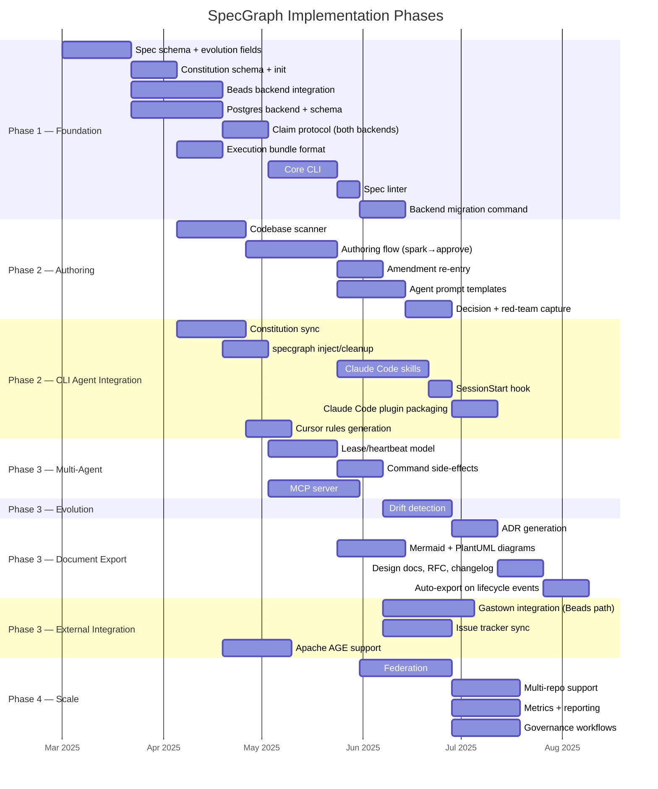
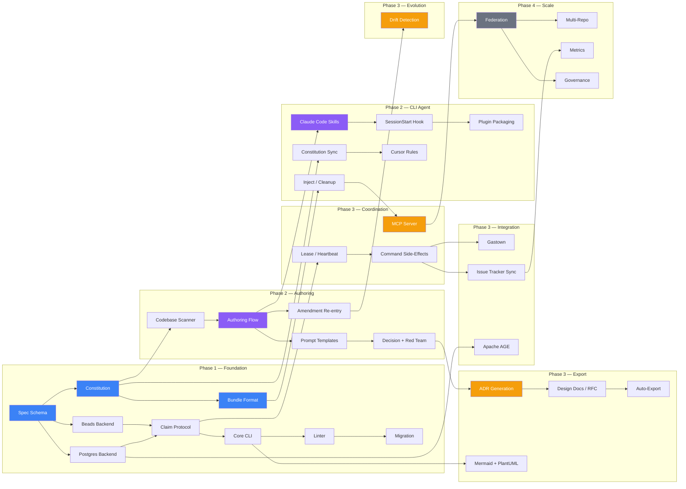

# SpecGraph Implementation Roadmap

**Version:** 1.0-draft
**Date:** 2025-02-25
**Status:** Planning
**Companion to:** specgraph-v1.0-draft-spec.md (main specification)

---

## Overview

Four phases, each building on the last. Phase 1 is the foundation everything else depends on. Phases 2 and 3 have independent workstreams that can overlap. Phase 4 is enterprise scaling — defer until the core is proven.

## Phase Dependencies

---

## Phase 1: Foundation

Everything downstream depends on this. No shortcuts.

| # | Item | Depends On | Notes |
|---|------|-----------|-------|
| 1 | Spec schema as JSON Schema | — | Include evolution fields: `lifecycle`, `supersedes`, `amends`, `history` |
| 2 | Constitution schema + bootstrap | #1 | `specgraph init` flow |
| 3 | Beads backend integration | #1 | Custom spec type + `bd` CLI wrapper |
| 4 | Postgres backend + schema | #1 | Tables, indexes, version column |
| 5 | Claim protocol | #3, #4 | Optimistic concurrency, both backends |
| 6 | Execution bundle format | #2 | The contract between all layers |
| 7 | Core CLI | #5 | list, show, create, update, deps, next, claim, amend, supersede |
| 8 | Spec linter | #7 | Schema validation, edge consistency, constitution checks |
| 9 | Backend migration | #8 | `specgraph migrate --from=beads --to=postgres` (and reverse) |

**Highest-leverage items:** #1 (schema), #2 (constitution), #6 (bundle). These three define the contracts everything else builds on.

---

## Phase 2: Authoring, Context & CLI Agent Integration

Two parallel workstreams. Authoring builds the design experience. CLI agent integration brings it into the tools developers already use.

### Authoring

| # | Item | Depends On | Notes |
|---|------|-----------|-------|
| 10 | Codebase scanner | #2 | `--scan` bootstrap, three context tiers |
| 11 | Authoring flow | #10 | spark → shape → specify → decompose → approve |
| 12 | Amendment re-entry | #11 | Done specs back into the funnel at shape/specify |
| 13 | Agent prompt templates | #11 | Per stage, posture, and analytical pass |
| 14 | Decision + red-team capture | #13 | Structured capture in spec schema |

### CLI Agent Integration

| # | Item | Depends On | Notes |
|---|------|-----------|-------|
| 15 | Constitution sync | #2 | CLAUDE.md ↔ constitution ↔ .cursorrules ↔ AGENTS.md |
| 16 | `specgraph inject/cleanup` | #6 | Context injection for Claude Code, Cursor, Codex, OpenCode |
| 17 | Claude Code skills | #11 | Authoring funnel + operations as `/specgraph-*` |
| 18 | SessionStart hook | #17 | Awareness priming (the only hook) |
| 19 | Claude Code plugin | #18 | Skills + hook + MCP as single installable |
| 20 | Cursor rules generation | #15 | `specgraph init --tool=cursor` |

---

## Phase 3: Coordination, Export & Integration

Four independent workstreams. Can be prioritized based on team needs.

### Multi-Agent Coordination

| # | Item | Depends On | Notes |
|---|------|-----------|-------|
| 21 | Lease/heartbeat model | #5 | Claim expiry, automatic unclaim |
| 22 | Command side-effects | #21 | complete→unblock, abandon→block, amend→flag drift |
| 23 | MCP server | #16 | Authoring agents + coding agents mid-task |

### Evolution

| # | Item | Depends On | Notes |
|---|------|-----------|-------|
| 24 | Drift detection | #12 | `specgraph drift` — interface, verify, dependency |

### Document Export

| # | Item | Depends On | Notes |
|---|------|-----------|-------|
| 25 | ADR generation | #14 | Spec decisions → Nygard-format ADRs |
| 26 | Mermaid + PlantUML diagrams | #7 | Deps, sequence, project graph, decomposition, critical path |
| 27 | Design docs, RFC, changelog | #25 | Full prose export from spec content |
| 28 | Auto-export on lifecycle | #27 | Trigger on approve, complete, amend, release |

### External Integration

| # | Item | Depends On | Notes |
|---|------|-----------|-------|
| 29 | Gastown integration | #22 | Beads path only — specs as beads, Mayor dispatch |
| 30 | Issue tracker sync | #22 | GitHub, Linear, ADO, Jira — bidirectional or push |
| 31 | Apache AGE support | #4 | Optional graph queries on Postgres path (CTE fallback) |

---

## Phase 4: Scale & Federation

Defer until Phases 1–3 are proven in real use.

| # | Item | Depends On | Notes |
|---|------|-----------|-------|
| 32 | Federation | #23 | Remote specs, cross-team dependencies |
| 33 | Multi-repo support | #32 | Monorepo and polyrepo topologies |
| 34 | Metrics + reporting | #30 | Throughput, cycle time, spec health |
| 35 | Governance workflows | #32 | Role-based approvals, audit trail |

---

## Starting Point

If you're starting today, build these first — they unlock the most downstream value:

1. **Spec schema** (#1) — everything else is a function of the schema
2. **Constitution** (#2) — makes every subsequent spec better
3. **Execution bundle format** (#6) — the contract between authoring and execution
4. **Core CLI** (#7) — usable immediately for manual spec management
5. **Claude Code skills** (#17) — the authoring funnel inside the tool developers already use
