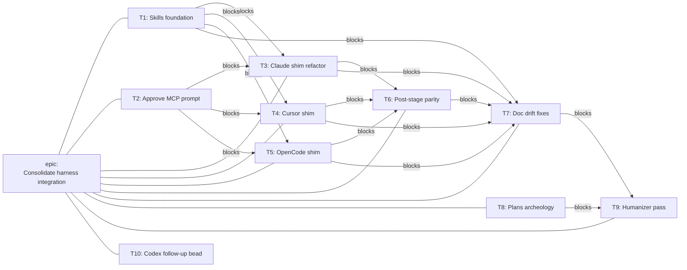

# Harness Parity Epic: Consolidate Claude Code, Cursor, and OpenCode Integration

## Context

SpecGraph today has integration with three agent harnesses but the depth varies
sharply by harness:

- **Claude Code** has a thin in-tree plugin at [plugin/specgraph/](../../plugin/specgraph/)
  with a manifest, a `SessionStart` hook that primes from `specgraph://prime`,
  and a `routing-guide.md` mapping user intent to MCP prompts and tools.
- **Cursor** has only the per-project MCP config that `specgraph init` writes
  to `.cursor/mcp.json`. No bundled rules pack, no shared routing guidance, no
  session priming entry point.
- **OpenCode** has only `opencode.json` written by `specgraph init`. No plugin,
  no skills, no session prime hook.

Server-side parity already exists. [internal/mcp/profiles.go](../../internal/mcp/profiles.go)
maps `claude-code`, `cursor`, `cursor-vscode`, `windsurf`, `opencode`, `codex`,
and `specgraph-cli` to the authoring profile. The MCP config writers in
[internal/config/mcpconfigs/configs.go](../../internal/config/mcpconfigs/configs.go)
emit idempotent JSON Merge Patches for the three harness config shapes. The
plumbing is fine; the surface a user sees in their harness is not.

A WebFetch-grounded survey (2026-05-06) of skill ecosystems confirms a real
opportunity:

| Harness | Skill discovery paths |
|---|---|
| Claude Code | `.claude/skills/`, `~/.claude/skills/`, plugin `skills/` |
| Cursor | `.cursor/skills/`, `.agents/skills/`, **`.claude/skills/`** (compat), `~/.cursor/skills/` |
| OpenCode | `.opencode/skills/`, **`.claude/skills/`** (compat), `~/.config/opencode/skills/` |

All three independently aligned on the same on-disk shape — directory + `SKILL.md`
with required `name` and `description` frontmatter — and Cursor and OpenCode
both load the Claude-shaped path natively. The [agentskills.io](https://agentskills.io)
specification documents this contract. There is one portable source-of-truth
shape across all three harnesses, and it is implementable in-tree today.

The current README at [plugin/specgraph/README.md](../../plugin/specgraph/README.md)
explicitly states "no skills bundled in this plugin." That was the right call
before the spec converged. It is the wrong call now.

There is also documented drift to close. [plugin/specgraph/routing-guide.md](../../plugin/specgraph/routing-guide.md)
claims an `approve` MCP prompt that [internal/mcp/prompts.go](../../internal/mcp/prompts.go)
does not register; the embedded composer content already has `stage-approve.md`
ready, so this is a one-line fix plus a test.

## Decision: in-tree shared `skills/`, per-harness shims, parity automation

Adopt a single in-tree `skills/` directory at repo root holding agentskills.io-
spec-clean skill packages. Each supported harness gets a shim under
`plugin/<harness>/` that consumes those skills (via symlink or sync) and adds
only the harness-specific surface (manifest, hook scripts, rules files, plugin
modules). Post-stage analytical-pass automation lands in all three harnesses
in this epic, replacing the Claude-only scope that `spgr-iap` originally had.

```mermaid
flowchart TB
    subgraph srcOfTruth [Source of truth in repo]
        skillsDir["skills/&lt;name&gt;/SKILL.md<br/>spec-clean: name, description"]
        mcpConfigs["internal/config/mcpconfigs/<br/>JSON Merge Patch writers"]
        composer["internal/authoring/<br/>composer + content/*.md"]
        mcpServer["internal/mcp/<br/>prompts, resources, tools"]
    end

    subgraph claudeShim [plugin/specgraph/ Claude shim]
        claudeManifest[".claude-plugin/plugin.json"]
        claudeHooks["hooks/session-start.sh<br/>hooks/post-stage.sh"]
        claudeRouting["routing-guide.md"]
        claudeSkillsLink["skills/ -&gt; ../../skills/"]
    end

    subgraph cursorShim [plugin/cursor/ Cursor shim]
        cursorRules[".cursor/rules/specgraph.md<br/>session prime + routing"]
        cursorSkillsLink[".cursor/skills/ -&gt; ../../skills/"]
        cursorPostStage[".cursor/rules/post-stage.md"]
    end

    subgraph opencodeShim [plugin/opencode/ OpenCode shim]
        opencodePlugin[".opencode/plugins/specgraph.ts<br/>session.start + tool.use"]
        opencodeSkillsLink[".opencode/skills/ -&gt; ../../skills/"]
    end

    skillsDir --> claudeSkillsLink
    skillsDir --> cursorSkillsLink
    skillsDir --> opencodeSkillsLink
    mcpConfigs --> claudeShim
    mcpConfigs --> cursorShim
    mcpConfigs --> opencodeShim
    mcpServer -.MCP/HTTP.-> claudeShim
    mcpServer -.MCP/HTTP.-> cursorShim
    mcpServer -.MCP/HTTP.-> opencodeShim
```

### Why in-tree, not a separate marketplace repo

The portable contract is files on disk. A second repository does not improve
interoperability unless we also need independent versioning or community
discovery as a product. We do not — yet. SpecGraph itself is the authoritative
source of "how to interact with SpecGraph"; the skill bodies belong with the
server they describe. If marketplace distribution becomes a goal later, the
in-tree skills are the natural source for a release-automation mirror. Going
the other direction (marketplace-first then back to in-tree) is harder.

### Why the spec-clean skills, not Claude-extended skills

OpenCode ignores unknown frontmatter; Cursor and Claude both extend the spec.
A spec-clean skill body works in all three. Harness-specific extensions
(Claude's `allowed-tools`, Cursor's `paths`, etc.) belong in the per-harness
shim, not the shared skill. This keeps the source of truth portable.

## Scope decisions (locked)

| Decision | Choice |
|---|---|
| Distribution | In-tree, single `skills/` directory; per-harness shims under `plugin/<harness>/`. |
| Harnesses | Claude + Cursor + OpenCode. Codex deferred to a follow-up bead. |
| Skills | Add agentskills.io-compliant skills back, in-tree. |
| Auto-passes (`spgr-iap`) | Include in this epic with parity across all three harnesses. |
| Docs | Harness-touching docs + reconcile `docs/plans/` archeology. |

## Architecture by workstream

### A. Skills foundation (in-tree, agentskills.io-compliant)

New top-level `skills/` directory at repo root. Each skill is `skills/<name>/SKILL.md`
with strict frontmatter: `name` (matches directory name), `description`
(1–1024 chars), optional `license`, `compatibility`, `metadata`. Optional
subdirectories: `scripts/`, `references/`, `assets/`. No Claude-only or
Cursor-only frontmatter in the skill body — those go in adapters in the shim
layer.

Skills to ship in v1 (six, focused on what genuinely benefits from progressive
disclosure):

- `specgraph-authoring` — when and how to invoke MCP authoring prompts.
  Supersedes most of `routing-guide.md`.
- `specgraph-graph-query` — querying ready specs, dependencies, impact.
- `specgraph-analytical-passes` — running constitution-check, peripheral-vision,
  red-team, consistency, simplicity.
- `specgraph-drift` — detecting and acknowledging drift on done specs.
- `specgraph-conventions` — slug conventions, stage transitions, approval rules.
- `specgraph-troubleshooting` — common errors, MCP connection issues.

Validation: add a `task skills:validate` step running `agentskills/skills-ref validate`
(via `go install` or Docker). Wire into `task check`. License headers and DCO
apply via SPDX in `metadata.license`.

### B. Per-harness shims under `plugin/<harness>/`

All three shims are thin and delegate to the in-tree `skills/` and the MCP
server. Shims are what users install locally; skills are what they all share.

**Claude (`plugin/specgraph/`)** — keep current location. The `specgraph` name
is meaningful to the marketplace target audience (it identifies the product,
not the harness). Changes:

- Add `skills/` as a symlink to `../../skills/` (or as a `task plugin:sync`
  copy if symlinks cause portability issues on Windows).
- Keep `hooks/session-start.sh` (reads `specgraph://prime`).
- Add `hooks/post-stage.sh` for post-stage automation (workstream D).
- Trim [routing-guide.md](../../plugin/specgraph/routing-guide.md) to a
  one-screen pointer; bulk content moves to `skills/specgraph-authoring/`.
- Fix the `approve` claim once workstream C lands.

**Cursor (`plugin/cursor/`, new)** —

- `.cursor/rules/specgraph.md` with `alwaysApply: false` and a description
  that triggers on spec/authoring intent. Points to MCP prompts and to skills.
- `.cursor/skills/` symlinks to `../../skills/` (Cursor reads
  `.cursor/skills/`, `.agents/skills/`, and `.claude/skills/`).
- `.cursor/rules/post-stage.md` with `paths` glob and trigger guidance.
- Install docs: how to drop these into a project, or import via Cursor's
  GitHub remote rules feature.

**OpenCode (`plugin/opencode/`, new)** —

- `.opencode/plugins/specgraph.ts` using the `@opencode-ai/plugin` shape.
  Hooks: `session.start` (calls `specgraph read-mcp-resource specgraph://prime`),
  `tool.use` (post-stage trigger).
- `.opencode/skills/` symlinks to `../../skills/`.
- `package.json` shaped for future npm publishing.
- Install path for now: local entry in the project's `opencode.json` `plugin`
  array.

### C. MCP server: close documented gaps

- Add an `approve` prompt to [internal/mcp/prompts.go](../../internal/mcp/prompts.go)
  matching the other stage prompts (`stagePromptHandler(c, "approve")`).
  Composer content `stage-approve.md` already exists; this is wiring only.
- Add a cross-harness integration test that verifies stage prompts work for
  `claude-code`, `cursor`, `opencode` `Implementation.Name` values.
- No new tools or resources. The server surface is otherwise correct.

### D. Post-stage automation parity (supersedes spgr-iap)

The `passRegistry` in [internal/authoring/passes.go](../../internal/authoring/passes.go)
already defines which analytical passes auto-run at each stage and posture.
The server exposes `analytical_pass`. What is missing is the client-side trigger.

- **Claude:** new `hooks/post-stage.sh` triggered on `PostToolUse` for the
  `author` tool. Calls `analytical_pass` via the MCP. Wired in
  [hooks.json](../../plugin/specgraph/hooks/hooks.json).
- **Cursor:** `.cursor/rules/post-stage.md` with `paths` matching specs and
  a description that prompts the agent to call `analytical_pass` after stage
  edits.
- **OpenCode:** the JS plugin's `tool.use` post-hook intercepts successful
  `author` calls and invokes `analytical_pass`.

Hook semantics differ across harnesses; the design contract is "after a stage
transition, analytical passes are surfaced." We document the difference rather
than pretend they are identical.

### E. `specgraph init` updates

- Print install hints for the new `plugin/cursor/` and `plugin/opencode/`
  shims in the init summary.
- No change to JSON merge-patch shapes. They are correct.

### F. Documentation pass

Two phases:

**F.1 Drift fixes (mechanical)**

- [plugin/specgraph/routing-guide.md](../../plugin/specgraph/routing-guide.md):
  fix the `approve` reference (becomes accurate once C lands).
- [plugin/specgraph/README.md](../../plugin/specgraph/README.md): replace "no
  skills bundled" with the new in-tree `skills/` story.
- [CLAUDE.md](../../CLAUDE.md): the Plugin entry under Documentation needs
  updating. It still references the retired 13-skill layout history; mention
  the new shared `skills/` and per-harness shims.
- [internal/inject/inject.go](../../internal/inject/inject.go) caller comments
  that say "injects into CLAUDE.md" are wrong; the package writes
  `.claude/specs/`, `.cursor/rules/`, `AGENTS.md`.
- Site docs under `site/docs/` covering init, inject, MCP — audit and align.

**F.2 Plans archeology**

Add a `superseded-by:` frontmatter block to:

- [docs/plans/2026-02-28-slice-7-claude-code-plugin-plan.md](2026-02-28-slice-7-claude-code-plugin-plan.md)
- [docs/plans/2026-03-16-slice-7-global-daemon-and-plugin-design.md](2026-03-16-slice-7-global-daemon-and-plugin-design.md)
- [docs/plans/2026-03-16-slice-7-global-daemon-and-plugin-plan.md](2026-03-16-slice-7-global-daemon-and-plugin-plan.md)
- [docs/plans/2026-03-17-skill-personas-design.md](2026-03-17-skill-personas-design.md)
- [docs/plans/2026-03-17-skill-personas-plan.md](2026-03-17-skill-personas-plan.md)

Add a new `docs/plans/README.md` index categorizing active vs superseded.

**F.3 Humanizer pass**

Run the [humanizer skill](/Users/SeBrandt/.claude/skills/humanizer/SKILL.md)
on: new SKILL.md bodies (workstream A), new shim READMEs (workstream B), all
docs touched in F.1, this design doc, and the implementation plan. Targets:
no promotional adjectives, no "leverage / robust / seamless" filler, no em-dash
overuse, no negative parallelisms ("not just X but also Y"), no rule-of-three
padding.

### G. Beads / tracking — single source of truth

This epic is the only place to track harness-parity work. Everything related
either folds in or gets explicitly closed-and-reissued so we do not have
parallel tracking.

#### G.1 Audit and resolve existing harness-related open beads

| Bead | Title | Disposition | Rationale |
|------|-------|-------------|-----------|
| **spgr-iap** | Auto-run analytical passes via Claude Code hooks after stage transitions | **Closed via `bd supersede spgr-iap --with spgr-cceg.6`.** Scope expanded from Claude-only to all three harnesses. | Closed-and-reissue gives a clean child bead under the epic. `spgr-iap` was Claude-only by design; the new bead is parity-from-the-start. |

No other open beads are on this surface (verified via `bd list --status open`
and search across `claude|cursor|opencode|harness|plugin|skill|mcp|agentskills|marketplace`).
The closed beads `spgr-mv32`, `spgr-7htb`, `spgr-bncv`, `spgr-3t9`, `spgr-e9z`,
`spgr-3dm.20`, `spgr-3dm.22` are referenced as prior art / shipped, not reopened.

#### G.2 Epic structure: single epic, flat children with explicit dependencies

#### G.3 Task summaries

The implementation plan ([2026-05-06-harness-parity-epic-plan.md](2026-05-06-harness-parity-epic-plan.md))
contains exact files, code, and steps. This design records the contract.

- **T1 — Skills foundation.** Six in-tree spec-clean SKILL.md packages plus
  `task skills:validate` wired into `task check`. Acceptance: `task check`
  validates all skills; license metadata present.
- **T2 — Approve prompt + cross-harness test.** Register `approve` in the MCP
  prompts registry; integration test verifies all three client names hit the
  authoring profile and can invoke stage prompts.
- **T3 — Claude shim refactor.** Add `skills/` link, trim routing guide to a
  pointer, update README. Acceptance: `claude --plugin-dir ./plugin/specgraph`
  loads with shared skills visible.
- **T4 — Cursor shim.** New `plugin/cursor/` with rules, skills link, install
  README. Acceptance: dropping the shim into a project enables SpecGraph in
  Cursor; skills resolve.
- **T5 — OpenCode shim.** New `plugin/opencode/` with TS plugin, skills link,
  publishable `package.json`. Acceptance: local install via `opencode.json`
  `plugin` array works; session prime triggers.
- **T6 — Post-stage parity.** Hooks/rules/plugin-listener in all three
  harnesses fire `analytical_pass` after stage transitions. Closes/supersedes
  `spgr-iap`.
- **T7 — Doc drift fixes.** Routing guide, READMEs, CLAUDE.md, inject doc
  comments, site docs aligned with code.
- **T8 — Plans archeology.** Superseded-by markers + index README in
  `docs/plans/`.
- **T9 — Humanizer pass.** Targeted prose audit on all new and touched docs.
- **T10 — Codex follow-up.** File a fresh standalone bead documenting Codex
  MCP config + shim work; not implementation.

#### G.4 Deferred follow-ups (filed but never enter this epic)

- Codex MCP config (`mcpconfigs.codexConfig`) and Codex shim — T10 files.
- Marketplace publishing (Claude Code marketplace, npm for OpenCode plugin) —
  separate bead.

## Acceptance criteria

- All three harnesses install SpecGraph integration with one documented step
  and reach feature parity for: session priming, MCP tool/prompt access,
  post-stage analytical pass automation, and skill-based routing guidance.
- `task check` passes including the new `task skills:validate` step.
- Claims in `routing-guide.md` match registrations in `internal/mcp/prompts.go`.
- `docs/plans/` has a clear active-vs-superseded distinction with an index.
- No README or CLAUDE.md statements contradict actual code behavior.
- `spgr-iap` is closed.

## Out of scope

- Codex (separate follow-up bead, filed by T10).
- Marketplace publishing (Claude marketplace submission, npm publish for
  OpenCode plugin).
- Standalone `specgraph-skills` repository (kept in-tree per decision).

## Risks and mitigations

- **Symlinks on Windows.** `plugin/<harness>/skills/` as a symlink may not
  work on Windows hosts. Mitigation: a `task plugin:sync` target that copies
  instead, with the symlink as the dev-friendly default. CI runs on Linux,
  so symlinks are fine for validation.
- **`skills-ref validate` availability.** The validator may not be a stable
  Go-installable binary in 2026. Mitigation: T1 picks the available method
  (binary, container, or vendored) at implementation time; the contract is
  "validation runs in `task check`," not a specific tool.
- **Cursor remote-rules import is a moving target.** If Cursor's GitHub
  remote-rules feature changes shape, the install instructions in the Cursor
  shim README go stale. Mitigation: docs link to current Cursor docs rather
  than transcribing flow that can drift.
- **OpenCode plugin API stability.** `@opencode-ai/plugin` is recent. If the
  hook contract changes, T5 needs a follow-up. Mitigation: pin the package
  version in `package.json`; document the dependency.
