# Site Documentation Overhaul Implementation Plan

> **For agentic workers:** REQUIRED: Use superpowers:subagent-driven-development (if subagents available) or superpowers:executing-plans to implement this plan. Steps use checkbox (`- [ ]`) syntax for tracking.

**Goal:** Update all SpecGraph site documentation to reflect the current codebase state — Postgres backend, new features, accurate terminology, mermaid diagrams.

**Architecture:** Pure documentation changes to markdown files under `site/docs/`. No code changes. Each task targets one or two related pages with all changes for that page grouped together.

**Tech Stack:** Markdown, Mermaid diagrams, Zensical static site generator

**Spec:** `docs/superpowers/specs/2026-04-03-site-docs-overhaul-design.md`

---

## Chunk 1: Foundation — Zensical Config, Landing Pages, and Quickstart

### Task 1: Verify Mermaid Support

Zensical's default config already includes mermaid support via
`pymdownx.superfences` with `custom_fences = [{"name": "mermaid", "class":
"mermaid"}]` (see `zensical/config.py:357-358`). Since `zensical.toml` does
not override `markdown_extensions`, the defaults apply and mermaid should
work out of the box.

**Files:**

- Review: `site/zensical.toml` (confirm no `markdown_extensions` override)

- [ ] **Step 1: Confirm no markdown_extensions override in zensical.toml**

Read `site/zensical.toml`. If it contains no `[project.markdown_extensions]`
section, mermaid is already enabled via Zensical defaults. No changes needed.

If it does contain an override, add the mermaid custom fence:

```toml
[project.markdown_extensions."pymdownx.superfences"]
custom_fences = [{ name = "mermaid", class = "mermaid" }]
```

- [ ] **Step 2: Verify mermaid renders**

Create a temporary file `site/docs/_mermaid-test.md` with:

````markdown

````

Build: `cd site && uv run zensical build`. Check the output HTML for a
`<pre class="mermaid">` or `<div class="mermaid">` block. Remove the test
file after confirming.

- [ ] **Step 3: Commit only if zensical.toml was modified**

If config was changed:

```text
jj --no-pager describe -m "docs(site): enable mermaid diagram support in zensical config"
jj --no-pager new -m ""
```

If no changes needed, abandon the empty change: `jj --no-pager abandon`

### Task 2: Fix `index.md`

**Files:**

- Modify: `site/docs/index.md`

- [ ] **Step 1: Remove version-specific language**

Replace:

```markdown
SpecGraph v0.1.0 is the first public release.
[Author your first spec](quickstart.md) in under 10 minutes, or read
the [architecture overview](architecture.md) to understand the system
design.
```

With:

```markdown
[Author your first spec](quickstart.md) in under ten minutes, or read
the [architecture overview](architecture.md) to understand the system
design. See the [changelog](changelog.md) for the latest release.
```

- [ ] **Step 2: Fix "graph database" terminology**

Replace:

```markdown
SpecGraph manages software specifications as nodes in a graph database, not
```

With:

```markdown
SpecGraph manages software specifications as nodes in a queryable graph, not
```

- [ ] **Step 3: Commit**

```text
jj --no-pager describe -m "docs(site): fix index.md — remove version pin, fix terminology"
jj --no-pager new -m ""
```

### Task 3: Fix `quickstart.md`

**Files:**

- Modify: `site/docs/quickstart.md`

- [ ] **Step 1: Fix time estimate**

Line 3: Replace `Author your first spec in five minutes.` with `Author your first spec in under ten minutes.`

- [ ] **Step 2: Fix prerequisites**

Line 12: Replace `- **Docker** (Memgraph container)` with `- **Docker** (PostgreSQL container)`

- [ ] **Step 3: Fix server start section**

Line 71: Replace `> **Action:** Start Memgraph and the SpecGraph server.` with `> **Action:** Start PostgreSQL and the SpecGraph server.`

Lines 77-78: Replace:

```markdown
This starts the Memgraph Docker container and installs a background service
```

With:

```markdown
This starts a PostgreSQL Docker container and installs a background service
```

- [ ] **Step 4: Commit**

```text
jj --no-pager describe -m "docs(site): fix quickstart — Memgraph→Postgres, time estimate"
jj --no-pager new -m ""
```

### Task 4: Fix `problem.md` — Link Verification

**Files:**

- Review: `site/docs/problem.md`

- [ ] **Step 1: Verify all external links**

Check each link is reachable (use `curl -sI <url>` or web fetch):

- `https://www.faros.ai/blog/ai-software-engineering`
- `https://metr.org/blog/2025-07-10-early-2025-ai-experienced-os-dev-study/`
- `https://www.coderabbit.ai/blog/state-of-ai-vs-human-code-generation-report`
- `https://github.com/github/spec-kit`
- `https://github.com/gsd-build/get-shit-done`

- [ ] **Step 2: Fix any broken links**

If any link is dead, either find the updated URL or remove the reference with a note about why.

- [ ] **Step 3: Commit (only if changes were made)**

If links were fixed:

```text
jj --no-pager describe -m "docs(site): fix broken links in problem.md"
jj --no-pager new -m ""
```

If no changes needed, abandon the empty change: `jj --no-pager abandon`

---

## Chunk 2: Core Concept Pages (specs, constitution, authoring)

### Task 5: Fix `concepts/specs.md`

**Files:**

- Modify: `site/docs/concepts/specs.md`

- [ ] **Step 1: Fix informal stage names in dependency graph diagram**

Lines 74-91: The ASCII diagram uses `(draft)` and `(pending)` which are not real stages. Replace the entire ```` ```text ```` block with a mermaid graph. The nodes should use actual stages:

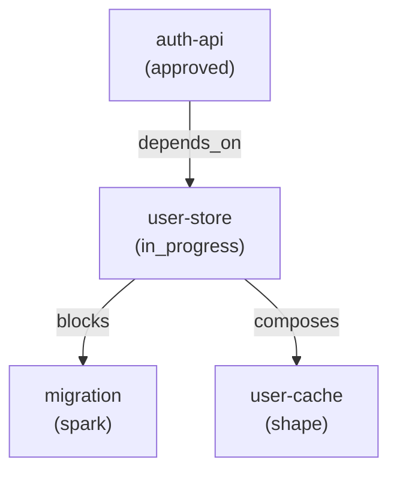

- [ ] **Step 2: Remove "queryable in Cypher" from ChangeLog description**

Lines 164-165: Replace:

```markdown
ChangeLog nodes are graph-native — queryable in Cypher (the graph query
language) without deserializing JSON blobs. You can ask "what changed across the project this week?" with a
single graph query.
```

With:

```markdown
ChangeLog entries are queryable without deserializing JSON blobs. You can
ask "what changed across the project this week?" with a single query.
```

- [ ] **Step 3: Add `specgraph changes` mention to Change Tracking section**

After the paragraph ending "if the ChangeLog failed, the mutation never happened." (around line 172), add:

```markdown
Use `specgraph changes <slug>` to view a spec's changelog. Filter to major
milestones with `--checkpoints`, or scope to recent changes with
`--since-version`.
```

- [ ] **Step 4: Commit**

```text
jj --no-pager describe -m "docs(site): fix specs.md — stage names, Cypher ref, changes command"
jj --no-pager new -m ""
```

### Task 6: Fix `concepts/constitution.md`

**Files:**

- Modify: `site/docs/concepts/constitution.md`

- [ ] **Step 1: Replace layer hierarchy ASCII diagram with mermaid**

Lines 29-43: Replace the ```` ```text ```` block with:

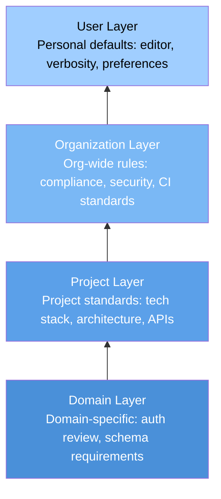

Add a note below: `More specific layers (bottom) override more general ones (top).`

- [ ] **Step 2: Add "Planned" admonition for multi-layer composition**

After the override model paragraph (line 71, ending "which layers it overrode."), add:

```markdown
!!! info "Planned"
    Multi-layer composition is designed but not yet shipped. Currently,
    SpecGraph stores one constitution per project at a single layer. The
    layer field is stored and the override model is defined, but automatic
    merging across layers and provenance tracking are not yet implemented.
```

- [ ] **Step 3: Fix "gRPC" in example constitution**

Line 57: Replace `"Internal communication is gRPC; external APIs` with `"Internal communication is ConnectRPC; external APIs`.

- [ ] **Step 4: Commit**

```text
jj --no-pager describe -m "docs(site): fix constitution.md — planned admonition, mermaid, ConnectRPC"
jj --no-pager new -m ""
```

### Task 7: Fix `concepts/authoring.md`

**Files:**

- Modify: `site/docs/concepts/authoring.md`

- [ ] **Step 1: Fix post-approval change mechanisms**

Lines 164-166: Replace:

```markdown
If a spec needs to change after approval, it must be **superseded** by a new
spec rather than edited in place — preserving the design history.
```

With:

```markdown
If a spec needs to change after reaching done, it can be **amended**
(returning to an earlier authoring stage for modification) or **superseded**
by a new spec that replaces it. Amendment is for refining an existing spec;
supersession is for replacing it with a fundamentally different approach.
```

- [ ] **Step 2: Add steel_thread decomposition strategy**

In the Decompose section (after line 133, after the "Single unit" description), add:

```markdown
A **steel thread** cuts the thinnest possible vertical slice that proves the
riskiest integration points first. The first slice (`slices[0]`) is the thread
itself with no dependencies; all subsequent slices are reachable from it. Use
when the primary risk is integration uncertainty rather than feature breadth.
```

Update the strategy field description table to include `steel_thread`:

```markdown
| `strategy` | How the spec is being sliced: `vertical_slice`, `layer_cake`, `single_unit`, or `steel_thread`. |
```

- [ ] **Step 3: Add spec lifecycle state diagram**

After the "After Approval" section (after line 183), add a new subsection:

```markdown
### Spec Lifecycle

The full spec lifecycle, including post-approval transitions:
```

Then add the mermaid diagram. Source of truth: `internal/storage/spec_domain.go` and `internal/storage/stage_validation.go`.

```mermaid
stateDiagram-v2
    [*] --> spark
    spark --> shape
    shape --> specify
    specify --> decompose
    decompose --> approved
    approved --> in_progress
    in_progress --> review
    review --> done

    done --> amended : amend
    amended --> spark : re-entry

    note left of amended : Re-entry targets any\nearlier funnel stage\n(spark through review)

    note right of superseded : Any non-terminal stage\ncan reach superseded\nor abandoned
    superseded --> [*]
    abandoned --> [*]
```

Below the diagram, add:

```markdown
**Terminal states:** `superseded` and `abandoned` are fully terminal — no
further transitions are possible. `amended` is semi-terminal: it can be
superseded or abandoned, but not amended again.

Any non-terminal stage can reach `superseded` (via `specgraph supersede`) or
`abandoned` (via `specgraph abandon`). The diagram shows only the `amended`
path for clarity.
```

- [ ] **Step 4: Add conversation recording mention**

At the end of the "Why a Funnel?" section (after line 259), add:

```markdown
Authoring conversations can be recorded for traceability using
`specgraph conversation record` and reviewed with
`specgraph conversation list`. Each record captures the exchanges that
shaped a spec at a given stage.
```

- [ ] **Step 5: Commit**

```text
jj --no-pager describe -m "docs(site): fix authoring.md — amendment, steel_thread, lifecycle diagram, conversations"
jj --no-pager new -m ""
```

---

## Chunk 3: Remaining Concept Pages

### Task 8: Fix `concepts/decisions.md` — Mermaid Diagrams

**Files:**

- Modify: `site/docs/concepts/decisions.md`

- [ ] **Step 1: Replace decision lifecycle ASCII with mermaid**

Lines 75-79: Replace the ```` ```text ```` block with:

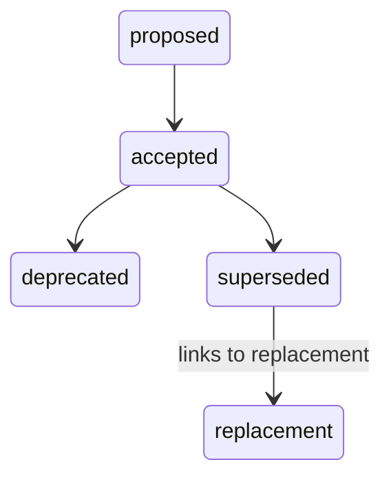

- [ ] **Step 2: Replace edge relationship ASCII diagrams with mermaid**

Lines 105-110: Replace with:

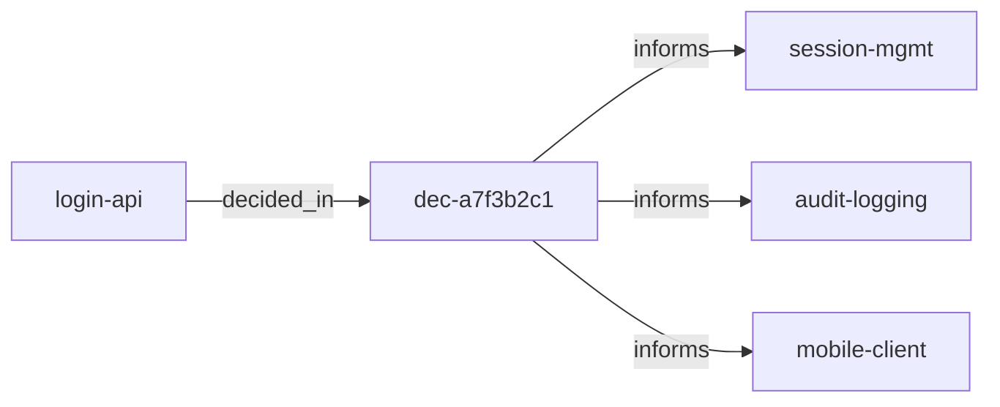

Lines 123-127: Replace with:

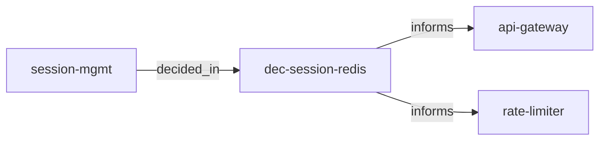

- [ ] **Step 3: Commit**

```text
jj --no-pager describe -m "docs(site): decisions.md — replace ASCII diagrams with mermaid"
jj --no-pager new -m ""
```

### Task 9: Fix `concepts/passes.md`

**Files:**

- Modify: `site/docs/concepts/passes.md`

- [ ] **Step 1: Replace version-pinned admonition**

Lines 15-22: Replace the entire `!!! warning "0.1.0 Implementation Status"` block with:

```markdown
!!! info "Planned"
    Pass scheduling infrastructure is fully implemented — passes are
    registered per-stage with posture-aware auto/offered rules
    (`internal/authoring/passes.go`). Pass execution currently returns
    placeholder findings. LLM-driven pass execution is planned.
```

- [ ] **Step 2: Update version reference in safety net section**

Line 142: Replace `The safety net catches two categories in v0.1.0:` with `The safety net catches two categories:`

- [ ] **Step 3: Add "Working with Findings" section**

At the end of the file (after the "Why Both?" section), add:

````markdown
---

## Working with Findings

Findings from analytical passes are stored as graph nodes linked to specs
via `HAS_FINDING` edges. Use the CLI to inspect them:

```bash
# List all findings for a spec
specgraph findings list <slug>

# Filter by pass type
specgraph findings list <slug> --pass-type constitution-check
specgraph findings list <slug> --pass-type red-team
```

Available pass types: `constitution-check`, `red-team`, `peripheral-vision`,
`consistency`, `simplicity`.
````

- [ ] **Step 4: Commit**

jj --no-pager describe -m "docs(site): passes.md — version-agnostic callout, findings section"
jj --no-pager new -m ""

```text

### Task 10: Fix `concepts/slices.md` — Mermaid Diagrams

**Files:**

- Modify: `site/docs/concepts/slices.md`

- [ ] **Step 1: Replace edge notation ASCII blocks with mermaid**

Lines 16-18: Replace with:

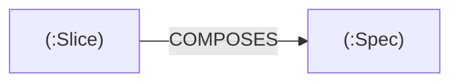

Lines 23-26: Replace with:

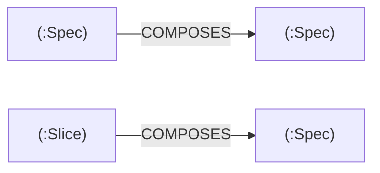

Add text annotations below: "Spec-to-Spec composition is structural (a spec broken into sub-specs). Slice-to-Spec composition is execution (implementable work items from decompose)."

- [ ] **Step 2: Replace slice lifecycle ASCII with mermaid**

Lines 49-51: Replace with:

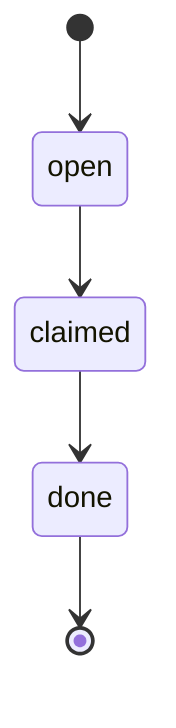

- [ ] **Step 3: Commit**

```text
jj --no-pager describe -m "docs(site): slices.md — replace ASCII diagrams with mermaid"
jj --no-pager new -m ""
```

### Task 11: Fix `concepts/drift.md`

**Files:**

- Modify: `site/docs/concepts/drift.md`

- [ ] **Step 1: Replace edge ASCII diagram with mermaid**

Lines 23-25: Replace with:

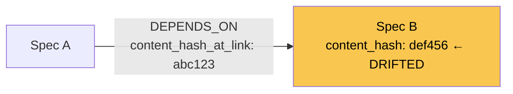

- [ ] **Step 2: Add "Planned" admonition for interface and verify scopes**

After the CLI usage section (after line 77), add:

```markdown
!!! info "Planned"
    The `--scope interfaces` and `--scope verify` options are defined but not
    yet implemented. Currently only `deps` (dependency edge hash comparison)
    is functional. Omitting `--scope` defaults to dependency-only checking.
```

- [ ] **Step 3: Commit**

```text
jj --no-pager describe -m "docs(site): drift.md — planned admonition, mermaid diagram"
jj --no-pager new -m ""
```

---

## Chunk 4: Architecture, How-It-Works, Ecosystem

### Task 12: Fix `how-it-works.md`

**Files:**

- Modify: `site/docs/how-it-works.md`

- [ ] **Step 1: Fix "graph database" terminology**

Line 40: Replace `Every specification is a **node** in a graph database.` with `Every specification is a **node** in a queryable graph.`

- [ ] **Step 2: Replace pipeline ASCII diagram with mermaid**

Lines 107-143: Replace the entire ```` ```text ```` block with:

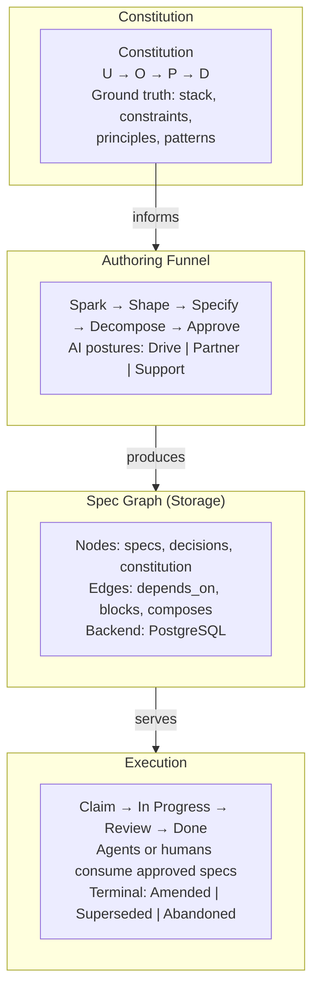

- [ ] **Step 3: Commit**

```text
jj --no-pager describe -m "docs(site): how-it-works.md — fix terminology, mermaid pipeline diagram"
jj --no-pager new -m ""
```

### Task 13: Fix `architecture.md` — Major Rewrite

This is the largest single task. The architecture page has the most stale content.

**Files:**

- Modify: `site/docs/architecture.md`

- [ ] **Step 1: Replace system diagram with mermaid**

Lines 12-36: Replace the ```` ```text ```` block with:

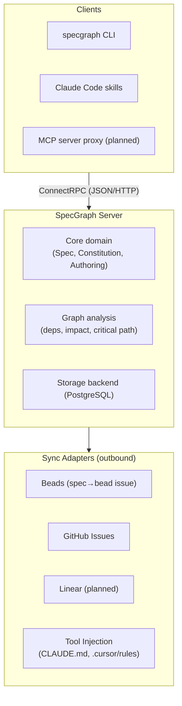

- [ ] **Step 2: Rewrite Storage section**

Replace lines 65-88 (from `## Storage` through the `Backend` interface example) with:

```markdown
## Storage

SpecGraph uses a pluggable storage backend behind composed interfaces — the
core domain never talks to the database directly.

**PostgreSQL** — The shipped backend. Uses pgx v5 with recursive CTEs for
graph traversals (transitive dependencies, impact analysis, critical path),
JSONB for structured fields, and optimistic locking via version guards.

The storage layer is composed of focused interfaces rather than one
monolithic backend:

`` `go
// Core resource backends
type SpecBackend interface { ... }
type DecisionBackend interface { ... }
type ConstitutionBackend interface { ... }
type SliceBackend interface { ... }

// Graph operations
type GraphBackend interface { ... }

// Lifecycle and authoring
type AuthoringBackend interface { ... }
type LifecycleBackend interface { ... }
type ClaimBackend interface { ... }

// Support
type ChangeLogBackend interface { ... }
type ConversationBackend interface { ... }
type FindingsBackend interface { ... }
type SyncBackend interface { ... }
type ExecutionBackend interface { ... }
`` `

Storage interfaces use domain types, not protobuf types. The ConnectRPC
handlers in `internal/server/` translate between protobuf and domain types
before calling the backend.
```

(Note: the backticks above are space-separated to avoid escaping issues — use real triple backticks in the actual file.)

- [ ] **Step 3: Replace graph data model ASCII with mermaid**

Lines 96-106: Replace the ```` ```text ```` block with:

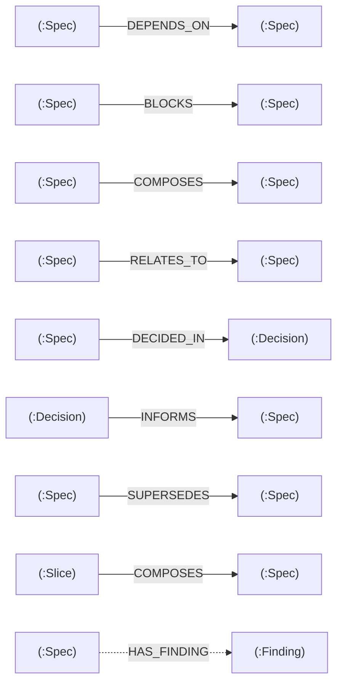

Add note below: `Dashed edges (HAS_FINDING) are internal — not exposed via AddEdge/RemoveEdge RPCs.`

- [ ] **Step 4: Replace decision promotion ASCII diagrams with mermaid**

Lines 124-129 (Shape stage): Replace with:

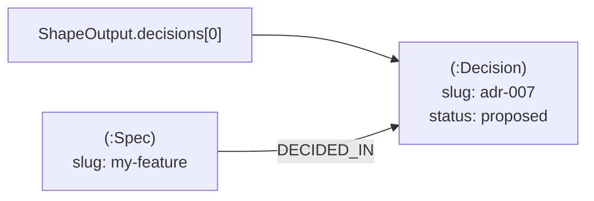

Lines 141-143 (Approve stage): Replace with:

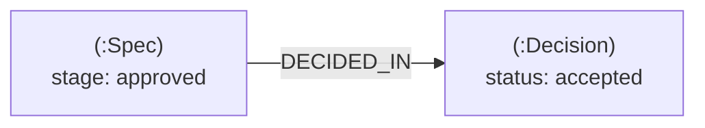

- [ ] **Step 5: Update code organization tree**

Lines 162-186: Update the file tree to match the current `internal/` layout. Remove `memgraph/`, add `export/`, `notify/`, `render/`:

```text
specgraph/
├── proto/specgraph/v1/     # Protobuf service definitions (source of truth)
├── gen/                    # Generated Go code (committed for module compat)
├── internal/
│   ├── auth/               # Auth interceptor + OIDC provider config
│   ├── authoring/          # Authoring funnel (stages, postures, passes)
│   ├── config/             # YAML-based server configuration
│   ├── docker/             # Docker Compose templates for DB containers
│   ├── drift/              # Drift detection engine
│   ├── driftscope/         # Drift scope analysis
│   ├── emitter/            # Constitution → tool file renderers
│   ├── export/             # Project export/import/verify engine
│   ├── inject/             # Tool injection (CLAUDE.md, .cursor/rules, AGENTS.md)
│   ├── linter/             # Spec linter (schema, edges, cycles)
│   ├── notify/             # Change notification subscribers (impact logging)
│   ├── render/             # Markdown renderers for CLI output
│   ├── server/             # ConnectRPC handlers + proto↔domain converters
│   ├── service/            # systemd/launchd integration
│   ├── storage/            # Backend interface + implementations
│   │   └── postgres/       # PostgreSQL implementation (pgx v5, testcontainers)
│   ├── sync/               # Sync adapters (Beads, GitHub)
│   └── xdg/                # XDG base directory paths
├── cmd/specgraph/          # CLI entry point
├── e2e/                    # End-to-end tests (Ginkgo/Gomega)
├── plugin/                 # Claude Code skills and hooks
└── Taskfile.yml            # Build automation
```

- [ ] **Step 6: Add Authentication section**

After the "Why ConnectRPC?" section (after line 157), add:

```markdown
---

## Authentication

SpecGraph supports token-based authentication via an interceptor that
validates requests before they reach service handlers.

- **OIDC** — Multi-provider support for OpenID Connect. Configure providers
  in the server config; tokens are validated against the provider's JWKS
  endpoint.
- **Dashboard sessions** — Cookie-based authentication for the web dashboard.
  Sessions are created on login and validated on each request.
- **Auth interceptor** — A ConnectRPC interceptor (`internal/auth/`) that
  extracts and validates credentials from request headers or cookies before
  forwarding to handlers.

Authentication is optional — the server runs without it for local
development. Enable it in the server configuration.
```

- [ ] **Step 7: Commit**

```text
jj --no-pager describe -m "docs(site): architecture.md — Postgres rewrite, mermaid diagrams, auth section, code tree"
jj --no-pager new -m ""
```

### Task 14: Fix `ecosystem.md`

**Files:**

- Modify: `site/docs/ecosystem.md`

- [ ] **Step 1: Replace Memgraph reference**

Line 116: Replace `The CLI and a Memgraph backend provide a complete setup —` with `The CLI and a PostgreSQL backend provide a complete setup —`

- [ ] **Step 2: Verify existing callouts are accurate**

Check each integration section against ground truth:

- **Gastown** (line 33): `!!! note "Status: Planned"` — correct, keep as-is.
- **Beads & Dolt** (line 52): `!!! info "Status: Shipped (push-only)"` — correct, keep as-is.
- **Sync Adapters** (line 68): `!!! info "Status: Shipped (push-only)"` — correct, keep as-is.
- **MCP Server** (line 102-103): Listed as `(Planned)` — correct, keep as-is.
- **Linear** (line 80): Listed as `(Planned)` — correct, keep as-is.

No changes needed if all match.

- [ ] **Step 3: Verify Beads project link**

Line 57: Check if `https://github.com/beads-project/beads` resolves. If not, remove or update the link.

- [ ] **Step 4: Commit (only if changes were made)**

If changes were made:

```text
jj --no-pager describe -m "docs(site): ecosystem.md — Memgraph→Postgres, verify callouts"
jj --no-pager new -m ""
```

If no changes beyond Step 1, abandon the empty change: `jj --no-pager abandon`

---

## Chunk 5: Guides and Final Polish

### Task 15: Fix `guides/cli-cookbook.md` — Slice Slugs and Export Recipe

**Files:**

- Modify: `site/docs/guides/cli-cookbook.md`

- [ ] **Step 1: Fix slice slug format**

The cookbook uses dotted notation (`auth-service.slice.1`) which is wrong. The actual format is `parent-slug/slice-id` (see `internal/storage/postgres/authoring.go:203`).

Replace all occurrences of `auth-service.slice.N` with realistic slugs like `auth-service/jwt-signing`, `auth-service/refresh-flow`, `auth-service/integration-tests`.

Lines to fix: 104, 107, 110, 111 (slice claim, report-progress, slice complete), and the expected output blocks.

- [ ] **Step 2: Add export/import/verify recipe**

After section 7 (Generate an execution bundle), add:

```markdown
---

## 8. Export and restore a project

**Goal:** Back up a project's specs, decisions, constitution, and slices to a portable JSON file, then verify or restore it.

`` `bash

# Export the project to a JSON file

specgraph export my-project -o backup.json

## Verify an export matches current server state

specgraph verify backup.json

## Import (restore) from a backup

specgraph import backup.json

## Force overwrite if project already exists

specgraph import backup.json --force
`` `

??? example "Expected output — `export`"
    `` `✓ Exported my-project to backup.json
      specs: 12
      decisions: 5
      slices: 23` ``

!!! tip
    Export files are self-contained JSON. Use `--require-signature` on import
    to validate HMAC integrity if the file was transferred across systems.
```

(Note: space-separated backticks above — use real triple backticks in the file.)

- [ ] **Step 3: Commit**

```text
jj --no-pager describe -m "docs(site): cli-cookbook.md — fix slice slug format, add export recipe"
jj --no-pager new -m ""
```

### Task 16: Review Remaining Pages for Accuracy

**Files:**

- Review: `site/docs/concepts/linting.md`
- Review: `site/docs/concepts/example-spec.md`
- Review: `site/docs/guides/sync.md`
- Review: `site/docs/guides/index.md`
- Review: `site/docs/concepts/index.md`
- Review: `site/docs/cli-reference.md` (auto-generated; review only, do not edit)

- [ ] **Step 1: Read each file and check for stale terms**

Grep for: `Memgraph`, `memgraph`, `Cypher`, `cypher`, `graph database`, `v0.1.0`, `0.1.0`, `gRPC` (case-sensitive — should be `ConnectRPC` in SpecGraph context)

- [ ] **Step 2: Fix any findings**

Apply the same terminology corrections used in previous tasks.

- [ ] **Step 3: Commit (only if changes were made)**

If changes were made:

```text
jj --no-pager describe -m "docs(site): fix remaining pages — terminology sweep"
jj --no-pager new -m ""
```

If no changes needed, abandon the empty change: `jj --no-pager abandon`

### Task 17: Build and Verify

- [ ] **Step 1: Build the site**

```bash
cd site && uv run zensical build
```

Verify no build errors. Check that mermaid diagrams render (open the built HTML in a browser or check for mermaid JS inclusion in the output).

- [ ] **Step 2: Grep the built output for any remaining stale terms**

```bash
grep -r "Memgraph\|memgraph\|Cypher\|cypher\|v0\.1\.0\|graph database" site/build/
```

Fix any remaining occurrences.

- [ ] **Step 3: Final commit if any fixes**

```text
jj --no-pager describe -m "docs(site): fix remaining stale terms found in build verification"
jj --no-pager new -m ""
```
