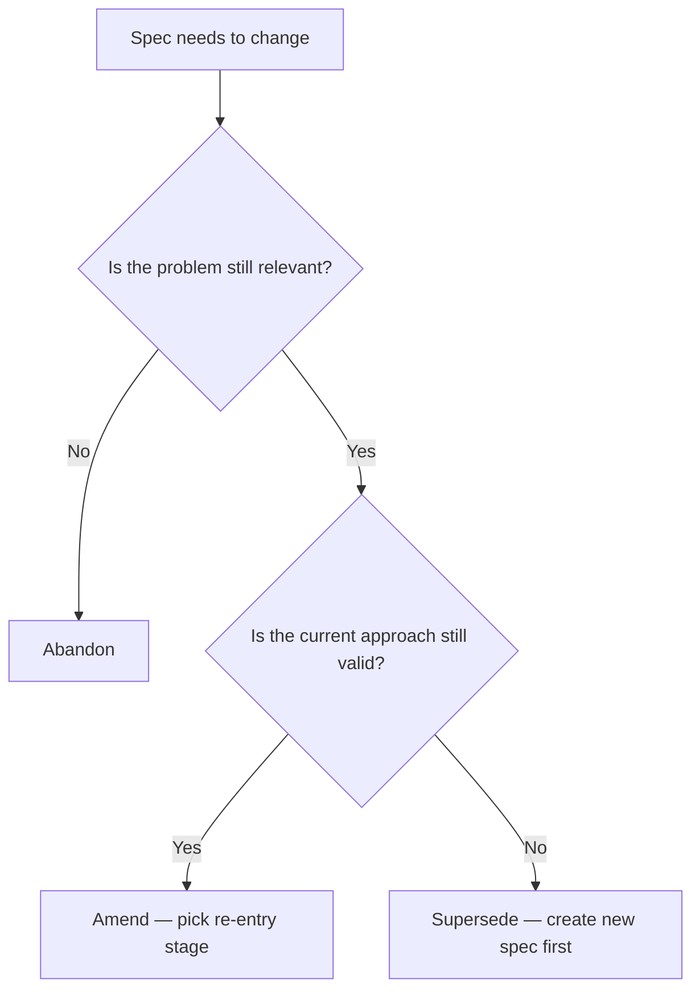

# Lifecycle Amendment & Supersede Implementation Plan

> **For agentic workers:** REQUIRED SUB-SKILL: Use superpowers:subagent-driven-development (recommended) or superpowers:executing-plans to implement this plan task-by-task. Steps use checkbox (`- [ ]`) syntax for tracking.

**Goal:** Make spec amendment and supersede fully visible on CLI and web dashboard with history, diffs, and layered E2E test coverage.

**Architecture:** New `internal/diff` package for word-level diffing, new `CompareVersions` RPC on SpecService, enhanced CLI `changes` command with `--diff`/`--from`/`--to` flags, new `ChangelogTimeline.svelte` component with side-by-side diffs on the web dashboard, new lifecycle concept page in site docs, and four-layer E2E tests (storage → API → CLI → browser).

**Tech Stack:** Go (sergi/go-diff for diffmatchpatch), SvelteKit (diff npm package for client-side rendering), Playwright for browser E2E, Ginkgo/Gomega for API E2E, testify for integration tests, Zensical for docs.

**Design spec:** `docs/superpowers/specs/2026-04-06-lifecycle-amendment-supersede-design.md`

---

## File Map

### New Files

| File | Purpose |
|------|---------|
| `internal/diff/diff.go` | Word-level diff engine wrapping go-diff |
| `internal/diff/diff_test.go` | Unit tests for diff engine |
| `internal/storage/postgres/spec_version.go` | `GetSpecAtVersion` — reconstruct spec state at version N |
| `internal/storage/postgres/spec_version_test.go` | Integration tests for version reconstruction |
| `internal/server/convert_versiondiff.go` | Proto conversion for CompareVersions types |
| `web/src/lib/components/ChangelogTimeline.svelte` | Changelog timeline with expandable diffs |
| `web/src/lib/components/DiffView.svelte` | Side-by-side diff renderer |
| `web/src/lib/components/VersionCompare.svelte` | Version picker + comparison panel |
| `e2e/ui/tests/lifecycle.spec.ts` | Playwright tests for lifecycle UI |
| `e2e/api/changes_test.go` | E2E tests for CompareVersions RPC |
| `site/docs/concepts/lifecycle.md` | Lifecycle transitions concept page |

### Modified Files

| File | Changes |
|------|---------|
| `proto/specgraph/v1/spec.proto` | Add CompareVersions RPC + messages |
| `internal/storage/changelog.go` | Add `SpecVersionBackend` interface |
| `internal/storage/postgres/changelog.go` | Implement `GetSpecAtVersion` (or new file) |
| `internal/server/spec_handler.go` | Add CompareVersions handler |
| `internal/render/changelog.go` | Add reason rendering + inline diff mode |
| `cmd/specgraph/changes.go` | Add `--diff`, `--from`, `--to` flags |
| `web/src/routes/spec/[...slug]/+page.svelte` | Add ChangelogTimeline accordion section + lifecycle banners |
| `web/src/lib/components/StatsBar.svelte` | Add amended/superseded counts |
| `web/src/lib/api/client.ts` | Already has specClient — no changes needed |
| `web/package.json` | Add `diff` dependency |
| `internal/storage/postgres/lifecycle_test.go` | Add changelog verification tests |
| `internal/storage/postgres/changelog_test.go` | Add lifecycle changelog tests |
| `e2e/api/lifecycle_test.go` | Add changelog verification after transitions |
| `e2e/ui/tests/helpers.ts` | Add lifecycle seeding helpers |
| `site/docs/concepts/specs.md` | Cross-reference to lifecycle page |
| `site/docs/concepts/authoring.md` | Cross-reference to lifecycle page |
| `site/zensical.toml` | Add lifecycle.md to nav |
| `go.mod` / `go.sum` | Add sergi/go-diff dependency |

---

## Phase 1: Shared Infrastructure

### Task 1: Diff Engine — `internal/diff`

**Files:**

- Create: `internal/diff/diff.go`
- Create: `internal/diff/diff_test.go`

- [ ] **Step 1: Add go-diff dependency**

```bash
cd /Volumes/Code/github.com/specgraph && go get github.com/sergi/go-diff@latest
```

- [ ] **Step 2: Write failing tests for diff engine**

Create `internal/diff/diff_test.go`:

```go
// Copyright 2025 SpecGraph Contributors
// SPDX-License-Identifier: Apache-2.0

package diff

import (
	"testing"

	"github.com/stretchr/testify/assert"
	"github.com/stretchr/testify/require"
)

func TestComputeHunks_NoChange(t *testing.T) {
	hunks := ComputeHunks("hello world", "hello world")
	require.Len(t, hunks, 1)
	assert.Equal(t, OpEqual, hunks[0].Op)
	assert.Equal(t, "hello world", hunks[0].Text)
}

func TestComputeHunks_Insertion(t *testing.T) {
	hunks := ComputeHunks("Build auth flow", "Build OAuth2 auth flow")
	// Should contain an INSERT hunk for "OAuth2 "
	hasInsert := false
	for _, h := range hunks {
		if h.Op == OpInsert {
			hasInsert = true
		}
	}
	assert.True(t, hasInsert, "expected at least one INSERT hunk")
}

func TestComputeHunks_Deletion(t *testing.T) {
	hunks := ComputeHunks("Build basic auth flow", "Build auth flow")
	hasDelete := false
	for _, h := range hunks {
		if h.Op == OpDelete {
			hasDelete = true
		}
	}
	assert.True(t, hasDelete, "expected at least one DELETE hunk")
}

func TestComputeHunks_Replacement(t *testing.T) {
	hunks := ComputeHunks("Build basic auth", "Build OAuth2 PKCE")
	hasDelete := false
	hasInsert := false
	for _, h := range hunks {
		if h.Op == OpDelete {
			hasDelete = true
		}
		if h.Op == OpInsert {
			hasInsert = true
		}
	}
	assert.True(t, hasDelete, "expected DELETE hunk")
	assert.True(t, hasInsert, "expected INSERT hunk")
}

func TestComputeHunks_EmptyOld(t *testing.T) {
	hunks := ComputeHunks("", "new content")
	require.Len(t, hunks, 1)
	assert.Equal(t, OpInsert, hunks[0].Op)
	assert.Equal(t, "new content", hunks[0].Text)
}

func TestComputeHunks_EmptyNew(t *testing.T) {
	hunks := ComputeHunks("old content", "")
	require.Len(t, hunks, 1)
	assert.Equal(t, OpDelete, hunks[0].Op)
	assert.Equal(t, "old content", hunks[0].Text)
}

func TestComputeHunks_BothEmpty(t *testing.T) {
	hunks := ComputeHunks("", "")
	assert.Empty(t, hunks)
}

func TestFormatInline(t *testing.T) {
	hunks := []Hunk{
		{Op: OpEqual, Text: "Build "},
		{Op: OpDelete, Text: "auth"},
		{Op: OpInsert, Text: "OAuth2"},
		{Op: OpEqual, Text: " flow"},
	}
	result := FormatInline(hunks)
	assert.Equal(t, "Build [-auth-]{+OAuth2+} flow", result)
}

func TestFormatInline_NoChanges(t *testing.T) {
	hunks := []Hunk{
		{Op: OpEqual, Text: "unchanged text"},
	}
	result := FormatInline(hunks)
	assert.Equal(t, "unchanged text", result)
}
```

- [ ] **Step 3: Run tests to verify they fail**

```bash
cd /Volumes/Code/github.com/specgraph && go test ./internal/diff/ -v
```

Expected: compilation errors (package doesn't exist yet).

- [ ] **Step 4: Implement the diff engine**

Create `internal/diff/diff.go`:

```go
// Copyright 2025 SpecGraph Contributors
// SPDX-License-Identifier: Apache-2.0

// Package diff provides word-level text diffing for changelog comparison.
package diff

import (
	"strings"

	godiff "github.com/sergi/go-diff/diffmatchpatch"
)

// Op represents a diff operation.
type Op int

const (
	OpEqual  Op = 0
	OpInsert Op = 1
	OpDelete Op = 2
)

// Hunk is a segment of a diff with an operation and text content.
type Hunk struct {
	Op   Op
	Text string
}

// ComputeHunks computes word-level diff hunks between old and new text.
func ComputeHunks(oldText, newText string) []Hunk {
	if oldText == "" && newText == "" {
		return nil
	}

	dmp := godiff.New()
	// Use line-mode diff on words by splitting on word boundaries
	diffs := dmp.DiffMain(oldText, newText, true)
	diffs = dmp.DiffCleanupSemantic(diffs)

	hunks := make([]Hunk, 0, len(diffs))
	for _, d := range diffs {
		if d.Text == "" {
			continue
		}
		var op Op
		switch d.Type {
		case godiff.DiffEqual:
			op = OpEqual
		case godiff.DiffInsert:
			op = OpInsert
		case godiff.DiffDelete:
			op = OpDelete
		}
		hunks = append(hunks, Hunk{Op: op, Text: d.Text})
	}
	return hunks
}

// FormatInline renders hunks as inline diff text using [-deleted-]{+inserted+} markers.
func FormatInline(hunks []Hunk) string {
	var b strings.Builder
	for _, h := range hunks {
		switch h.Op {
		case OpEqual:
			b.WriteString(h.Text)
		case OpDelete:
			b.WriteString("[-")
			b.WriteString(h.Text)
			b.WriteString("-]")
		case OpInsert:
			b.WriteString("{+")
			b.WriteString(h.Text)
			b.WriteString("+}")
		}
	}
	return b.String()
}
```

- [ ] **Step 5: Run tests to verify they pass**

```bash
cd /Volumes/Code/github.com/specgraph && go test ./internal/diff/ -v
```

Expected: all tests PASS.

- [ ] **Step 6: Commit**

```bash
cd /Volumes/Code/github.com/specgraph && git add internal/diff/ go.mod go.sum && git commit -m "feat(diff): add word-level diff engine for changelog comparison"
```

---

### Task 2: Proto — CompareVersions RPC

**Files:**

- Modify: `proto/specgraph/v1/spec.proto`

- [ ] **Step 1: Add CompareVersions messages and RPC to spec.proto**

Add these messages after the existing `ListChangesResponse` message in `proto/specgraph/v1/spec.proto`:

```protobuf
// InlineDiff represents a segment of a word-level diff.
message InlineDiff {
  enum Op {
    EQUAL = 0;
    INSERT = 1;
    DELETE = 2;
  }
  Op op = 1;
  string text = 2;
}

// VersionDiff represents a field-level diff between two spec versions.
message VersionDiff {
  string field = 1;
  string old_value = 2;
  string new_value = 3;
  repeated InlineDiff hunks = 4;
}

message CompareVersionsRequest {
  string slug = 1;
  int32 from_version = 2; // 0 = previous version relative to to_version
  int32 to_version = 3;   // 0 = latest
}

message CompareVersionsResponse {
  int32 from_version = 1;
  int32 to_version = 2;
  string from_stage = 3;
  string to_stage = 4;
  repeated VersionDiff diffs = 5;
}
```

Add the RPC to the `SpecService` service block:

```protobuf
  rpc CompareVersions(CompareVersionsRequest) returns (CompareVersionsResponse);
```

- [ ] **Step 2: Generate Go code**

```bash
cd /Volumes/Code/github.com/specgraph && task proto
```

Expected: generates updated `.pb.go` and `.connect.go` files in `gen/specgraph/v1/`.

- [ ] **Step 3: Verify build**

```bash
cd /Volumes/Code/github.com/specgraph && go build ./...
```

Expected: build may fail because the handler doesn't satisfy the SpecServiceHandler interface yet (missing CompareVersions method). This is expected — Task 4 will fix it. Verify `go build ./gen/...` succeeds for the generated code itself.

- [ ] **Step 4: Commit**

```bash
cd /Volumes/Code/github.com/specgraph && git add proto/ gen/ && git commit -m "feat(proto): add CompareVersions RPC with InlineDiff messages"
```

---

### Task 3: Storage — GetSpecAtVersion

**Files:**

- Modify: `internal/storage/changelog.go` (add interface)
- Create: `internal/storage/postgres/spec_version.go`
- Create: `internal/storage/postgres/spec_version_test.go`

- [ ] **Step 1: Add SpecVersionBackend interface**

Add to `internal/storage/changelog.go`:

```go
// SpecVersionBackend provides version reconstruction for spec comparison.
type SpecVersionBackend interface {
	// GetSpecAtVersion reconstructs the spec state at a given version
	// by walking changelog entries. Version 0 means latest.
	// Returns ErrSpecNotFound if slug doesn't exist.
	// Returns ErrVersionNotFound if version exceeds current version.
	GetSpecAtVersion(ctx context.Context, slug string, version int32) (*Spec, error)
}
```

Add a new sentinel error to `internal/storage/errors.go` (or wherever sentinel errors live):

```go
var ErrVersionNotFound = errors.New("version not found")
```

- [ ] **Step 2: Write failing integration tests**

Create `internal/storage/postgres/spec_version_test.go`:

```go
// Copyright 2025 SpecGraph Contributors
// SPDX-License-Identifier: Apache-2.0

//go:build integration

package postgres

import (
	"context"
	"testing"

	"github.com/specgraph/specgraph/internal/storage"
	"github.com/stretchr/testify/assert"
	"github.com/stretchr/testify/require"
)

func TestGetSpecAtVersion_CurrentVersion(t *testing.T) {
	store := newStore(t)
	clearDatabase(t, store)
	ctx := context.Background()

	spec, err := store.CreateSpec(ctx, "version-test", "initial intent", storage.SpecPriorityP2, storage.SpecComplexityMedium)
	require.NoError(t, err)

	got, err := store.GetSpecAtVersion(ctx, "version-test", spec.Version)
	require.NoError(t, err)
	assert.Equal(t, "initial intent", got.Intent)
	assert.Equal(t, storage.SpecStageSpark, got.Stage)
	assert.Equal(t, int32(1), got.Version)
}

func TestGetSpecAtVersion_AfterUpdate(t *testing.T) {
	store := newStore(t)
	clearDatabase(t, store)
	ctx := context.Background()

	_, err := store.CreateSpec(ctx, "version-update", "v1 intent", storage.SpecPriorityP2, storage.SpecComplexityMedium)
	require.NoError(t, err)

	_, err = store.UpdateSpec(ctx, "version-update", storage.SpecUpdate{Intent: strPtr("v2 intent")})
	require.NoError(t, err)

	// Get v1
	v1, err := store.GetSpecAtVersion(ctx, "version-update", 1)
	require.NoError(t, err)
	assert.Equal(t, "v1 intent", v1.Intent)

	// Get v2
	v2, err := store.GetSpecAtVersion(ctx, "version-update", 2)
	require.NoError(t, err)
	assert.Equal(t, "v2 intent", v2.Intent)
}

func TestGetSpecAtVersion_Zero_ReturnsLatest(t *testing.T) {
	store := newStore(t)
	clearDatabase(t, store)
	ctx := context.Background()

	_, err := store.CreateSpec(ctx, "version-zero", "v1 intent", storage.SpecPriorityP2, storage.SpecComplexityMedium)
	require.NoError(t, err)

	_, err = store.UpdateSpec(ctx, "version-zero", storage.SpecUpdate{Intent: strPtr("v2 intent")})
	require.NoError(t, err)

	got, err := store.GetSpecAtVersion(ctx, "version-zero", 0)
	require.NoError(t, err)
	assert.Equal(t, "v2 intent", got.Intent)
	assert.Equal(t, int32(2), got.Version)
}

func TestGetSpecAtVersion_NotFound(t *testing.T) {
	store := newStore(t)
	clearDatabase(t, store)
	ctx := context.Background()

	_, err := store.GetSpecAtVersion(ctx, "nonexistent", 1)
	assert.ErrorIs(t, err, storage.ErrSpecNotFound)
}

func TestGetSpecAtVersion_VersionTooHigh(t *testing.T) {
	store := newStore(t)
	clearDatabase(t, store)
	ctx := context.Background()

	_, err := store.CreateSpec(ctx, "version-high", "intent", storage.SpecPriorityP2, storage.SpecComplexityMedium)
	require.NoError(t, err)

	_, err = store.GetSpecAtVersion(ctx, "version-high", 99)
	assert.ErrorIs(t, err, storage.ErrVersionNotFound)
}

func strPtr(s string) *string { return &s }
```

- [ ] **Step 3: Run tests to verify they fail**

```bash
cd /Volumes/Code/github.com/specgraph && go test -tags integration ./internal/storage/postgres/ -run TestGetSpecAtVersion -v
```

Expected: compilation error (GetSpecAtVersion not implemented).

- [ ] **Step 4: Implement GetSpecAtVersion**

Create `internal/storage/postgres/spec_version.go`:

```go
// Copyright 2025 SpecGraph Contributors
// SPDX-License-Identifier: Apache-2.0

package postgres

import (
	"context"
	"fmt"

	"github.com/specgraph/specgraph/internal/storage"
)

// GetSpecAtVersion reconstructs spec state at a given version by fetching
// the current spec and reverse-applying changelog deltas if needed.
// Version 0 returns the current (latest) spec.
func (s *Store) GetSpecAtVersion(ctx context.Context, slug string, version int32) (*storage.Spec, error) {
	// Get current spec to check existence and current version
	current, err := s.GetSpec(ctx, slug)
	if err != nil {
		return nil, err
	}

	if version == 0 || version == current.Version {
		return current, nil
	}

	if version > current.Version {
		return nil, fmt.Errorf("version %d exceeds current version %d: %w", version, current.Version, storage.ErrVersionNotFound)
	}

	// Get all changelog entries from the target version+1 to current
	// and reverse-apply the deltas to reconstruct the earlier state.
	entries, err := s.ListChanges(ctx, slug, storage.ChangeLogFilter{
		SinceVersion: version, // returns entries with version > target
	})
	if err != nil {
		return nil, err
	}

	// Start from current state and reverse-apply deltas
	spec := *current
	// Apply in reverse order (newest first, which is how ListChanges returns them)
	for _, entry := range entries {
		for _, change := range entry.Changes {
			reverseApplyDelta(&spec, change)
		}
	}
	spec.Version = version

	// Find the stage at this version from the changelog entry AT this version
	atEntries, err := s.ListChanges(ctx, slug, storage.ChangeLogFilter{
		SinceVersion: version - 1,
		Limit:        1,
	})
	if err != nil {
		return nil, err
	}
	if len(atEntries) > 0 {
		spec.Stage = storage.SpecStage(atEntries[0].Stage)
		spec.ContentHash = atEntries[0].ContentHash
	}

	return &spec, nil
}

// reverseApplyDelta undoes a field change by setting the field to OldValue.
func reverseApplyDelta(spec *storage.Spec, change storage.FieldChange) {
	switch change.Field {
	case "intent":
		spec.Intent = change.OldValue
	case "stage":
		spec.Stage = storage.SpecStage(change.OldValue)
	case "priority":
		spec.Priority = storage.SpecPriority(change.OldValue)
	case "complexity":
		spec.Complexity = storage.SpecComplexity(change.OldValue)
	case "spark_output":
		// Authoring outputs stored as serialized strings in changelog
		// For diff purposes, we only need the string representation
	case "shape_output":
		// Same as above
	case "specify_output":
		// Same as above
	case "decompose_output":
		// Same as above
	case "superseded_by":
		spec.SupersededBy = change.OldValue
	case "supersedes":
		spec.Supersedes = change.OldValue
	}
}
```

Note: The `reverseApplyDelta` approach works because `ListChanges` returns entries ordered by version descending (newest first). We walk backward from current state, undoing each change. For authoring outputs (complex structs), the changelog stores their serialized form — the diff engine will operate on these string representations.

- [ ] **Step 5: Run tests to verify they pass**

```bash
cd /Volumes/Code/github.com/specgraph && go test -tags integration ./internal/storage/postgres/ -run TestGetSpecAtVersion -v
```

Expected: all tests PASS.

- [ ] **Step 6: Commit**

```bash
cd /Volumes/Code/github.com/specgraph && git add internal/storage/changelog.go internal/storage/errors.go internal/storage/postgres/spec_version.go internal/storage/postgres/spec_version_test.go && git commit -m "feat(storage): add GetSpecAtVersion for changelog-based version reconstruction"
```

---

### Task 4: Handler — CompareVersions RPC

**Files:**

- Create: `internal/server/convert_versiondiff.go`
- Modify: `internal/server/spec_handler.go`

- [ ] **Step 1: Create proto conversion helpers**

Create `internal/server/convert_versiondiff.go`:

```go
// Copyright 2025 SpecGraph Contributors
// SPDX-License-Identifier: Apache-2.0

package server

import (
	specv1 "github.com/specgraph/specgraph/gen/specgraph/v1"
	"github.com/specgraph/specgraph/internal/diff"
)

func hunksToProto(hunks []diff.Hunk) []*specv1.InlineDiff {
	pbs := make([]*specv1.InlineDiff, len(hunks))
	for i, h := range hunks {
		var op specv1.InlineDiff_Op
		switch h.Op {
		case diff.OpEqual:
			op = specv1.InlineDiff_EQUAL
		case diff.OpInsert:
			op = specv1.InlineDiff_INSERT
		case diff.OpDelete:
			op = specv1.InlineDiff_DELETE
		}
		pbs[i] = &specv1.InlineDiff{
			Op:   op,
			Text: h.Text,
		}
	}
	return pbs
}
```

- [ ] **Step 2: Implement CompareVersions handler**

Add to `internal/server/spec_handler.go`:

```go
// CompareVersions compares two versions of a spec and returns field-level diffs
// with word-level inline diff hunks.
func (h *SpecHandler) CompareVersions(ctx context.Context, req *connect.Request[specv1.CompareVersionsRequest]) (*connect.Response[specv1.CompareVersionsResponse], error) {
	store, scopeErr := scopeStore(ctx, h.scoper)
	if scopeErr != nil {
		return nil, scopeErr
	}
	msg := req.Msg
	if err := validateSlug(msg.Slug); err != nil {
		return nil, connect.NewError(connect.CodeInvalidArgument, err)
	}
	if msg.FromVersion < 0 || msg.ToVersion < 0 {
		return nil, connect.NewError(connect.CodeInvalidArgument, errors.New("versions must be non-negative"))
	}

	toSpec, err := store.GetSpecAtVersion(ctx, msg.Slug, msg.ToVersion)
	if err != nil {
		return nil, specError(err)
	}

	fromVersion := msg.FromVersion
	if fromVersion == 0 {
		fromVersion = toSpec.Version - 1
		if fromVersion < 1 {
			fromVersion = 1
		}
	}

	fromSpec, err := store.GetSpecAtVersion(ctx, msg.Slug, fromVersion)
	if err != nil {
		return nil, specError(err)
	}

	diffs := computeVersionDiffs(fromSpec, toSpec)

	return connect.NewResponse(&specv1.CompareVersionsResponse{
		FromVersion: fromSpec.Version,
		ToVersion:   toSpec.Version,
		FromStage:   string(fromSpec.Stage),
		ToStage:     string(toSpec.Stage),
		Diffs:       diffs,
	}), nil
}
```

Add the helper that computes field-by-field diffs (same file):

```go
func computeVersionDiffs(from, to *storage.Spec) []*specv1.VersionDiff {
	pairs := []struct {
		field    string
		oldVal   string
		newVal   string
	}{
		{"intent", from.Intent, to.Intent},
		{"stage", string(from.Stage), string(to.Stage)},
		{"priority", string(from.Priority), string(to.Priority)},
		{"complexity", string(from.Complexity), string(to.Complexity)},
		{"superseded_by", from.SupersededBy, to.SupersededBy},
		{"supersedes", from.Supersedes, to.Supersedes},
		{"notes", from.Notes, to.Notes},
	}

	var diffs []*specv1.VersionDiff
	for _, p := range pairs {
		if p.oldVal == p.newVal {
			continue
		}
		hunks := diff.ComputeHunks(p.oldVal, p.newVal)
		diffs = append(diffs, &specv1.VersionDiff{
			Field:    p.field,
			OldValue: p.oldVal,
			NewValue: p.newVal,
			Hunks:    hunksToProto(hunks),
		})
	}
	return diffs
}
```

- [ ] **Step 3: Add the specError mapping for ErrVersionNotFound**

In `internal/server/spec_handler.go`, find the `specError` function and add:

```go
case errors.Is(err, storage.ErrVersionNotFound):
    return connect.NewError(connect.CodeNotFound, err)
```

- [ ] **Step 4: Verify build**

```bash
cd /Volumes/Code/github.com/specgraph && go build ./...
```

Expected: build succeeds.

- [ ] **Step 5: Commit**

```bash
cd /Volumes/Code/github.com/specgraph && git add internal/server/convert_versiondiff.go internal/server/spec_handler.go && git commit -m "feat(server): implement CompareVersions RPC handler"
```

---

### Task 5: CLI — Enhanced `specgraph changes`

**Files:**

- Modify: `cmd/specgraph/changes.go`
- Modify: `internal/render/changelog.go`

- [ ] **Step 1: Add reason rendering to changelog output**

In `internal/render/changelog.go`, modify the `Changes` function to render the `Reason` field. Find the section after the date/hash line and add:

```go
		if e.Reason != "" {
			fmt.Fprintf(&b, "Reason: %s\n", e.Reason)
		}
```

This goes right after the `fmt.Fprintf(&b, "**%s** | Hash: %s\n", date, e.ContentHash)` line.

- [ ] **Step 2: Add inline diff rendering function**

Add to `internal/render/changelog.go`:

```go
// ChangesWithDiff renders changelog entries with inline word-level diffs.
func ChangesWithDiff(entries []*specv1.ChangeLogEntry, hunksProvider func(oldVal, newVal string) []*specv1.InlineDiff) string {
	if len(entries) == 0 {
		return "No changelog entries found.\n"
	}
	var b strings.Builder
	for _, e := range entries {
		header := fmt.Sprintf("## v%d — %s", e.Version, e.Stage)
		if e.Checkpoint {
			header += " (checkpoint)"
		}
		fmt.Fprintln(&b, header)
		date := ""
		if e.Date != nil {
			date = e.Date.AsTime().Format("2006-01-02")
		}
		fmt.Fprintf(&b, "**%s** | Hash: %s\n", date, e.ContentHash)
		if e.Reason != "" {
			fmt.Fprintf(&b, "Reason: %s\n", e.Reason)
		}
		if e.Summary != "" {
			fmt.Fprintf(&b, "\n%s\n", e.Summary)
		}
		if len(e.Changes) > 0 {
			fmt.Fprintln(&b)
			for _, c := range e.Changes {
				hunks := hunksProvider(c.OldValue, c.NewValue)
				if len(hunks) == 0 {
					fmt.Fprintf(&b, "  %s: %s → %s\n", c.Field, c.OldValue, c.NewValue)
					continue
				}
				fmt.Fprintf(&b, "  %s: %s\n", c.Field, formatInlineHunks(hunks))
			}
		}
		fmt.Fprintln(&b)
	}
	return b.String()
}

func formatInlineHunks(hunks []*specv1.InlineDiff) string {
	var b strings.Builder
	for _, h := range hunks {
		switch h.Op {
		case specv1.InlineDiff_EQUAL:
			b.WriteString(h.Text)
		case specv1.InlineDiff_DELETE:
			b.WriteString("[-")
			b.WriteString(h.Text)
			b.WriteString("-]")
		case specv1.InlineDiff_INSERT:
			b.WriteString("{+")
			b.WriteString(h.Text)
			b.WriteString("+}")
		}
	}
	return b.String()
}
```

- [ ] **Step 3: Add version comparison rendering function**

Add to `internal/render/changelog.go`:

```go
// VersionComparison renders a CompareVersionsResponse as inline diff text.
func VersionComparison(resp *specv1.CompareVersionsResponse) string {
	var b strings.Builder
	fmt.Fprintf(&b, "## Comparing v%d → v%d\n\n", resp.FromVersion, resp.ToVersion)
	for _, d := range resp.Diffs {
		fmt.Fprintf(&b, "  %s: %s\n", d.Field, formatInlineHunks(d.Hunks))
	}
	return b.String()
}
```

- [ ] **Step 4: Add `--diff`, `--from`, `--to` flags to CLI command**

Modify `cmd/specgraph/changes.go`:

```go
var (
	changesCheckpoints  bool
	changesSinceVersion int32
	changesLimit        int32
	changesJSON         bool
	changesDiff         bool
	changesFrom         int32
	changesTo           int32
)

func init() {
	changesCmd.Flags().BoolVar(&changesCheckpoints, "checkpoints", false, "show only checkpoint entries")
	changesCmd.Flags().Int32Var(&changesSinceVersion, "since-version", 0, "show entries after this version")
	changesCmd.Flags().Int32Var(&changesLimit, "limit", 0, "maximum number of entries (0 = all)")
	changesCmd.Flags().BoolVar(&changesJSON, "json", false, "output as JSON")
	changesCmd.Flags().BoolVar(&changesDiff, "diff", false, "show inline word-level diffs")
	changesCmd.Flags().Int32Var(&changesFrom, "from", 0, "compare from this version (requires --diff)")
	changesCmd.Flags().Int32Var(&changesTo, "to", 0, "compare to this version (requires --diff)")
	rootCmd.AddCommand(changesCmd)
}
```

- [ ] **Step 5: Update runChanges to handle diff modes**

Replace the `runChanges` function body:

```go
func runChanges(cmd *cobra.Command, args []string) error {
	slug := args[0]

	// Version comparison mode: --diff with --from or --to
	if changesDiff && (changesFrom > 0 || changesTo > 0) {
		specClient, err := newClient(specgraphv1connect.NewSpecServiceClient)
		if err != nil {
			return err
		}
		resp, err := specClient.CompareVersions(cmd.Context(), connect.NewRequest(&specv1.CompareVersionsRequest{
			Slug:        slug,
			FromVersion: changesFrom,
			ToVersion:   changesTo,
		}))
		if err != nil {
			return fmt.Errorf("compare versions: %w", err)
		}
		if changesJSON {
			return printJSON(cmd.OutOrStdout(), resp.Msg)
		}
		_, err = fmt.Fprint(cmd.OutOrStdout(), render.VersionComparison(resp.Msg))
		return err
	}

	// Standard changelog mode
	specClient, err := newClient(specgraphv1connect.NewSpecServiceClient)
	if err != nil {
		return err
	}
	resp, err := specClient.ListChanges(cmd.Context(), connect.NewRequest(&specv1.ListChangesRequest{
		Slug:            slug,
		CheckpointsOnly: changesCheckpoints,
		SinceVersion:    changesSinceVersion,
		Limit:           changesLimit,
	}))
	if err != nil {
		return fmt.Errorf("list changes: %w", err)
	}
	if changesJSON {
		return printJSON(cmd.OutOrStdout(), resp.Msg)
	}

	if changesDiff {
		// Inline diff mode: compute hunks locally using the diff engine
		hunksProvider := func(oldVal, newVal string) []*specv1.InlineDiff {
			hunks := diff.ComputeHunks(oldVal, newVal)
			pbs := make([]*specv1.InlineDiff, len(hunks))
			for i, h := range hunks {
				var op specv1.InlineDiff_Op
				switch h.Op {
				case diff.OpEqual:
					op = specv1.InlineDiff_EQUAL
				case diff.OpInsert:
					op = specv1.InlineDiff_INSERT
				case diff.OpDelete:
					op = specv1.InlineDiff_DELETE
				}
				pbs[i] = &specv1.InlineDiff{Op: op, Text: h.Text}
			}
			return pbs
		}
		_, err = fmt.Fprint(cmd.OutOrStdout(), render.ChangesWithDiff(resp.Msg.Entries, hunksProvider))
		return err
	}

	_, err = fmt.Fprint(cmd.OutOrStdout(), render.Changes(resp.Msg.Entries))
	return err
}
```

Add the import for the diff package:

```go
"github.com/specgraph/specgraph/internal/diff"
```

- [ ] **Step 6: Verify build**

```bash
cd /Volumes/Code/github.com/specgraph && go build ./...
```

Expected: build succeeds.

- [ ] **Step 7: Commit**

```bash
cd /Volumes/Code/github.com/specgraph && git add internal/render/changelog.go cmd/specgraph/changes.go && git commit -m "feat(cli): add --diff/--from/--to flags to changes command with inline diffs"
```

---

### Task 6: Web — Diff Dependency & DiffView Component

**Files:**

- Modify: `web/package.json`
- Create: `web/src/lib/components/DiffView.svelte`

- [ ] **Step 1: Add diff dependency**

```bash
cd /Volumes/Code/github.com/specgraph/web && pnpm add diff
```

- [ ] **Step 2: Create DiffView component**

Create `web/src/lib/components/DiffView.svelte`:

```svelte
<script lang="ts">
  import type { InlineDiff } from '$lib/api/gen/specgraph/v1/spec_pb';

  interface Props {
    field: string;
    oldValue: string;
    newValue: string;
    hunks?: InlineDiff[];
  }

  let { field, oldValue, newValue, hunks = [] }: Props = $props();
</script>

<div class="diff-view">
  <div class="diff-field-name">{field}</div>
  <div class="diff-panels">
    <div class="diff-panel diff-old">
      <div class="diff-panel-header">Old</div>
      <div class="diff-panel-content">
        {#if hunks.length > 0}
          {#each hunks as hunk}
            {#if hunk.op === 0}
              <span>{hunk.text}</span>
            {:else if hunk.op === 2}
              <span class="diff-delete">{hunk.text}</span>
            {/if}
          {/each}
        {:else}
          <span>{oldValue}</span>
        {/if}
      </div>
    </div>
    <div class="diff-panel diff-new">
      <div class="diff-panel-header">New</div>
      <div class="diff-panel-content">
        {#if hunks.length > 0}
          {#each hunks as hunk}
            {#if hunk.op === 0}
              <span>{hunk.text}</span>
            {:else if hunk.op === 1}
              <span class="diff-insert">{hunk.text}</span>
            {/if}
          {/each}
        {:else}
          <span>{newValue}</span>
        {/if}
      </div>
    </div>
  </div>
</div>

<style>
  .diff-view {
    margin-bottom: 0.75rem;
  }
  .diff-field-name {
    font-weight: 600;
    font-size: 0.8rem;
    color: var(--text-secondary, #6b7280);
    margin-bottom: 0.25rem;
    text-transform: uppercase;
    letter-spacing: 0.025em;
  }
  .diff-panels {
    display: grid;
    grid-template-columns: 1fr 1fr;
    gap: 0.5rem;
  }
  .diff-panel {
    border: 1px solid var(--border-color, #e5e7eb);
    border-radius: 0.375rem;
    overflow: hidden;
  }
  .diff-panel-header {
    background: var(--bg-subtle, #f9fafb);
    padding: 0.25rem 0.5rem;
    font-size: 0.7rem;
    font-weight: 600;
    color: var(--text-secondary, #6b7280);
    text-transform: uppercase;
    border-bottom: 1px solid var(--border-color, #e5e7eb);
  }
  .diff-panel-content {
    padding: 0.5rem;
    font-size: 0.85rem;
    line-height: 1.5;
    white-space: pre-wrap;
    word-break: break-word;
    max-height: 300px;
    overflow-y: auto;
  }
  .diff-old .diff-panel-header {
    background: #fef2f2;
    color: #991b1b;
  }
  .diff-new .diff-panel-header {
    background: #f0fdf4;
    color: #166534;
  }
  .diff-delete {
    background: #fecaca;
    text-decoration: line-through;
    color: #991b1b;
    border-radius: 2px;
    padding: 0 2px;
  }
  .diff-insert {
    background: #bbf7d0;
    color: #166534;
    border-radius: 2px;
    padding: 0 2px;
  }
</style>
```

- [ ] **Step 3: Commit**

```bash
cd /Volumes/Code/github.com/specgraph && git add web/src/lib/components/DiffView.svelte web/package.json web/pnpm-lock.yaml && git commit -m "feat(web): add DiffView component for side-by-side field diffs"
```

---

### Task 7: Web — ChangelogTimeline Component

**Files:**

- Create: `web/src/lib/components/ChangelogTimeline.svelte`

- [ ] **Step 1: Create ChangelogTimeline component**

Create `web/src/lib/components/ChangelogTimeline.svelte`:

```svelte
<script lang="ts">
  import type { ChangeLogEntry } from '$lib/api/gen/specgraph/v1/spec_pb';
  import DiffView from './DiffView.svelte';

  interface Props {
    entries: ChangeLogEntry[];
    loading?: boolean;
  }

  let { entries, loading = false }: Props = $props();
  let expandedVersions: Set<number> = $state(new Set());

  function toggleEntry(version: number) {
    const next = new Set(expandedVersions);
    if (next.has(version)) {
      next.delete(version);
    } else {
      next.add(version);
    }
    expandedVersions = next;
  }

  function formatDate(entry: ChangeLogEntry): string {
    if (!entry.date) return '';
    const d = new Date(Number(entry.date.seconds) * 1000);
    return d.toLocaleDateString('en-US', { year: 'numeric', month: 'short', day: 'numeric' });
  }

  function stageBadgeClass(stage: string): string {
    const map: Record<string, string> = {
      spark: 'badge-purple',
      shape: 'badge-blue',
      specify: 'badge-green',
      decompose: 'badge-yellow',
      approved: 'badge-teal',
      in_progress: 'badge-orange',
      review: 'badge-orange',
      done: 'badge-gray',
      amended: 'badge-amber',
      superseded: 'badge-gray-strike',
      abandoned: 'badge-red',
    };
    return map[stage] || 'badge-gray';
  }
</script>

{#if loading}
  <div class="loading">Loading changelog...</div>
{:else if entries.length === 0}
  <div class="empty">No changelog entries.</div>
{:else}
  <div class="timeline">
    {#each entries as entry}
      <div class="timeline-entry" class:checkpoint={entry.checkpoint}>
        <div class="timeline-marker" class:checkpoint-marker={entry.checkpoint}></div>
        <button class="timeline-card" onclick={() => toggleEntry(entry.version)}>
          <div class="card-header">
            <span class="version-badge">v{entry.version}</span>
            <span class="stage-badge {stageBadgeClass(entry.stage)}">{entry.stage}</span>
            {#if entry.checkpoint}
              <span class="checkpoint-badge">checkpoint</span>
            {/if}
            <span class="date">{formatDate(entry)}</span>
            <span class="expand-icon">{expandedVersions.has(entry.version) ? '▾' : '▸'}</span>
          </div>
          {#if entry.reason}
            <div class="card-reason">{entry.reason}</div>
          {/if}
          {#if entry.summary}
            <div class="card-summary">{entry.summary}</div>
          {/if}
        </button>

        {#if expandedVersions.has(entry.version) && entry.changes.length > 0}
          <div class="card-diffs">
            {#each entry.changes as change}
              <DiffView
                field={change.field}
                oldValue={change.oldValue}
                newValue={change.newValue}
              />
            {/each}
          </div>
        {/if}
      </div>
    {/each}
  </div>
{/if}

<style>
  .timeline {
    position: relative;
    padding-left: 1.5rem;
  }
  .timeline::before {
    content: '';
    position: absolute;
    left: 0.5rem;
    top: 0;
    bottom: 0;
    width: 2px;
    background: var(--border-color, #e5e7eb);
  }
  .timeline-entry {
    position: relative;
    margin-bottom: 1rem;
  }
  .timeline-marker {
    position: absolute;
    left: -1.25rem;
    top: 0.75rem;
    width: 10px;
    height: 10px;
    border-radius: 50%;
    border: 2px solid var(--border-color, #d1d5db);
    background: var(--bg-surface, #fff);
    z-index: 1;
  }
  .checkpoint-marker {
    background: var(--accent-color, #6366f1);
    border-color: var(--accent-color, #6366f1);
  }
  .timeline-card {
    display: block;
    width: 100%;
    text-align: left;
    background: var(--bg-surface, #fff);
    border: 1px solid var(--border-color, #e5e7eb);
    border-radius: 0.5rem;
    padding: 0.75rem;
    cursor: pointer;
    transition: border-color 0.15s;
    font: inherit;
    color: inherit;
  }
  .timeline-card:hover {
    border-color: var(--accent-color, #6366f1);
  }
  .card-header {
    display: flex;
    align-items: center;
    gap: 0.5rem;
    flex-wrap: wrap;
  }
  .version-badge {
    font-weight: 700;
    font-size: 0.85rem;
  }
  .stage-badge {
    font-size: 0.75rem;
    padding: 0.125rem 0.5rem;
    border-radius: 9999px;
    font-weight: 500;
  }
  .badge-purple { background: #ede9fe; color: #5b21b6; }
  .badge-blue { background: #dbeafe; color: #1e40af; }
  .badge-green { background: #dcfce7; color: #166534; }
  .badge-yellow { background: #fef9c3; color: #854d0e; }
  .badge-teal { background: #ccfbf1; color: #115e59; }
  .badge-orange { background: #ffedd5; color: #9a3412; }
  .badge-gray { background: #f3f4f6; color: #374151; }
  .badge-amber { background: #fef3c7; color: #92400e; }
  .badge-gray-strike { background: #f3f4f6; color: #6b7280; text-decoration: line-through; }
  .badge-red { background: #fee2e2; color: #991b1b; }
  .checkpoint-badge {
    font-size: 0.65rem;
    padding: 0.1rem 0.375rem;
    border-radius: 0.25rem;
    background: var(--accent-color, #6366f1);
    color: #fff;
    font-weight: 600;
    text-transform: uppercase;
    letter-spacing: 0.05em;
  }
  .date {
    font-size: 0.8rem;
    color: var(--text-secondary, #6b7280);
    margin-left: auto;
  }
  .expand-icon {
    font-size: 0.75rem;
    color: var(--text-secondary, #9ca3af);
  }
  .card-reason {
    margin-top: 0.375rem;
    font-size: 0.8rem;
    color: var(--text-secondary, #6b7280);
    font-style: italic;
  }
  .card-summary {
    margin-top: 0.25rem;
    font-size: 0.85rem;
  }
  .card-diffs {
    margin-top: 0.5rem;
    padding: 0.75rem;
    background: var(--bg-subtle, #f9fafb);
    border: 1px solid var(--border-color, #e5e7eb);
    border-radius: 0 0 0.5rem 0.5rem;
    border-top: none;
  }
  .loading, .empty {
    padding: 1rem;
    text-align: center;
    color: var(--text-secondary, #6b7280);
    font-size: 0.85rem;
  }
</style>
```

- [ ] **Step 2: Commit**

```bash
cd /Volumes/Code/github.com/specgraph && git add web/src/lib/components/ChangelogTimeline.svelte && git commit -m "feat(web): add ChangelogTimeline component with expandable diff entries"
```

---

### Task 8: Web — VersionCompare Component

**Files:**

- Create: `web/src/lib/components/VersionCompare.svelte`

- [ ] **Step 1: Create VersionCompare component**

Create `web/src/lib/components/VersionCompare.svelte`:

```svelte
<script lang="ts">
  import type { ChangeLogEntry, CompareVersionsResponse } from '$lib/api/gen/specgraph/v1/spec_pb';
  import { specClient } from '$lib/api/client';
  import DiffView from './DiffView.svelte';

  interface Props {
    slug: string;
    entries: ChangeLogEntry[];
  }

  let { slug, entries }: Props = $props();
  let fromVersion: number = $state(0);
  let toVersion: number = $state(0);
  let result: CompareVersionsResponse | null = $state(null);
  let comparing: boolean = $state(false);
  let error: string = $state('');

  let versions = $derived(entries.map((e) => e.version).sort((a, b) => b - a));

  async function compare() {
    if (fromVersion === 0 && toVersion === 0) return;
    comparing = true;
    error = '';
    result = null;
    try {
      const resp = await specClient.compareVersions({
        slug,
        fromVersion: fromVersion,
        toVersion: toVersion,
      });
      result = resp;
    } catch (e: unknown) {
      error = e instanceof Error ? e.message : 'Comparison failed';
    } finally {
      comparing = false;
    }
  }
</script>

<div class="version-compare">
  <div class="compare-controls">
    <label class="compare-label">
      From:
      <select bind:value={fromVersion}>
        <option value={0}>auto (previous)</option>
        {#each versions as v}
          <option value={v}>v{v}</option>
        {/each}
      </select>
    </label>
    <label class="compare-label">
      To:
      <select bind:value={toVersion}>
        <option value={0}>latest</option>
        {#each versions as v}
          <option value={v}>v{v}</option>
        {/each}
      </select>
    </label>
    <button class="compare-btn" onclick={compare} disabled={comparing}>
      {comparing ? 'Comparing...' : 'Compare'}
    </button>
  </div>

  {#if error}
    <div class="compare-error">{error}</div>
  {/if}

  {#if result}
    <div class="compare-result">
      <div class="compare-header">
        v{result.fromVersion} ({result.fromStage}) → v{result.toVersion} ({result.toStage})
      </div>
      {#if result.diffs.length === 0}
        <div class="compare-empty">No differences between these versions.</div>
      {:else}
        {#each result.diffs as d}
          <DiffView
            field={d.field}
            oldValue={d.oldValue}
            newValue={d.newValue}
            hunks={d.hunks}
          />
        {/each}
      {/if}
    </div>
  {/if}
</div>

<style>
  .version-compare {
    margin-bottom: 1rem;
  }
  .compare-controls {
    display: flex;
    align-items: center;
    gap: 0.75rem;
    flex-wrap: wrap;
    margin-bottom: 0.75rem;
  }
  .compare-label {
    font-size: 0.8rem;
    font-weight: 600;
    color: var(--text-secondary, #6b7280);
    display: flex;
    align-items: center;
    gap: 0.375rem;
  }
  .compare-label select {
    padding: 0.25rem 0.5rem;
    border: 1px solid var(--border-color, #d1d5db);
    border-radius: 0.375rem;
    font-size: 0.8rem;
    background: var(--bg-surface, #fff);
  }
  .compare-btn {
    padding: 0.375rem 0.75rem;
    font-size: 0.8rem;
    font-weight: 600;
    background: var(--accent-color, #6366f1);
    color: #fff;
    border: none;
    border-radius: 0.375rem;
    cursor: pointer;
  }
  .compare-btn:disabled {
    opacity: 0.5;
    cursor: not-allowed;
  }
  .compare-header {
    font-weight: 700;
    font-size: 0.9rem;
    margin-bottom: 0.75rem;
    padding-bottom: 0.5rem;
    border-bottom: 1px solid var(--border-color, #e5e7eb);
  }
  .compare-error {
    color: #dc2626;
    font-size: 0.85rem;
    margin-bottom: 0.5rem;
  }
  .compare-empty {
    color: var(--text-secondary, #6b7280);
    font-size: 0.85rem;
    text-align: center;
    padding: 1rem;
  }
</style>
```

- [ ] **Step 2: Commit**

```bash
cd /Volumes/Code/github.com/specgraph && git add web/src/lib/components/VersionCompare.svelte && git commit -m "feat(web): add VersionCompare component for arbitrary version diffs"
```

---

## Phase 2: Amendment Vertical

### Task 9: Web — Integrate Changelog on Spec Detail Page

**Files:**

- Modify: `web/src/routes/spec/[...slug]/+page.svelte`

- [ ] **Step 1: Import new components and add changelog data loading**

At the top of the `<script>` section in `+page.svelte`, add imports:

```ts
import ChangelogTimeline from '$lib/components/ChangelogTimeline.svelte';
import VersionCompare from '$lib/components/VersionCompare.svelte';
import { specClient } from '$lib/api/client';
import type { ChangeLogEntry } from '$lib/api/gen/specgraph/v1/spec_pb';
```

Add state for changelog data:

```ts
let changelogEntries: ChangeLogEntry[] = $state([]);
let changelogLoading: boolean = $state(false);
let changelogLoaded: boolean = $state(false);

async function loadChangelog() {
  if (changelogLoaded) return;
  changelogLoading = true;
  try {
    const resp = await specClient.listChanges({ slug: spec.slug, limit: 0 });
    changelogEntries = resp.entries;
  } catch {
    changelogEntries = [];
  } finally {
    changelogLoading = false;
    changelogLoaded = true;
  }
}
```

- [ ] **Step 2: Add lifecycle banners to spec detail**

Add after the metadata table section, before the accordion sections:

```svelte
{#if spec.supersededBy}
  <div class="lifecycle-banner superseded-banner">
    This spec has been superseded by
    <a href="/spec/{spec.supersededBy}">{spec.supersededBy}</a>
  </div>
{/if}
{#if spec.supersedes}
  <div class="lifecycle-banner supersedes-banner">
    This spec supersedes
    <a href="/spec/{spec.supersedes}">{spec.supersedes}</a>
  </div>
{/if}
```

Add corresponding styles:

```css
.lifecycle-banner {
  padding: 0.75rem 1rem;
  border-radius: 0.5rem;
  margin-bottom: 1rem;
  font-size: 0.9rem;
  font-weight: 500;
}
.lifecycle-banner a {
  font-weight: 700;
  text-decoration: underline;
}
.superseded-banner {
  background: #fef3c7;
  border: 1px solid #f59e0b;
  color: #92400e;
}
.supersedes-banner {
  background: #dbeafe;
  border: 1px solid #3b82f6;
  color: #1e40af;
}
```

- [ ] **Step 3: Add Changelog accordion section**

Add a new `AccordionSection` (follow the existing pattern in the file) after the existing sections:

```svelte
<AccordionSection title="Changelog" badge={changelogLoaded ? String(changelogEntries.length) : '...'} onopen={loadChangelog}>
  <VersionCompare slug={spec.slug} entries={changelogEntries} />
  <ChangelogTimeline entries={changelogEntries} loading={changelogLoading} />
</AccordionSection>
```

Note: Check how the existing `AccordionSection` component handles the `onopen` callback. If it doesn't support one, the changelog should be loaded when the section is toggled open. Adapt as needed — the key is lazy loading.

- [ ] **Step 4: Add stage badge colors for lifecycle states**

Find the existing stage badge color mapping in the page's `<style>` section and extend it to include:

```css
/* Add to existing stage badge styles */
.stage-amended { background: #fef3c7; color: #92400e; }
.stage-superseded { background: #f3f4f6; color: #6b7280; text-decoration: line-through; }
.stage-abandoned { background: #fee2e2; color: #991b1b; }
```

- [ ] **Step 5: Verify dev build**

```bash
cd /Volumes/Code/github.com/specgraph/web && pnpm build
```

Expected: build succeeds.

- [ ] **Step 6: Commit**

```bash
cd /Volumes/Code/github.com/specgraph && git add web/src/routes/spec/ && git commit -m "feat(web): integrate changelog timeline, lifecycle banners, and version compare on spec detail"
```

---

### Task 10: Web — Dashboard Stats for Lifecycle States

**Files:**

- Modify: `web/src/lib/components/StatsBar.svelte`
- Modify: `web/src/routes/+page.svelte` (dashboard)

- [ ] **Step 1: Add amended/superseded props to StatsBar**

In `StatsBar.svelte`, add new props:

```ts
interface Props {
  totalSpecs: number;
  readyCount: number;
  driftCount: number;
  decisionCount: number;
  amendedCount?: number;
  supersededCount?: number;
}

let { totalSpecs, readyCount, driftCount, decisionCount, amendedCount = 0, supersededCount = 0 }: Props = $props();
```

Add new stat cards in the template following the existing pattern:

```svelte
<div class="stat-card" style="border-top-color: #f59e0b;">
  <div class="stat-value">{amendedCount}</div>
  <div class="stat-label">Amended</div>
</div>
<div class="stat-card" style="border-top-color: #6b7280;">
  <div class="stat-value">{supersededCount}</div>
  <div class="stat-label">Superseded</div>
</div>
```

- [ ] **Step 2: Compute counts on dashboard page**

In `web/src/routes/+page.svelte`, where specs are loaded, compute the counts:

```ts
let amendedCount = $derived(specs.filter((s) => s.stage === 'amended').length);
let supersededCount = $derived(specs.filter((s) => s.stage === 'superseded').length);
```

Pass them to StatsBar:

```svelte
<StatsBar {totalSpecs} {readyCount} {driftCount} {decisionCount} {amendedCount} {supersededCount} />
```

- [ ] **Step 3: Verify dev build**

```bash
cd /Volumes/Code/github.com/specgraph/web && pnpm build
```

- [ ] **Step 4: Commit**

```bash
cd /Volumes/Code/github.com/specgraph && git add web/src/lib/components/StatsBar.svelte web/src/routes/+page.svelte && git commit -m "feat(web): add amended/superseded counts to dashboard StatsBar"
```

---

## Phase 3: Test Coverage

### Task 11: Storage Method Correctness — Lifecycle Changelog Tests

**Files:**

- Modify: `internal/storage/postgres/changelog_test.go`

- [ ] **Step 1: Add lifecycle changelog integration tests**

Add to `internal/storage/postgres/changelog_test.go`:

```go
func TestListChanges_AfterAmend(t *testing.T) {
	store := newStore(t)
	clearDatabase(t, store)
	ctx := context.Background()

	// Create spec and advance to done
	_, err := store.CreateSpec(ctx, "amend-changelog", "original intent", storage.SpecPriorityP2, storage.SpecComplexityMedium)
	require.NoError(t, err)
	_, err = store.TransitionStage(ctx, "amend-changelog", storage.SpecStageDone)
	require.NoError(t, err)

	// Amend with re-entry
	_, err = store.LifecycleAmendSpec(ctx, "amend-changelog", "requirements changed", string(storage.SpecStageShape))
	require.NoError(t, err)

	entries, err := store.ListChanges(ctx, "amend-changelog", storage.ChangeLogFilter{})
	require.NoError(t, err)

	// Find the amendment changelog entry (latest = highest version)
	var amendEntry *storage.ChangeLogEntry
	for _, e := range entries {
		if e.Stage == string(storage.SpecStageShape) && e.Checkpoint {
			amendEntry = e
			break
		}
	}
	require.NotNil(t, amendEntry, "expected checkpoint entry for amendment")
	assert.Equal(t, "requirements changed", amendEntry.Reason)
	assert.True(t, amendEntry.Checkpoint)

	// Verify field deltas include stage change
	hasStageChange := false
	for _, c := range amendEntry.Changes {
		if c.Field == "stage" {
			hasStageChange = true
			assert.Equal(t, string(storage.SpecStageDone), c.OldValue)
			assert.Equal(t, string(storage.SpecStageShape), c.NewValue)
		}
	}
	assert.True(t, hasStageChange, "expected stage field delta in changelog")
}

func TestListChanges_AfterSupersede(t *testing.T) {
	store := newStore(t)
	clearDatabase(t, store)
	ctx := context.Background()

	_, err := store.CreateSpec(ctx, "old-spec", "old intent", storage.SpecPriorityP2, storage.SpecComplexityMedium)
	require.NoError(t, err)
	_, err = store.CreateSpec(ctx, "new-spec", "new intent", storage.SpecPriorityP2, storage.SpecComplexityMedium)
	require.NoError(t, err)

	_, _, err = store.LifecycleSupersedeSpec(ctx, "old-spec", "new-spec")
	require.NoError(t, err)

	// Check old spec changelog
	oldEntries, err := store.ListChanges(ctx, "old-spec", storage.ChangeLogFilter{})
	require.NoError(t, err)

	var supersedeEntry *storage.ChangeLogEntry
	for _, e := range oldEntries {
		if e.Stage == string(storage.SpecStageSuperseded) {
			supersedeEntry = e
			break
		}
	}
	require.NotNil(t, supersedeEntry, "expected superseded changelog entry")
	assert.True(t, supersedeEntry.Checkpoint)

	// Verify superseded_by field delta
	hasSupersededBy := false
	for _, c := range supersedeEntry.Changes {
		if c.Field == "superseded_by" {
			hasSupersededBy = true
			assert.Equal(t, "", c.OldValue)
			assert.Equal(t, "new-spec", c.NewValue)
		}
	}
	assert.True(t, hasSupersededBy, "expected superseded_by field delta")

	// Check new spec changelog for supersedes field
	newEntries, err := store.ListChanges(ctx, "new-spec", storage.ChangeLogFilter{})
	require.NoError(t, err)

	hasSupersedes := false
	for _, e := range newEntries {
		for _, c := range e.Changes {
			if c.Field == "supersedes" {
				hasSupersedes = true
				assert.Equal(t, "", c.OldValue)
				assert.Equal(t, "old-spec", c.NewValue)
			}
		}
	}
	assert.True(t, hasSupersedes, "expected supersedes field delta in new spec changelog")
}

func TestListChanges_AfterAbandon(t *testing.T) {
	store := newStore(t)
	clearDatabase(t, store)
	ctx := context.Background()

	_, err := store.CreateSpec(ctx, "abandon-changelog", "intent", storage.SpecPriorityP2, storage.SpecComplexityMedium)
	require.NoError(t, err)

	_, err = store.LifecycleAbandonSpec(ctx, "abandon-changelog", "no longer needed")
	require.NoError(t, err)

	entries, err := store.ListChanges(ctx, "abandon-changelog", storage.ChangeLogFilter{})
	require.NoError(t, err)

	var abandonEntry *storage.ChangeLogEntry
	for _, e := range entries {
		if e.Stage == string(storage.SpecStageAbandoned) {
			abandonEntry = e
			break
		}
	}
	require.NotNil(t, abandonEntry, "expected abandoned changelog entry")
	assert.True(t, abandonEntry.Checkpoint)
	assert.Equal(t, "no longer needed", abandonEntry.Reason)

	hasStageChange := false
	for _, c := range abandonEntry.Changes {
		if c.Field == "stage" {
			hasStageChange = true
			assert.Equal(t, string(storage.SpecStageAbandoned), c.NewValue)
		}
	}
	assert.True(t, hasStageChange, "expected stage field delta")
}
```

- [ ] **Step 2: Run tests**

```bash
cd /Volumes/Code/github.com/specgraph && go test -tags integration ./internal/storage/postgres/ -run "TestListChanges_After" -v
```

Expected: all tests PASS. If any fail, it means the storage layer isn't creating the changelog entries we expect — investigate and fix the storage implementation.

- [ ] **Step 3: Commit**

```bash
cd /Volumes/Code/github.com/specgraph && git add internal/storage/postgres/changelog_test.go && git commit -m "test(storage): add lifecycle changelog verification tests for amend/supersede/abandon"
```

---

### Task 12: Storage Method Correctness — Edge Hash Refresh After Amend

**Files:**

- Modify: `internal/storage/postgres/lifecycle_test.go`

- [ ] **Step 1: Add content_hash_at_link refresh test**

Add to `internal/storage/postgres/lifecycle_test.go`:

```go
func TestLifecycle_AmendRefreshesEdgeHash(t *testing.T) {
	store := newStore(t)
	clearDatabase(t, store)
	ctx := context.Background()

	// Create upstream and downstream specs
	upstream, err := store.CreateSpec(ctx, "upstream-hash", "upstream intent", storage.SpecPriorityP2, storage.SpecComplexityMedium)
	require.NoError(t, err)
	_, err = store.CreateSpec(ctx, "downstream-hash", "downstream intent", storage.SpecPriorityP2, storage.SpecComplexityMedium)
	require.NoError(t, err)

	// Add DEPENDS_ON edge (downstream depends on upstream)
	err = store.AddEdge(ctx, "downstream-hash", "upstream-hash", storage.EdgeTypeDependsOn)
	require.NoError(t, err)

	// Record the initial edge hash
	deps, err := store.GetDependenciesWithEdgeData(ctx, "downstream-hash")
	require.NoError(t, err)
	require.Len(t, deps, 1)
	initialEdgeHash := deps[0].ContentHashAtLink

	// Advance upstream to done, then amend it (which changes content_hash)
	_, err = store.TransitionStage(ctx, "upstream-hash", storage.SpecStageDone)
	require.NoError(t, err)
	_, err = store.LifecycleAmendSpec(ctx, "upstream-hash", "needs revision", string(storage.SpecStageShape))
	require.NoError(t, err)

	// Get upstream's new content hash
	amended, err := store.GetSpec(ctx, "upstream-hash")
	require.NoError(t, err)
	assert.NotEqual(t, upstream.ContentHash, amended.ContentHash, "content hash should change after amend")

	// Advance amended spec back to done
	_, err = store.TransitionStage(ctx, "upstream-hash", storage.SpecStageDone)
	require.NoError(t, err)

	// The edge hash should now reflect the new content hash (refreshed on done transition)
	deps, err = store.GetDependenciesWithEdgeData(ctx, "downstream-hash")
	require.NoError(t, err)
	require.Len(t, deps, 1)
	assert.NotEqual(t, initialEdgeHash, deps[0].ContentHashAtLink, "edge hash should be refreshed after amend + re-complete")
}
```

- [ ] **Step 2: Run test**

```bash
cd /Volumes/Code/github.com/specgraph && go test -tags integration ./internal/storage/postgres/ -run TestLifecycle_AmendRefreshesEdgeHash -v
```

Expected: PASS.

- [ ] **Step 3: Commit**

```bash
cd /Volumes/Code/github.com/specgraph && git add internal/storage/postgres/lifecycle_test.go && git commit -m "test(storage): verify content_hash_at_link refresh after amend and re-complete"
```

---

### Task 13: E2E API — Changelog After Lifecycle Transitions

**Files:**

- Modify: `e2e/api/lifecycle_test.go`

- [ ] **Step 1: Add changelog verification to existing amend test**

In the existing amend test block in `e2e/api/lifecycle_test.go`, add after the amend assertion:

```go
		It("creates a changelog entry with reason and field deltas", func() {
			changesResp, err := specClient.ListChanges(ctx, connect.NewRequest(&specv1.ListChangesRequest{
				Slug: slug,
			}))
			Expect(err).NotTo(HaveOccurred())
			entries := changesResp.Msg.Entries
			Expect(len(entries)).To(BeNumerically(">=", 1))

			// Find the amendment entry (checkpoint with stage = re-entry stage)
			var amendEntry *specv1.ChangeLogEntry
			for _, e := range entries {
				if e.Checkpoint && e.Stage == "shape" {
					amendEntry = e
					break
				}
			}
			Expect(amendEntry).NotTo(BeNil(), "expected checkpoint entry for amendment")
			Expect(amendEntry.Reason).To(ContainSubstring("reason"))

			hasStageChange := false
			for _, c := range amendEntry.Changes {
				if c.Field == "stage" {
					hasStageChange = true
					Expect(c.OldValue).To(Equal("done"))
					Expect(c.NewValue).To(Equal("shape"))
				}
			}
			Expect(hasStageChange).To(BeTrue(), "expected stage field delta")
		})
```

- [ ] **Step 2: Add changelog verification to supersede test**

In the existing supersede test block, add:

```go
		It("creates changelog entries for both old and new specs", func() {
			oldChanges, err := specClient.ListChanges(ctx, connect.NewRequest(&specv1.ListChangesRequest{
				Slug: oldSlug,
			}))
			Expect(err).NotTo(HaveOccurred())

			var supersedeEntry *specv1.ChangeLogEntry
			for _, e := range oldChanges.Msg.Entries {
				if e.Stage == "superseded" && e.Checkpoint {
					supersedeEntry = e
					break
				}
			}
			Expect(supersedeEntry).NotTo(BeNil())

			hasSupersededBy := false
			for _, c := range supersedeEntry.Changes {
				if c.Field == "superseded_by" {
					hasSupersededBy = true
					Expect(c.NewValue).To(Equal(newSlug))
				}
			}
			Expect(hasSupersededBy).To(BeTrue())
		})
```

- [ ] **Step 3: Run e2e tests**

```bash
cd /Volumes/Code/github.com/specgraph && go test -tags e2e ./e2e/api/ -run "lifecycle" -v
```

Expected: all tests PASS.

- [ ] **Step 4: Commit**

```bash
cd /Volumes/Code/github.com/specgraph && git add e2e/api/lifecycle_test.go && git commit -m "test(e2e): add changelog verification after lifecycle transitions"
```

---

### Task 14: E2E API — CompareVersions

**Files:**

- Create: `e2e/api/changes_test.go`

- [ ] **Step 1: Write CompareVersions E2E tests**

Create `e2e/api/changes_test.go`:

```go
// Copyright 2025 SpecGraph Contributors
// SPDX-License-Identifier: Apache-2.0

//go:build e2e

package api

import (
	"time"

	"connectrpc.com/connect"
	specv1 "github.com/specgraph/specgraph/gen/specgraph/v1"
	. "github.com/onsi/ginkgo/v2"
	. "github.com/onsi/gomega"
)

var _ = Describe("CompareVersions", func() {
	var slug string

	BeforeEach(func() {
		slug = uniqueSlug("compare")
		// Create spec (v1)
		_, err := specClient.CreateSpec(ctx, connect.NewRequest(&specv1.CreateSpecRequest{
			Slug:       slug,
			Intent:     "v1 original intent",
			Priority:   "p2",
			Complexity: "medium",
		}))
		Expect(err).NotTo(HaveOccurred())

		// Pause for ordering
		time.Sleep(timestampSkew)

		// Update intent (v2)
		_, err = specClient.UpdateSpec(ctx, connect.NewRequest(&specv1.UpdateSpecRequest{
			Slug:   slug,
			Intent: strPtr("v2 revised intent"),
		}))
		Expect(err).NotTo(HaveOccurred())
	})

	It("returns diffs between two explicit versions", func() {
		resp, err := specClient.CompareVersions(ctx, connect.NewRequest(&specv1.CompareVersionsRequest{
			Slug:        slug,
			FromVersion: 1,
			ToVersion:   2,
		}))
		Expect(err).NotTo(HaveOccurred())
		Expect(resp.Msg.FromVersion).To(Equal(int32(1)))
		Expect(resp.Msg.ToVersion).To(Equal(int32(2)))

		// Should have an intent diff
		var intentDiff *specv1.VersionDiff
		for _, d := range resp.Msg.Diffs {
			if d.Field == "intent" {
				intentDiff = d
				break
			}
		}
		Expect(intentDiff).NotTo(BeNil(), "expected intent field diff")
		Expect(intentDiff.OldValue).To(Equal("v1 original intent"))
		Expect(intentDiff.NewValue).To(Equal("v2 revised intent"))
		Expect(len(intentDiff.Hunks)).To(BeNumerically(">", 0))
	})

	It("auto-resolves from=0 to previous version", func() {
		resp, err := specClient.CompareVersions(ctx, connect.NewRequest(&specv1.CompareVersionsRequest{
			Slug:        slug,
			FromVersion: 0,
			ToVersion:   2,
		}))
		Expect(err).NotTo(HaveOccurred())
		Expect(resp.Msg.FromVersion).To(Equal(int32(1)))
		Expect(resp.Msg.ToVersion).To(Equal(int32(2)))
	})

	It("auto-resolves to=0 to latest version", func() {
		resp, err := specClient.CompareVersions(ctx, connect.NewRequest(&specv1.CompareVersionsRequest{
			Slug:        slug,
			FromVersion: 1,
			ToVersion:   0,
		}))
		Expect(err).NotTo(HaveOccurred())
		Expect(resp.Msg.ToVersion).To(Equal(int32(2)))
	})

	It("returns error for version too high", func() {
		_, err := specClient.CompareVersions(ctx, connect.NewRequest(&specv1.CompareVersionsRequest{
			Slug:        slug,
			FromVersion: 1,
			ToVersion:   99,
		}))
		Expect(err).To(HaveOccurred())
		Expect(connect.CodeOf(err)).To(Equal(connect.CodeNotFound))
	})

	It("returns error for nonexistent spec", func() {
		_, err := specClient.CompareVersions(ctx, connect.NewRequest(&specv1.CompareVersionsRequest{
			Slug:        "nonexistent-compare-spec",
			FromVersion: 1,
			ToVersion:   2,
		}))
		Expect(err).To(HaveOccurred())
		Expect(connect.CodeOf(err)).To(Equal(connect.CodeNotFound))
	})
})
```

Note: Adapt imports and helper functions (`uniqueSlug`, `strPtr`, `ctx`, `specClient`) to match the existing test file patterns. Check the existing `lifecycle_test.go` for the exact helpers used.

- [ ] **Step 2: Run e2e tests**

```bash
cd /Volumes/Code/github.com/specgraph && go test -tags e2e ./e2e/api/ -run CompareVersions -v
```

Expected: all tests PASS.

- [ ] **Step 3: Commit**

```bash
cd /Volumes/Code/github.com/specgraph && git add e2e/api/changes_test.go && git commit -m "test(e2e): add CompareVersions RPC E2E tests"
```

---

### Task 15: Playwright — Lifecycle Seeding Helpers

**Files:**

- Modify: `e2e/ui/tests/helpers.ts`

- [ ] **Step 1: Add lifecycle seeding helpers**

Add to `e2e/ui/tests/helpers.ts`:

```ts
export async function advanceSpecToDone(request: APIRequestContext, slug: string): Promise<void> {
  // Transition through stages to reach done
  const stages = ['shape', 'specify', 'decompose', 'approved', 'in_progress', 'review', 'done'];
  for (const stage of stages) {
    await retryOnTransient(request, `/specgraph.v1.SpecService/TransitionStage`, {
      slug,
      stage,
    });
  }
}

export async function amendSpec(
  request: APIRequestContext,
  slug: string,
  reason: string,
  reEntryStage?: string,
): Promise<void> {
  const body: Record<string, string> = { slug, reason };
  if (reEntryStage) {
    body.reEntryStage = reEntryStage;
  }
  await retryOnTransient(request, `/specgraph.v1.LifecycleService/TransitionAmend`, body);
}

export async function supersedeSpec(
  request: APIRequestContext,
  oldSlug: string,
  newSlug: string,
): Promise<void> {
  await retryOnTransient(request, `/specgraph.v1.LifecycleService/TransitionSupersede`, {
    slug: oldSlug,
    newSlug,
  });
}

async function retryOnTransient(
  request: APIRequestContext,
  path: string,
  body: Record<string, string>,
  maxRetries = 3,
): Promise<void> {
  const baseUrl = process.env.BASE_URL || 'http://specgraph:9090';
  for (let i = 0; i < maxRetries; i++) {
    const resp = await request.post(`${baseUrl}${path}`, {
      headers: { 'Content-Type': 'application/json' },
      data: JSON.stringify(body),
    });
    if (resp.ok() || resp.status() === 409) return;
    if (resp.status() === 500 && i < maxRetries - 1) continue;
    throw new Error(`${path} failed: ${resp.status()} ${await resp.text()}`);
  }
}
```

Note: Adapt the `retryOnTransient` function to match the existing helper pattern in `helpers.ts`. The existing `seedSpec` function shows the exact HTTP request pattern used. `TransitionStage` may not be an actual RPC — check the proto for the correct stage advancement path (it might be individual stage RPCs or `UpdateSpec` with stage field). Adjust accordingly.

- [ ] **Step 2: Commit**

```bash
cd /Volumes/Code/github.com/specgraph && git add e2e/ui/tests/helpers.ts && git commit -m "test(e2e): add lifecycle seeding helpers for Playwright tests"
```

---

### Task 16: Playwright — Lifecycle UI Tests

**Files:**

- Create: `e2e/ui/tests/lifecycle.spec.ts`

- [ ] **Step 1: Write lifecycle Playwright tests**

Create `e2e/ui/tests/lifecycle.spec.ts`:

```ts
// Copyright 2025 SpecGraph Contributors
// SPDX-License-Identifier: Apache-2.0

import { test, expect } from './fixtures';
import { seedSpec, amendSpec, supersedeSpec, advanceSpecToDone } from './helpers';

test.describe('Lifecycle - Amendment', () => {
  const slug = 'e2e-amend-ui-' + Date.now();

  test.beforeAll(async ({ request }) => {
    await seedSpec(request, slug, 'Original intent for amendment test', 'p2');
    await advanceSpecToDone(request, slug);
    await amendSpec(request, slug, 'Requirements changed after review', 'shape');
  });

  test('shows amended stage badge', async ({ page }) => {
    await page.goto(`/spec/${slug}`);
    const stageBadge = page.locator('[data-testid="stage-badge"], .stage-badge').first();
    await expect(stageBadge).toContainText('shape');
  });

  test('changelog section shows amendment entry', async ({ page }) => {
    await page.goto(`/spec/${slug}`);
    // Open the Changelog accordion
    const changelogHeader = page.getByText('Changelog');
    await changelogHeader.click();
    // Wait for entries to load
    await expect(page.locator('.timeline-entry')).toHaveCount(3, { timeout: 5000 }); // create + done + amend
    // Check for checkpoint marker on amendment entry
    await expect(page.locator('.checkpoint-marker')).toHaveCount(2); // create + amend are checkpoints
  });

  test('changelog entry expands to show diffs', async ({ page }) => {
    await page.goto(`/spec/${slug}`);
    const changelogHeader = page.getByText('Changelog');
    await changelogHeader.click();
    await page.waitForSelector('.timeline-card');
    // Click the first (newest) entry to expand
    await page.locator('.timeline-card').first().click();
    // Should show diff panels
    await expect(page.locator('.diff-view')).toBeVisible({ timeout: 3000 });
  });
});

test.describe('Lifecycle - Supersede', () => {
  const oldSlug = 'e2e-old-super-' + Date.now();
  const newSlug = 'e2e-new-super-' + Date.now();

  test.beforeAll(async ({ request }) => {
    await seedSpec(request, oldSlug, 'Old spec intent', 'p2');
    await seedSpec(request, newSlug, 'New replacement spec', 'p2');
    await supersedeSpec(request, oldSlug, newSlug);
  });

  test('superseded spec shows banner with link to replacement', async ({ page }) => {
    await page.goto(`/spec/${oldSlug}`);
    const banner = page.locator('.superseded-banner');
    await expect(banner).toBeVisible();
    await expect(banner).toContainText(newSlug);
    // Verify link works
    const link = banner.locator('a');
    await expect(link).toHaveAttribute('href', `/spec/${newSlug}`);
  });

  test('replacement spec shows supersedes banner', async ({ page }) => {
    await page.goto(`/spec/${newSlug}`);
    const banner = page.locator('.supersedes-banner');
    await expect(banner).toBeVisible();
    await expect(banner).toContainText(oldSlug);
  });

  test('graph shows SUPERSEDES edge', async ({ page }) => {
    await page.goto('/graph');
    // Wait for graph to render
    await page.waitForSelector('svg', { timeout: 10000 });
    // The SUPERSEDES edge should exist (rendered as a path element)
    // Check that both spec nodes are present
    await expect(page.locator(`text >> "${oldSlug}"`)).toBeVisible({ timeout: 5000 });
    await expect(page.locator(`text >> "${newSlug}"`)).toBeVisible({ timeout: 5000 });
  });
});

test.describe('Lifecycle - Version Compare', () => {
  const slug = 'e2e-compare-ui-' + Date.now();

  test.beforeAll(async ({ request }) => {
    await seedSpec(request, slug, 'v1 intent', 'p2');
    // Update to create v2
    const baseUrl = process.env.BASE_URL || 'http://specgraph:9090';
    await request.post(`${baseUrl}/specgraph.v1.SpecService/UpdateSpec`, {
      headers: { 'Content-Type': 'application/json' },
      data: JSON.stringify({ slug, intent: 'v2 revised intent' }),
    });
  });

  test('version compare shows diffs between selected versions', async ({ page }) => {
    await page.goto(`/spec/${slug}`);
    const changelogHeader = page.getByText('Changelog');
    await changelogHeader.click();
    await page.waitForSelector('.version-compare');
    // Select v1 as from
    await page.locator('.compare-label select').first().selectOption('1');
    // Click Compare
    await page.locator('.compare-btn').click();
    // Should show comparison result
    await expect(page.locator('.compare-result')).toBeVisible({ timeout: 5000 });
    await expect(page.locator('.diff-view')).toBeVisible();
  });
});

test.describe('Lifecycle - Dashboard Stats', () => {
  test('dashboard shows amended and superseded counts', async ({ page }) => {
    await page.goto('/');
    await page.waitForSelector('.stat-card');
    // Check that Amended and Superseded stat cards exist
    await expect(page.getByText('Amended')).toBeVisible();
    await expect(page.getByText('Superseded')).toBeVisible();
  });
});
```

- [ ] **Step 2: Run Playwright tests locally**

```bash
cd /Volumes/Code/github.com/specgraph/e2e/ui && pnpm test -- --grep "Lifecycle"
```

Expected: tests pass against running specgraph + web instances.

- [ ] **Step 3: Commit**

```bash
cd /Volumes/Code/github.com/specgraph && git add e2e/ui/tests/lifecycle.spec.ts && git commit -m "test(e2e): add Playwright lifecycle UI tests for amendment, supersede, changelog, and dashboard"
```

---

## Phase 4: Documentation

### Task 17: Site — Lifecycle Concept Page

**Files:**

- Create: `site/docs/concepts/lifecycle.md`
- Modify: `site/zensical.toml`

- [ ] **Step 1: Create lifecycle concept page**

Create `site/docs/concepts/lifecycle.md`:

````markdown
# Lifecycle Transitions

Specs aren't static. After reaching **done**, reality may demand changes. SpecGraph provides three lifecycle transitions to handle this cleanly, preserving full history and graph integrity.

## Amendment

**Returning a completed spec to an earlier authoring stage.**

Use amendment when the spec's core approach is still valid but details need refinement — scope correction, requirement clarification, or fixing mistakes in the spec itself.

### How it works

- The spec keeps its slug and identity
- Version increments and stage resets to the chosen re-entry point
- A checkpoint changelog entry records the reason and field deltas
- All existing edges (dependencies, decisions) remain intact

### Choosing a re-entry stage

| What changed | Re-entry stage |
|-------------|----------------|
| Fundamental intent or problem statement | `spark` |
| Structural approach or scope boundaries | `shape` |
| Detailed requirements or acceptance criteria | `specify` |
| Decomposition or slice structure | `decompose` |
| Implementation plan or assignments | `approved` / `in_progress` |

### Example

```bash
specgraph amend my-auth-spec \
  --reason "Stakeholder review revealed OAuth2 requirement" \
  --re-entry shape
```

```text

After amendment, the spec re-enters the authoring funnel at the **shape** stage. The team refines the approach, then progresses through specify → decompose → approve → done again.

Amended specs can be amended again after re-completion. Amendment is semi-terminal — it blocks further amendment until the spec reaches `done` again, but allows supersession or abandonment at any time.

## Supersession

**Replacing a spec with a fundamentally different one.**

Use supersession when the approach itself is wrong — not just the details. The new spec represents a different solution to the same or an evolved problem.

### How it works

- The old spec transitions to `superseded` (terminal — it cannot be amended or abandoned after)
- A `SUPERSEDES` edge is created from the new spec to the old one
- Both specs get changelog entries recording the transition
- The old spec's `superseded_by` field points to the replacement
- The new spec's `supersedes` field points to what it replaced
- The new spec starts fresh in the authoring funnel

### Example

```bash
# First, create the replacement spec through the authoring funnel
specgraph spark new-auth-approach --intent "Token-based auth with PKCE"

# Then supersede the old spec
specgraph supersede old-auth-spec --with new-auth-approach
```

The graph now shows a clear lineage: **new-auth-approach** supersedes **old-auth-spec**, visible as a directed edge in the dependency graph.

## Abandonment

**Dropping a spec entirely.**

Use abandonment when the problem is no longer relevant, the work has been absorbed into another spec, or the team has decided not to pursue it.

### How it works

- The spec transitions to `abandoned` (fully terminal)
- A checkpoint changelog entry records the reason
- The spec cannot be amended, superseded, or otherwise transitioned after abandonment

### Example

```bash
specgraph abandon legacy-migration-spec \
  --reason "Migrating to new platform instead, tracked in platform-migration-spec"
```

## When to use which



**Rules of thumb:**

- If you're fixing or refining → **amend**
- If you're starting over → **supersede**
- If you're giving up → **abandon**

## Viewing history

Both CLI and dashboard provide full changelog visibility after lifecycle transitions.

### CLI

```bash
# View changelog with field-level deltas
specgraph changes my-spec

# View with inline word-level diffs
specgraph changes my-spec --diff

# Compare two specific versions
specgraph changes my-spec --diff --from=3 --to=7
```

### Dashboard

The spec detail page includes:

- **Lifecycle banners** — prominent indicators when a spec has been superseded or supersedes another, with links to the related spec
- **Changelog timeline** — every version as an expandable entry with checkpoint markers for major transitions. Click to see side-by-side field diffs.
- **Version comparison** — select any two versions to see a full side-by-side diff of all changed fields
````

- [ ] **Step 2: Add to navigation config**

In `site/zensical.toml`, add `lifecycle` to the concepts section after `drift` and before `linting`:

Find:

```toml
    "drift",
    "linting",
```

Replace with:

```toml
    "drift",
    "lifecycle",
    "linting",
```

- [ ] **Step 3: Verify docs build**

```bash
cd /Volumes/Code/github.com/specgraph/site && uv run zensical build
```

Expected: build succeeds, lifecycle page appears in navigation.

- [ ] **Step 4: Commit**

```bash
cd /Volumes/Code/github.com/specgraph && git add site/docs/concepts/lifecycle.md site/zensical.toml && git commit -m "docs(site): add lifecycle transitions concept page"
```

---

### Task 18: Site — Cross-References from Existing Pages

**Files:**

- Modify: `site/docs/concepts/specs.md`
- Modify: `site/docs/concepts/authoring.md`

- [ ] **Step 1: Add cross-reference in specs.md**

Find the section where `amended`, `superseded`, and `abandoned` stages are listed. Add a callout after the stage listing:

```markdown
> **See also:** [Lifecycle Transitions](lifecycle.md) for details on amendment, supersession, and abandonment — including when to use each and how they affect the graph.
```

- [ ] **Step 2: Update authoring.md terminal states section**

Find the "Terminal States" or equivalent section (around lines 205-207) that briefly describes amended/superseded/abandoned. Replace the inline descriptions with:

```markdown
After reaching **done**, specs can undergo lifecycle transitions: **amendment** (return to an earlier stage), **supersession** (replacement by a new spec), or **abandonment** (dropped entirely). See [Lifecycle Transitions](lifecycle.md) for the full guide, including a decision tree for choosing the right transition.
```

- [ ] **Step 3: Verify docs build**

```bash
cd /Volumes/Code/github.com/specgraph/site && uv run zensical build
```

- [ ] **Step 4: Commit**

```bash
cd /Volumes/Code/github.com/specgraph && git add site/docs/concepts/specs.md site/docs/concepts/authoring.md && git commit -m "docs(site): add lifecycle cross-references from specs and authoring pages"
```

---

### Task 19: Quality Gates & Final Verification

- [ ] **Step 1: Run task check**

```bash
cd /Volumes/Code/github.com/specgraph && task check
```

Expected: all linters, build, and unit tests pass.

- [ ] **Step 2: Run task pr-prep (requires Docker)**

```bash
cd /Volumes/Code/github.com/specgraph && task pr-prep
```

Expected: check + integration tests + e2e tests all pass.

- [ ] **Step 3: Run web build**

```bash
cd /Volumes/Code/github.com/specgraph/web && pnpm build
```

Expected: build succeeds with no errors.

- [ ] **Step 4: Run Playwright tests**

```bash
cd /Volumes/Code/github.com/specgraph/e2e/ui && pnpm test
```

Expected: all tests including new lifecycle tests pass.

- [ ] **Step 5: Run docs build**

```bash
cd /Volumes/Code/github.com/specgraph/site && uv run zensical build
```

Expected: build succeeds, lifecycle page renders correctly.

- [ ] **Step 6: Final commit if any fixups needed**

```bash
cd /Volumes/Code/github.com/specgraph && git status
```

If there are uncommitted fixups, commit them with a descriptive message.
