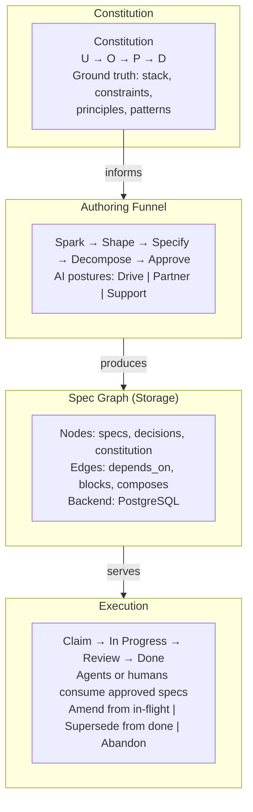
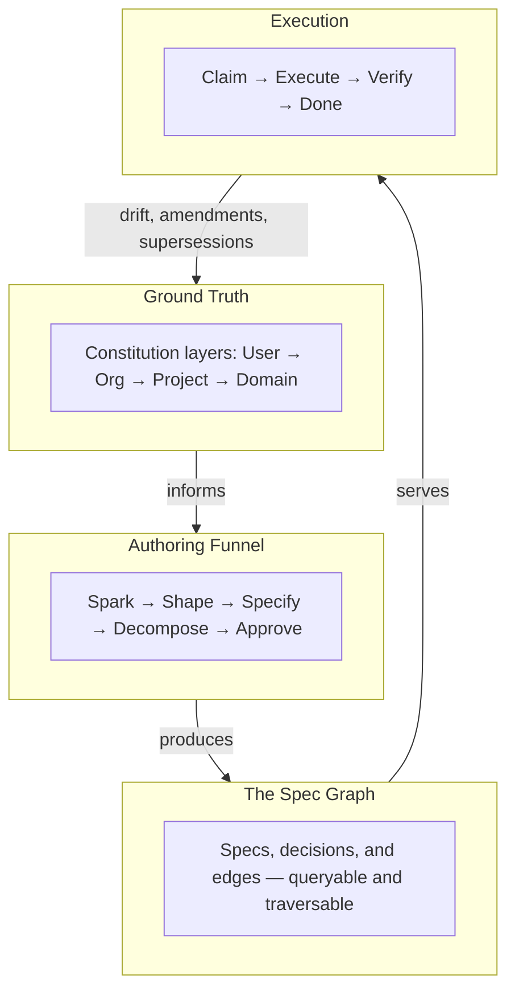

# Site Narrative Restructure — Implementation Plan

> **For agentic workers:** REQUIRED SUB-SKILL: Use superpowers:subagent-driven-development (recommended) or superpowers:executing-plans to implement this plan task-by-task. Steps use checkbox (`- [ ]`) syntax for tracking.

**Goal:** Restructure `site/docs/` around the SDD enterprise narrative — page renames, nav reorder, landing page rewrite, How It Works restructure, concept page updates, Problem page bridge, Quickstart fix, and full internal link resolution.

**Architecture:** Static site built with Zensical (`site/zensical.toml` config). All pages are markdown with Mermaid diagrams and Material-style admonitions. Page renames require `git mv`, `zensical.toml` nav update, and internal link fixup across all referencing files.

**Tech Stack:** Zensical static site generator, Markdown, Mermaid diagrams, Material for MkDocs admonition syntax.

**Design Spec:** `docs/superpowers/specs/2026-04-10-site-narrative-restructure-design.md`

---

## Task 1: Rename Constitution → Ground Truth

Rename the file and update its H1 and sidebar label. This is a prerequisite for all subsequent link fixups.

**Files:**

- Rename: `site/docs/concepts/constitution.md` → `site/docs/concepts/ground-truth.md`

- [ ] **Step 1: Rename the file**

```bash
cd /Volumes/Code/github.com/specgraph
git mv site/docs/concepts/constitution.md site/docs/concepts/ground-truth.md
```

- [ ] **Step 2: Update the H1 heading**

In `site/docs/concepts/ground-truth.md`, change line 1:

Old:

```markdown
# Constitution
```

New:

```markdown
# Ground Truth
```

- [ ] **Step 3: Update the subtitle**

In `site/docs/concepts/ground-truth.md`, change line 3:

Old:

```markdown
**The project's ground truth, encoded once and inherited by every spec.**
```

New:

```markdown
**Your project's architectural context, encoded once and inherited by every engineer and agent.**
```

- [ ] **Step 4: Commit**

```bash
git add site/docs/concepts/ground-truth.md
git commit -s -m "docs(site): rename constitution.md → ground-truth.md"
```

---

### Task 2: Rename Specs → The Spec Graph

Rename the file and update its H1 heading.

**Files:**

- Rename: `site/docs/concepts/specs.md` → `site/docs/concepts/spec-graph.md`

- [ ] **Step 1: Rename the file**

```bash
cd /Volumes/Code/github.com/specgraph
git mv site/docs/concepts/specs.md site/docs/concepts/spec-graph.md
```

- [ ] **Step 2: Update the H1 heading**

In `site/docs/concepts/spec-graph.md`, change line 1:

Old:

```markdown
# Specs & the Graph
```

New:

```markdown
# The Spec Graph
```

- [ ] **Step 3: Commit**

```bash
git add site/docs/concepts/spec-graph.md
git commit -s -m "docs(site): rename specs.md → spec-graph.md"
```

---

### Task 3: Update zensical.toml Navigation

Swap How It Works ↔ Quick Start, reorder concepts, and update renamed file references.

**Files:**

- Modify: `site/zensical.toml:11-22`

- [ ] **Step 1: Update the nav array**

Replace the entire `nav` block in `site/zensical.toml`:

Old:

```toml
nav = [
  "index.md",
  "problem.md",
  "quickstart.md",
  "how-it-works.md",
  { "Concepts" = ["concepts/index.md", "concepts/specs.md", "concepts/constitution.md", "concepts/authoring.md", "concepts/decisions.md", "concepts/passes.md", "concepts/slices.md", "concepts/drift.md", "concepts/lifecycle.md", "concepts/linting.md", "concepts/example-spec.md"] },
  { "Guides" = ["guides/index.md", "guides/cli-cookbook.md", "guides/sync.md"] },
  "cli-reference.md",
  "architecture.md",
  "ecosystem.md",
  "changelog.md",
]
```

New:

```toml
nav = [
  "index.md",
  "problem.md",
  "how-it-works.md",
  "quickstart.md",
  { "Concepts" = ["concepts/index.md", "concepts/ground-truth.md", "concepts/spec-graph.md", "concepts/decisions.md", "concepts/authoring.md", "concepts/passes.md", "concepts/slices.md", "concepts/drift.md", "concepts/lifecycle.md", "concepts/linting.md", "concepts/example-spec.md"] },
  { "Guides" = ["guides/index.md", "guides/cli-cookbook.md", "guides/sync.md"] },
  "cli-reference.md",
  "architecture.md",
  "ecosystem.md",
  "changelog.md",
]
```

Changes:

- `quickstart.md` and `how-it-works.md` swapped (positions 3 ↔ 4)
- `concepts/constitution.md` → `concepts/ground-truth.md` (moved to 1st in concepts)
- `concepts/specs.md` → `concepts/spec-graph.md` (moved to 2nd in concepts)
- `concepts/decisions.md` promoted to 3rd (before `authoring.md`)

- [ ] **Step 2: Commit**

```bash
git add site/zensical.toml
git commit -s -m "docs(site): reorder nav — How It Works before Quick Start, reorder concepts"
```

---

### Task 4: Fix All Internal Links After Renames

Update every file that links to the old `constitution.md` or `specs.md` paths.

**Files:**

- Modify: `site/docs/index.md` (2 links)
- Modify: `site/docs/how-it-works.md` (2 links)
- Modify: `site/docs/concepts/index.md` (2 links)
- Modify: `site/docs/concepts/passes.md` (1 link)

- [ ] **Step 1: Fix index.md links**

In `site/docs/index.md`:

Change:

```markdown
    [:octicons-arrow-right-24: Learn more](concepts/specs.md)
```

To:

```markdown
    [:octicons-arrow-right-24: Learn more](concepts/spec-graph.md)
```

Change:

```markdown
    [:octicons-arrow-right-24: Learn more](concepts/constitution.md)
```

To:

```markdown
    [:octicons-arrow-right-24: Learn more](concepts/ground-truth.md)
```

- [ ] **Step 2: Fix how-it-works.md links**

In `site/docs/how-it-works.md`:

Change:

```markdown
[:octicons-arrow-right-24: Deep dive into the constitution](concepts/constitution.md)
```

To:

```markdown
[:octicons-arrow-right-24: Deep dive into Ground Truth](concepts/ground-truth.md)
```

Change:

```markdown
[:octicons-arrow-right-24: See the full graph model](concepts/specs.md)
```

To:

```markdown
[:octicons-arrow-right-24: See the full graph model](concepts/spec-graph.md)
```

- [ ] **Step 3: Fix concepts/index.md links**

In `site/docs/concepts/index.md`:

Change:

```markdown
    [:octicons-arrow-right-24: Specs & the Graph](specs.md)
```

To:

```markdown
    [:octicons-arrow-right-24: The Spec Graph](spec-graph.md)
```

Change:

```markdown
    [:octicons-arrow-right-24: Constitution](constitution.md)
```

To:

```markdown
    [:octicons-arrow-right-24: Ground Truth](ground-truth.md)
```

- [ ] **Step 4: Fix concepts/passes.md link**

In `site/docs/concepts/passes.md`:

Change:

```markdown
[constitution](constitution.md)
```

To:

```markdown
[constitution](ground-truth.md)
```

- [ ] **Step 5: Verify no remaining references to old filenames**

```bash
cd /Volumes/Code/github.com/specgraph
grep -r "constitution\.md" site/docs/ --include="*.md"
grep -r "concepts/specs\.md\|](specs\.md)" site/docs/ --include="*.md"
```

Expected: No matches.

- [ ] **Step 6: Commit**

```bash
git add site/docs/index.md site/docs/how-it-works.md site/docs/concepts/index.md site/docs/concepts/passes.md
git commit -s -m "docs(site): update internal links for page renames"
```

---

### Task 5: Rewrite Landing Page (index.md)

Replace the hero, why block, grid cards, when-to-use callout, and project status section.

**Files:**

- Modify: `site/docs/index.md`

- [ ] **Step 1: Replace the hero section**

Replace lines 1–14 of `site/docs/index.md`:

Old:

```markdown
# SpecGraph

**Spec-Driven Development infrastructure — specifications as a queryable graph**

SpecGraph manages software specifications as nodes in a queryable graph, not
files in a folder. Dependencies, blocks, and compositions are first-class
edges. Architectural constraints live in a layered constitution that agents
query before writing a single line of code. An AI-collaborative authoring
funnel guides ideas from rough spark to execution-ready spec. The result is
a specification graph that humans and agents can query, traverse, and act on.

SpecGraph is a reference implementation of Spec-Driven Development (SDD)
infrastructure — the practice of treating specifications as the primary
engineering artifact and code as generated output.
```

New:

```markdown
# SpecGraph

**One ground truth. Every decision, every dependency, every engineer.**

SpecGraph is Spec-Driven Development at enterprise scale — a live, queryable
spec graph where architectural constraints are enforced, decisions are
traceable, and every member of your team starts with the full picture.
Human or AI, no one builds cold.
```

- [ ] **Step 2: Replace the Quick Start CTA link**

Old:

```markdown
[:octicons-arrow-right-24: Quick Start — author your first spec in under ten minutes](quickstart.md)
```

New:

```markdown
[:octicons-arrow-right-24: How It Works — understand the full SDD picture](how-it-works.md){ .md-button }
[:octicons-arrow-right-24: Quick Start — author your first spec in under ten minutes](quickstart.md)
```

- [ ] **Step 3: Replace the when-to-use callout**

Old:

```markdown
!!! tip "When to Use SpecGraph"
    SpecGraph is designed for teams where file-based specs break down:
    cross-spec queries, dependency tracking, multi-agent coordination, and
    layered governance at scale. For solo developers or small projects,
    simpler tools — markdown files,
    [Spec Kit](https://github.com/github/spec-kit), lightweight execution
    frameworks — are a better fit.
```

New:

```markdown
!!! tip "When to Use SpecGraph"
    SpecGraph is designed for enterprise teams where multiple engineers and
    AI agents need shared architectural context, live dependency tracking,
    and governance at the spec layer. For solo developers or small projects,
    simpler tools are a better fit.
```

- [ ] **Step 4: Expand the Why block**

Old:

```markdown
## Why

AI agents produce code fast. The bottleneck has moved upstream — to
specification, review, and verification. File-based specs cannot keep up:
no stable identity, no queryable dependencies, no governance enforcement,
no structured execution interface.

[:octicons-arrow-right-24: The full problem statement](problem.md)
```

New:

```markdown
## Why

AI coding teams produce code fast. The bottleneck has moved upstream — to
specification, governance, and verification. Static specs in files can't
coordinate parallel workers, can't enforce architectural constraints, and
can't answer "what's the critical path?" Spec-Driven Development solves
this. SpecGraph is SDD built for enterprise scale.

[:octicons-arrow-right-24: The full problem statement](problem.md)
```

- [ ] **Step 5: Replace the grid cards**

Replace the entire `## Core Concepts` section (from `## Core Concepts` through the closing `</div>`):

New:

```markdown
## Core Concepts

<div class="grid cards" markdown>

- :material-shield-check: **Ground Truth**

---

    No engineer starts cold. Your tech stack, constraints, and architectural
    decisions — encoded once, inherited by every engineer and agent. Query
    before you build.

    [:octicons-arrow-right-24: Learn more](concepts/ground-truth.md)

- :material-graph: **The Spec Graph**

---

    Query your architecture. Specs are live graph nodes with typed edges.
    Find what's blocked, trace the critical path, detect drift — one
    command, not a grep script.

    [:octicons-arrow-right-24: Learn more](concepts/spec-graph.md)

- :material-filter: **Authoring Funnel**

---

    From rough idea to execution-ready spec. A five-stage AI-collaborative
    pipeline — Spark, Shape, Specify, Decompose, Approve. Human or agent,
    the funnel adds just enough structure at each step.

    [:octicons-arrow-right-24: Learn more](concepts/authoring.md)

- :material-gavel: **Architectural Governance**

---

    Violations surface at the spec layer. Constitution checks, red-team
    passes, and drift detection catch problems before code review — or
    production.

    [:octicons-arrow-right-24: How it works](how-it-works.md)

</div>
```

- [ ] **Step 6: Fix the Project Status section**

Replace the current Project Status section (which has a duplicate changelog link):

Old:

```markdown
## Project Status

See the [changelog](changelog.md) for the latest release.

[Author your first spec](quickstart.md) in under ten minutes, or read
the [architecture overview](architecture.md) to understand the system
design. See the [changelog](changelog.md) for the latest release.
```

New:

```markdown
## Project Status

Core authoring, graph queries, ground truth, drift detection, and sync
adapters are shipped. CLI and Claude Code plugin available now.

See the [changelog](changelog.md) for the latest release.
[Author your first spec](quickstart.md) in under ten minutes, or read
the [architecture overview](architecture.md) to understand the system design.
```

- [ ] **Step 7: Commit**

```bash
git add site/docs/index.md
git commit -s -m "docs(site): rewrite landing page for SDD enterprise narrative"
```

---

### Task 6: Restructure How It Works Page

Reframe around SDD, rename sections, add live queries, posture sentences, cycle diagram, and closing links.

**Files:**

- Modify: `site/docs/how-it-works.md`

- [ ] **Step 1: Replace the opening paragraph**

Old:

```markdown
# How It Works

SpecGraph rests on four pillars: a **constitution** that captures project
ground truth, a **graph-native spec schema** that makes relationships
queryable, an **AI-collaborative authoring funnel** that guides ideas from
spark to execution-ready spec, and a **storage + query layer** that keeps
every artifact live. This page walks through each pillar and shows how they
fit together.
```

New:

```markdown
# How It Works

Spec-Driven Development has four layers. SpecGraph implements all of them:
**Ground Truth** that anchors every authoring session, a **Spec Graph** that
makes relationships queryable, an **Authoring Funnel** that guides ideas to
execution-ready specs, and **Execution** that keeps the loop closed with
drift detection and governance. This page walks through each layer and shows
how they fit together.
```

- [ ] **Step 2: Rename "The Constitution" section to "Ground Truth"**

Old:

```markdown
## The Constitution

Every SpecGraph project begins with a constitution — a layered document
that records the decisions, constraints, and conventions that define how
the project works.
```

New:

```markdown
## Ground Truth

Every SpecGraph project begins with a constitution — a layered document
that records the decisions, constraints, and conventions that define how
the project works. This is the ground truth: the thing every engineer
and every agent queries before building anything.
```

- [ ] **Step 3: Add "What engineers and agents receive" subsection after the constitution deep-dive link**

After the line `[:octicons-arrow-right-24: Deep dive into Ground Truth](concepts/ground-truth.md)`, insert:

```markdown

### What engineers and agents receive

Run `specgraph constitution emit --format claude-md` to see the ground truth
as your tools see it. Here is a realistic snippet:

```

## Project Constitution

Generated by SpecGraph. Do not edit manually.

## Tech Stack

- **Primary language:** go
- **Allowed languages:** go, python
- **Forbidden languages:** java
  - java: No Java expertise

**Frameworks:**

- api: ConnectRPC
- testing: testify

**Infrastructure:**

- ci: GitHub Actions
- runtime: Docker

## Principles

- **backward-compat**: All API changes must be backward compatible (External consumers)

## Constraints

- No ORMs
- All secrets via Secret Manager

## Anti-patterns

- **Shared mutable state** — Caused cascading failure. Instead: Event-driven

```text

This is what agents query before writing a single line of code. Every
constraint, every principle, every tech choice — resolved from all
constitution layers and emitted as a single document.
```

Note: The outer code fence around the emit snippet must use 4 backticks (`````) to avoid breaking the inner backtick-free plain text block.

- [ ] **Step 4: Rename "Specs as a Graph" section to "The Spec Graph"**

Old:

```markdown
## Specs as a Graph

Every specification is a **node** in a queryable graph. Relationships
between specs are **first-class edges**, not filename references or
hand-maintained lists:
```

New:

```markdown
## The Spec Graph

Every specification is a **node** in a queryable graph. Relationships
between specs are **first-class edges**, not filename references or
hand-maintained lists:
```

- [ ] **Step 5: Add "Live Queries" subsection after the spec graph deep-dive link**

After the line `[:octicons-arrow-right-24: See the full graph model](concepts/spec-graph.md)`, insert:

````markdown

### Live Queries

These are questions no static folder can answer — but the spec graph handles with a single command:

```bash
# What's on the critical path to the checkout release?
specgraph critical-path checkout-flow
```

```text
## Critical Path

| Slug            | Stage       |
|-----------------|-------------|
| auth-tokens     | in_progress |
| payment-service | approved    |
| checkout-flow   | approved    |
```

```bash
# What breaks if auth-tokens changes?
specgraph impact auth-tokens
```

```text
## Impacted Specs

| Slug            | Stage    |
|-----------------|----------|
| payment-service | approved |
| session-mgmt    | approved |
| checkout-flow   | approved |
```

```bash
# What's ready to claim right now?
specgraph ready
```

```text
## Ready Specs

| Slug          | Stage    |
|---------------|----------|
| rate-limiter  | approved |
| audit-logging | approved |
```

See the [CLI Cookbook](guides/cli-cookbook.md) for the full set of graph queries.
````

- [ ] **Step 6: Add posture sentences to the Authoring Funnel section**

After the posture bullet list (after the "Support" bullet), add:

```markdown

The funnel adapts to how your team works. Drive mode lets the AI lead and
deliver a complete draft for review. Support mode keeps a senior engineer
in control with AI filling gaps on request.
```

- [ ] **Step 7: Reframe the Execution-Ready Output section**

Old:

```markdown
## Execution-Ready Output

When a spec reaches the **Approved** stage, it becomes a claimable work
unit. Each approved spec carries everything an executor — human or agent —
needs to act without further clarification: **verify criteria** that define
"done," **invariants** that must hold before and after execution, and
**interface contracts** that specify inputs and outputs. Dependencies are
explicit graph edges, so the executor knows exactly what must be complete
before starting.

Agents (or humans) **claim** an approved spec, locking it to prevent
duplicate work. They execute against the verify criteria and report
completion. If the invariants are violated or the criteria are not met, the
claim fails and the spec returns to the pool. The graph structure ensures
work proceeds in dependency order.
```

New:

```markdown
## Execution-Ready Output

When a spec reaches the **Approved** stage, it becomes a claimable work
unit. Each approved spec carries everything an executor — human or agent —
needs to act without further clarification: **verify criteria** that define
"done," **invariants** that must hold before and after execution, and
**interface contracts** that specify inputs and outputs. Dependencies are
explicit graph edges, so the executor knows exactly what must be complete
before starting.

Agents (or humans) **claim** an approved spec, locking it to prevent
duplicate work. They execute against the verify criteria and report
completion. If the invariants are violated or the criteria are not met, the
claim fails and the spec returns to the pool. The graph structure ensures
work proceeds in dependency order.

When upstream specs change, downstream dependencies surface as drift —
reviewed and acknowledged before execution continues, not discovered in
code review.
```

- [ ] **Step 8: Replace the "Putting It Together" diagram with a cycle**

Replace the entire Mermaid diagram:

Old:

````markdown

````

New:

````markdown

````

The feedback arrow from Execution back to Ground Truth makes the cycle visible — SDD is not a waterfall.

- [ ] **Step 9: Add closing "Where to go next" section**

After the diagram, add:

```markdown

---

## Where to Go Next

- **[The Problem](problem.md)** — the full evidence-backed case for SDD
- **[Quick Start](quickstart.md)** — get running in under 10 minutes
- **[Ground Truth](concepts/ground-truth.md)** — the first concept to understand
```

- [ ] **Step 10: Commit**

```bash
git add site/docs/how-it-works.md
git commit -s -m "docs(site): restructure How It Works around SDD narrative"
```

---

### Task 7: Update Concept Index Page

Reorder cards, fix passes card description, update copy for renamed concepts.

**Files:**

- Modify: `site/docs/concepts/index.md`

- [ ] **Step 1: Replace the entire file content**

Replace `site/docs/concepts/index.md` with:

```markdown
# Concepts

SpecGraph is built on a few core concepts. Each page in this section explains
one in detail — what it is, why it matters, and how it fits into the overall
framework.

<div class="grid cards" markdown>

- :material-shield-check: **Ground Truth**

---

    Your project's architectural context — tech stack, constraints, and
    conventions — encoded once so engineers and agents never start cold.

    [:octicons-arrow-right-24: Ground Truth](ground-truth.md)

- :material-graph: **The Spec Graph**

---

    Specifications are nodes in a queryable graph with first-class dependency
    edges — not files in a folder.

    [:octicons-arrow-right-24: The Spec Graph](spec-graph.md)

- :material-gavel: **Decisions**

---

    Architectural decisions are first-class graph nodes with bidirectional edges
    to the specs they influence.

    [:octicons-arrow-right-24: Decisions](decisions.md)

- :material-filter: **Authoring Funnel**

---

    A five-stage pipeline (Spark through Approve) that transforms rough ideas
    into execution-ready, structured specifications.

    [:octicons-arrow-right-24: Authoring Funnel](authoring.md)

- :material-shield-search: **Analytical Passes & Safety**

---

    Red team, peripheral vision, consistency, and simplicity checks —
    posture-aware analysis that runs at each authoring stage.

    [:octicons-arrow-right-24: Passes & Safety](passes.md)

- :material-puzzle: **Slices & Execution Units**

---

    Decompose creates independently claimable slice nodes in the graph — each
    with its own lifecycle from open through claimed to completed.

    [:octicons-arrow-right-24: Slices](slices.md)

- :material-swap-horizontal: **Drift Detection**

---

    Per-edge content hashing detects when upstream specs change after a
    dependency was baselined — keeping downstream assumptions honest.

    [:octicons-arrow-right-24: Drift Detection](drift.md)

- :material-history: **Lifecycle Transitions**

---

    Amendment, supersession, and abandonment — what happens when in-flight
    or completed specs need to change, with full changelog and diff support.

    [:octicons-arrow-right-24: Lifecycle Transitions](lifecycle.md)

- :material-check-decagram: **Spec Linting**

---

    Structural validation catches malformed specs, broken edges, and
    constitution violations before deeper analytical passes run.

    [:octicons-arrow-right-24: Spec Linting](linting.md)

</div>
```

Changes from current:

- Ground Truth replaces Constitution (1st position, new copy)
- The Spec Graph replaces Specs & the Graph (2nd position)
- Decisions promoted to 3rd (was 4th)
- Authoring Funnel moved to 4th (was 3rd)
- Analytical Passes card description fixed — was "detect cycles, unreachable specs, missing verify criteria, and other structural problems" (that's linting, not passes), now correctly describes the analytical passes

- [ ] **Step 2: Commit**

```bash
git add site/docs/concepts/index.md
git commit -s -m "docs(site): reorder concept cards, fix passes description, update renamed concepts"
```

---

### Task 8: Add "What engineers and agents receive" to Ground Truth Page

Add the emit output snippet to the concept page (same content as How It Works, cross-referenced).

**Files:**

- Modify: `site/docs/concepts/ground-truth.md`

- [ ] **Step 1: Add emit output section before "Why It Matters"**

In `site/docs/concepts/ground-truth.md`, before the `## Why It Matters` section (currently the last section), insert:

```markdown
---

## What Engineers and Agents Receive

The constitution is consumed by tools — not just humans reading YAML. Run
`specgraph constitution emit --format claude-md` to see the resolved ground
truth as your tools see it:

```

## Project Constitution

Generated by SpecGraph. Do not edit manually.

## Tech Stack

- **Primary language:** go
- **Allowed languages:** go, python
- **Forbidden languages:** java
  - java: No Java expertise

**Frameworks:**

- api: ConnectRPC
- testing: testify

**Infrastructure:**

- ci: GitHub Actions
- runtime: Docker

## Principles

- **backward-compat**: All API changes must be backward compatible (External consumers)

## Constraints

- No ORMs
- All secrets via Secret Manager

## Anti-patterns

- **Shared mutable state** — Caused cascading failure. Instead: Event-driven

```text

All four layers — User, Org, Project, Domain — are resolved into a single
merged document. Every constraint, principle, and tech choice carries
provenance so you can trace where it was set. Agents query this before
writing a single line of code.

The `emit` command supports three output formats:

| Format | Flag | Target |
|---|---|---|
| Claude Code | `--format claude-md` | CLAUDE.md |
| Cursor | `--format cursorrules` | .cursorrules |
| Agents.md | `--format agents-md` | AGENTS.md |

Use `--output <path>` to write directly to a file. Without it, content prints
to stdout.
```

Note: Use 4-backtick fences for the outer code block to avoid breaking the inner emit snippet.

- [ ] **Step 2: Commit**

```bash
git add site/docs/concepts/ground-truth.md
git commit -s -m "docs(site): add emit output section to Ground Truth concept page"
```

---

### Task 9: Add Live Queries to Spec Graph Page

Add the same live queries block from How It Works to the concept page.

**Files:**

- Modify: `site/docs/concepts/spec-graph.md`

- [ ] **Step 1: Add "Live Queries" section before "Why a Graph?"**

In `site/docs/concepts/spec-graph.md`, before the `## Why a Graph?` section, insert:

````markdown
---

## Live Queries

The graph answers questions that no static folder can. These are real CLI
commands with realistic output:

```bash
# What's on the critical path to the checkout release?
specgraph critical-path checkout-flow
```

```text
## Critical Path

| Slug            | Stage       |
|-----------------|-------------|
| auth-tokens     | in_progress |
| payment-service | approved    |
| checkout-flow   | approved    |
```

```bash
# What breaks if auth-tokens changes?
specgraph impact auth-tokens
```

```text
## Impacted Specs

| Slug            | Stage    |
|-----------------|----------|
| payment-service | approved |
| session-mgmt    | approved |
| checkout-flow   | approved |
```

```bash
# What's ready to claim right now?
specgraph ready
```

```text
## Ready Specs

| Slug          | Stage    |
|---------------|----------|
| rate-limiter  | approved |
| audit-logging | approved |
```

```bash
# What does the auth-tokens spec depend on?
specgraph deps auth-tokens --transitive
```

```text
## Dependencies (transitive)

| Slug        | Stage       |
|-------------|-------------|
| user-model  | done        |
| db-schema   | done        |
```

See the [CLI Cookbook](../guides/cli-cookbook.md) for the full set of graph
queries.
````

- [ ] **Step 2: Commit**

```bash
git add site/docs/concepts/spec-graph.md
git commit -s -m "docs(site): add live queries section to Spec Graph concept page"
```

---

### Task 10: Add Governance Opener to Decisions Page

Add a governance-framed opening paragraph that connects decisions to graph queries.

**Files:**

- Modify: `site/docs/concepts/decisions.md`

- [ ] **Step 1: Add governance framing after "What are Decisions?"**

In `site/docs/concepts/decisions.md`, after the `## What are Decisions?` heading and before the first paragraph, insert a new opening paragraph:

Old (first paragraph after heading):

```markdown
A decision is a **first-class node** in the spec graph. When you make a choice
during authoring — "use Postgres for token storage", "authenticate via OAuth2,
not API keys" — that choice becomes a graph node with a stable identity, a
lifecycle, and bidirectional edges to every spec it touches.
```

New (replace with):

```markdown
In most teams, architectural decisions live in ADR files that drift from the
specs they influenced. In SpecGraph, decisions are graph nodes with
bidirectional edges — you can query every spec a decision shaped, and every
decision a spec was built on.

A decision is a **first-class node** in the spec graph. When you make a choice
during authoring — "use Postgres for token storage", "authenticate via OAuth2,
not API keys" — that choice becomes a graph node with a stable identity, a
lifecycle, and bidirectional edges to every spec it touches.
```

- [ ] **Step 2: Commit**

```bash
git add site/docs/concepts/decisions.md
git commit -s -m "docs(site): add governance-framed opener to Decisions page"
```

---

### Task 11: Add "What SDD Does About This" Bridge to Problem Page

Add a closing section that maps each of the five gaps to its SpecGraph answer.

**Files:**

- Modify: `site/docs/problem.md`

- [ ] **Step 1: Add bridge section at the end of the file**

After the last paragraph of the "The Opportunity" section (ending with "The patterns matter more than any particular tool."), append:

```markdown

---

## What SDD Does About This

| Gap | SpecGraph answer |
|---|---|
| No Ground Truth | The constitution — layered architectural context every engineer and agent queries before building |
| No Governance | Constitution check and analytical passes enforce constraints at the spec layer, before code is written |
| No Addressability | Every spec has a stable ULID and slug — reorganise folders, rename files, references hold |
| No Execution Interface | Approved specs carry verify criteria, invariants, interface contracts, and typed dependencies — structured input for any executor |
| No Live Query | The spec graph answers `critical-path`, `impact`, `ready`, `drift` — direct traversal, not a grep script |

This is Spec-Driven Development. SpecGraph is what it looks like at enterprise scale.

[:octicons-arrow-right-24: How It Works](how-it-works.md){ .md-button }
```

- [ ] **Step 2: Commit**

```bash
git add site/docs/problem.md
git commit -s -m "docs(site): add SDD bridge section to Problem page"
```

---

### Task 12: Remove Stale Note Callout from Quickstart

Remove the misleading "Note" about unpublished releases — v0.5.0 shipped April 4th.

**Files:**

- Modify: `site/docs/quickstart.md:38-40`

- [ ] **Step 1: Remove the stale note**

In `site/docs/quickstart.md`, delete these lines (38-40):

```markdown
> **Note:** Homebrew, binary, and Docker install paths require a published
> release. To build from source instead:
> `go install github.com/specgraph/specgraph/cmd/specgraph@latest`
```

- [ ] **Step 2: Commit**

```bash
git add site/docs/quickstart.md
git commit -s -m "docs(site): remove stale unpublished-release note from quickstart"
```

---

### Task 13: Build Verification

Confirm the site builds clean with no broken links.

**Files:** None (verification only)

- [ ] **Step 1: Build the site**

```bash
cd /Volumes/Code/github.com/specgraph/site && task build
```

Expected: Clean build, no errors, no broken link warnings.

- [ ] **Step 2: Verify no remaining references to old filenames**

```bash
cd /Volumes/Code/github.com/specgraph
grep -rn "constitution\.md" site/docs/ --include="*.md"
grep -rn "concepts/specs\.md\|](specs\.md)" site/docs/ --include="*.md"
```

Expected: No matches (the word "constitution" will appear in prose, but not as a `.md` link target).

- [ ] **Step 3: Read the landing page aloud**

Open `site/docs/index.md` and verify the hero + why block + grid cards tell a coherent story in under 60 seconds.

- [ ] **Step 4: Check the four-page journey**

Navigate: Landing → How It Works → Ground Truth → The Spec Graph. The journey should feel like one continuous argument.

- [ ] **Step 5: Verify live query output format matches actual code**

The live query examples use `## Ready Specs` / `## Critical Path` / `## Impacted Specs` / `## Dependencies (transitive)` headers and `| Slug | Stage |` tables — matching the actual `render.NodeRefList` output format from `internal/render/noderef.go`.

- [ ] **Step 6: Verify emit snippet matches actual code**

The emit snippet matches the output format from `internal/emitter/emitter.go`: header, `## Tech Stack`, `## Principles`, `## Constraints`, `## Anti-patterns` sections with the exact formatting the emitter produces.
