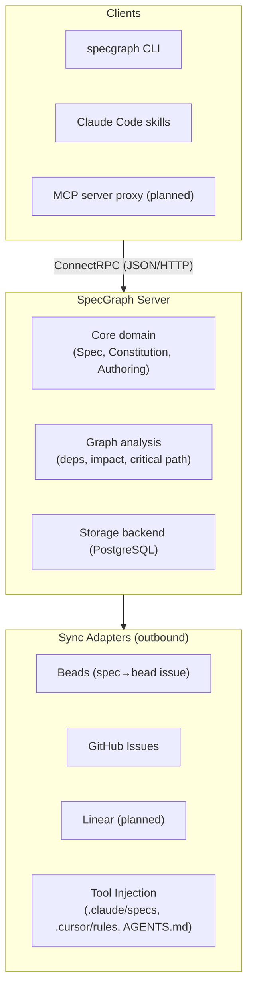
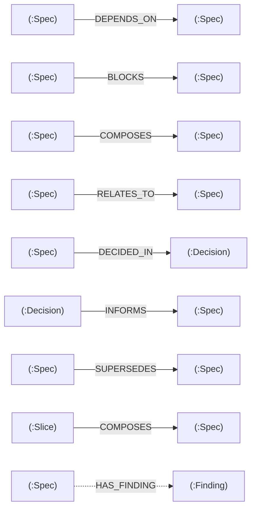
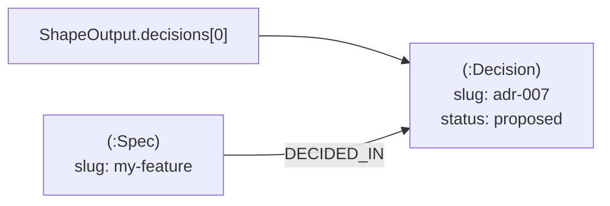
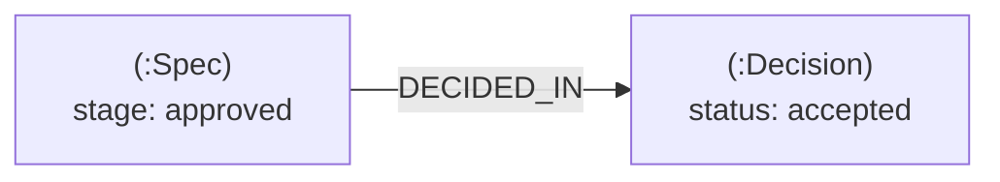

# Architecture

SpecGraph uses a client/server architecture. A single server process owns all
domain logic and storage. Clients connect via ConnectRPC — JSON over HTTP,
gRPC-compatible, protobuf-typed. The server is the single source of truth;
there is no embedded or library mode.

---

## System Diagram



---

## API Surface

SpecGraph exposes its functionality through ConnectRPC services, each focused on
a single domain concern:

| Service | Description |
|---------|-------------|
| **SpecService** | Create, get, list, update specs, view changelogs, and compare versions — the primary resource in the graph. |
| **DecisionService** | Create and manage decisions — first-class graph nodes with bidirectional edges to specs. |
| **ConstitutionService** | Layer merging, validation, and queries across the User → Org → Project → Domain hierarchy. |
| **AuthoringService** | Authoring funnel RPCs: Spark, Shape, Specify, Decompose, Approve, Amend, Supersede. |
| **ClaimService** | Claim and release specs for execution. Time-limited leases prevent duplicate work. |
| **GraphService** | Dependency queries, impact analysis, critical-path computation, and ready-spec detection. |
| **LifecycleService** | Lifecycle transitions (amend, supersede, abandon), drift detection, and spec linting. |
| **ExecutionService** | Execution bundles, prime context, and progress/blocker/completion reporting. |
| **SliceService** | List, get, claim, and complete decomposition slices. Slices are created by `AuthoringService.Decompose`. |
| **AnalyticalPassService** | Run analytical passes and manage findings for specs. |
| **SyncService** | Push specs to external systems (Beads, GitHub) and inject context into tool files. |
| **ExportService** | Export a project to JSON, import from JSON, and verify export integrity. |
| **ServerService** | Health checks. |

All services use protobuf message types on the wire and generate both `.pb.go`
and `.connect.go` files from the proto definitions.

---

## Storage

SpecGraph uses a pluggable storage backend behind composed interfaces — the
core domain never talks to the database directly.

**PostgreSQL** — The shipped backend. Uses pgx v5 with recursive CTEs for
graph traversals (transitive dependencies, impact analysis, critical path),
JSONB for structured fields, and optimistic locking via version guards.

The storage layer is composed of focused interfaces rather than one
monolithic backend:

```go
// Core resource backends
type SpecBackend interface { ... }
type DecisionBackend interface { ... }
type ConstitutionBackend interface { ... }
type SliceBackend interface { ... }

// Graph operations
type GraphBackend interface { ... }

// Lifecycle and authoring
type AuthoringBackend interface { ... }
type LifecycleBackend interface { ... }
type ClaimBackend interface { ... }

// Support
type ChangeLogBackend interface { ... }
type ConversationBackend interface { ... }
type FindingsBackend interface { ... }
type SyncBackend interface { ... }
type ExecutionBackend interface { ... }
```

Storage interfaces use domain types, not protobuf types. The ConnectRPC
handlers in `internal/server/` translate between protobuf and domain types
before calling the backend.

---

## Graph Data Model

Specs, constitutions, decisions, and agents are nodes. Relationships between them
are typed edges:



Dashed edges (HAS_FINDING) are internal — not exposed via AddEdge/RemoveEdge RPCs.

These edges are first-class — they carry metadata, support traversal queries,
and power the graph analysis operations (impact analysis, critical path, ready
detection).

---

## Decision Promotion Lifecycle

Decisions follow a two-step promotion flow through the authoring funnel:

**Step 1 — Shape creates decision nodes.** When `AuthoringService.Shape` stores
its output, each `DecisionInput` in `ShapeOutput.decisions` is promoted to a
first-class Decision graph node with a `DECIDED_IN` edge from the spec
(per ADR-003: Decisions as Graph Nodes).
This happens inside `StoreShapeOutput` in a single transaction.



From this point forward, decisions are queryable graph nodes. The Specify and
Decompose stages can reference them, and impact analysis traverses through them.

**Step 2 — Approve accepts linked decisions.** When `AuthoringService.Approve`
transitions a spec to the approved stage, it calls `acceptLinkedDecisions` which
traverses all `DECIDED_IN` edges from that spec and transitions each linked
decision from `proposed` to `accepted`. Both the stage transition and decision
acceptance run in a single transaction — if any decision fails to accept, the
approval is rolled back.



This separation means decisions are visible and linkable throughout the funnel
but only reach their final state when the spec is approved.

---

## Why ConnectRPC?

ConnectRPC is browser-compatible (JSON over HTTP) while maintaining gRPC wire
compatibility and protobuf type safety. Plain gRPC cannot be called from
browsers directly. ConnectRPC provides both: structured APIs for tools, human-readable JSON
for debugging.

---

## Authentication

SpecGraph supports token-based authentication via an interceptor that
validates requests before they reach service handlers.

- **OIDC** — Multi-provider support for OpenID Connect. Configure providers
  in the server config; tokens are validated against the provider's JWKS
  endpoint.
- **Dashboard sessions** — Cookie-based authentication for the web dashboard.
  Sessions are created on login and validated on each request.
- **Auth interceptor** — A ConnectRPC interceptor (`internal/auth/`) that
  extracts and validates credentials from request headers or cookies before
  forwarding to handlers.

Authentication is optional — the server runs without it for local
development. Enable it in the server configuration.

---

## Code Organization

```text
specgraph/
├── proto/specgraph/v1/     # Protobuf service definitions (source of truth)
├── gen/                    # Generated Go code (committed for module compat)
├── internal/
│   ├── auth/               # Auth interceptor + OIDC provider config
│   ├── authoring/          # Authoring funnel (stages, postures, passes)
│   ├── config/             # YAML-based server configuration
│   ├── docker/             # Docker Compose templates for DB containers
│   ├── drift/              # Drift detection engine
│   ├── driftscope/         # Drift scope analysis
│   ├── emitter/            # Constitution → tool file renderers
│   ├── export/             # Project export/import/verify engine
│   ├── inject/             # Tool injection (.claude/specs, .cursor/rules, AGENTS.md)
│   ├── linter/             # Spec linter (schema, edges, cycles)
│   ├── notify/             # Change notification subscribers (impact logging)
│   ├── render/             # Markdown renderers for CLI output
│   ├── server/             # ConnectRPC handlers + proto↔domain converters
│   ├── service/            # systemd/launchd integration
│   ├── storage/            # Backend interface + implementations
│   │   └── postgres/       # PostgreSQL implementation (pgx v5, testcontainers)
│   ├── sync/               # Sync adapters (Beads, GitHub)
│   └── xdg/                # XDG base directory paths
├── cmd/specgraph/          # CLI entry point
├── e2e/                    # End-to-end tests (Ginkgo/Gomega)
├── plugin/                 # Claude Code skills and hooks
└── Taskfile.yml            # Build automation
```

Build automation is via [Taskfile.dev](https://taskfile.dev). Run `task --list`
for the full catalog. The key commands are `task build`, `task test`,
`task proto`, `task lint`, and `task fmt`. Generated code in `gen/` is
committed — regenerate with `task proto` after changing `.proto` files.
