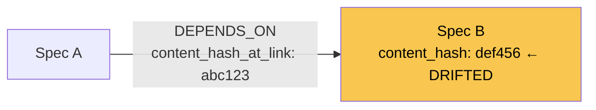

# Drift Detection

When a spec declares a dependency on another spec, SpecGraph records a snapshot
of the upstream's content hash at the moment the edge is created. **Drift**
occurs when the upstream spec is later modified — the downstream spec's
dependency edge still references the old hash, meaning its assumptions may be
based on a version of the upstream that no longer exists. Drift detection gives
teams a reliable signal that a spec needs to be reviewed in light of upstream
changes, before that staleness silently propagates into execution.

---

## How It Works

Every `DEPENDS_ON` edge carries a `content_hash_at_link` property. When the
edge is created (via `specgraph edge add`, `specgraph decompose`, or
`specgraph update`), the upstream spec's current `content_hash` is written into
that property.

At detection time, SpecGraph compares `content_hash_at_link` against the
upstream's live `content_hash`. A mismatch means drift.



Spec A was linked when Spec B had hash `abc123`. Spec B has since changed to
`def456`. SpecGraph surfaces this as a drift finding on Spec A's edge toward
Spec B.

An empty `content_hash_at_link` (possible on edges created before drift
tracking was introduced) is always treated as drifted. Run
`specgraph drift acknowledge <slug> --all --note "baseline"` to write current
hashes and silence the noise.

---

## Per-Edge Acknowledgment

Drift is tracked **per edge**, not per spec. A spec with three upstream
dependencies can drift on one edge without the other two being affected.
Acknowledgment re-baselines a single edge by writing the upstream's current
`content_hash` into `content_hash_at_link`.

You can acknowledge one upstream at a time or acknowledge all drifted edges for
a spec in a single command. Either way, each acknowledgment records a required
note explaining why the drift is acceptable or what was reviewed.

---

## CLI Usage

**Check for drift**

```
specgraph drift [slug] [--scope deps|interfaces|verify] [--json]
```

- Omit `slug` to check all specs in the graph.
- `--scope` narrows which dimensions to evaluate:
  - `deps` — dependency edge hashes only (default)
  - `interfaces` — interface contract compatibility
  - `verify` — verification criteria coverage
- `--json` emits machine-readable output for scripting or CI.

**Acknowledge drift**

```
specgraph drift acknowledge <slug> --note "reason" [--upstream <dep-slug> | --all]
```

- `--note` is **required** — document why the drift is accepted or what was reviewed.
- `--upstream <dep-slug>` — acknowledge a single upstream dependency.
- `--all` — acknowledge every drifted edge on the spec in one operation.

Exactly one of `--upstream` or `--all` must be provided.

!!! info "Planned"
    The `--scope interfaces` and `--scope verify` options are defined but not
    yet implemented. Currently only `deps` (dependency edge hash comparison)
    is functional. Omitting `--scope` defaults to dependency-only checking.

---

## Worked Example

Two specs: `payment-service` depends on `auth-tokens`.

```bash
# Create the dependency
specgraph edge add payment-service auth-tokens --type depends_on
# Edge is created with content_hash_at_link = auth-tokens' current hash
```

Later, the auth spec is updated to add a new token field:

```bash
specgraph update auth-tokens --note "Add refresh_token field to contract"
# auth-tokens now has a new content_hash
```

Check for drift on the downstream spec:

```bash
specgraph drift payment-service
```

Output indicates `payment-service → auth-tokens` has drifted. Review the
upstream changes, then acknowledge:

```bash
specgraph drift acknowledge payment-service \
  --upstream auth-tokens \
  --note "Reviewed auth-tokens refresh_token addition; payment-service unaffected"
```

The edge's `content_hash_at_link` is updated to the current hash of
`auth-tokens`. Subsequent drift checks report clean.
