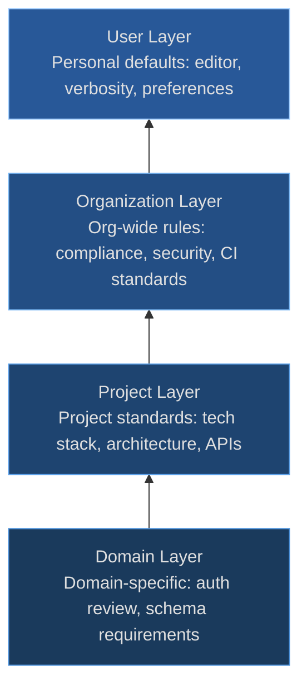

# Ground Truth

**Your project's architectural context, encoded once and inherited by every engineer and agent.**

---

## What Is a Constitution?

A constitution is the document that tells SpecGraph — and any agent working within
it — what your project values, allows, forbids, and expects. It captures the
decisions your team has already made: which languages you use, which architectural
principles you follow, which patterns are banned and why.

Without a constitution, every authoring session starts cold. An agent drafting
spec #47 asks "what language should this be in?" even though the team settled on
Go eighteen months ago. A new engineer writes a spec proposing a shared database
between services, unaware of the postmortem that led to an explicit ban on that
pattern. The constitution fixes this: project context becomes queryable and
enforceable, not just documented.

---

## Four Layers

The constitution uses a layered inheritance model. Each layer adds specificity,
and more specific layers override more general ones. All layers remain visible,
so you can always trace where a constraint originated.



More specific layers (bottom) override more general ones (top).

**User Layer** — Personal defaults that follow you across projects. "I prefer
terse specs." "I use neovim." These do not affect team behavior; they shape
how SpecGraph interacts with you individually.

**Organization Layer** — Rules that apply to every project in the org. "SOC2
compliance is mandatory." "All services must expose health check endpoints."
"Production deployments require two approvals." These encode organizational
policy that no single project should override without explicit justification.

**Project Layer** — Standards specific to this project. "This project uses
Go 1.25 with the chi router." "Internal communication is ConnectRPC; external APIs
are REST." "PostgreSQL 15 on Cloud SQL." This is the layer most teams populate
first and most heavily.

**Domain Layer** — Rules scoped to a bounded context within the project. "Auth
specs require a security review pass." "Data pipeline specs must include schema
definitions." "Payment specs must reference the PCI compliance checklist." This
layer prevents domain-specific requirements from cluttering the project-wide
constitution.

The override model is simple: if the Org layer says "use REST for all APIs" but
the Project layer says "use ConnectRPC for internal services," the project layer
wins for internal services. The org layer's REST rule still applies to anything
the project layer doesn't explicitly override. Every resolved value carries a
provenance trail — you can always see which layer set it and which layers it
overrode.

### Importing layers

Use `specgraph constitution import` to load a constitution file into a specific
layer. The default layer is `project`:

```bash
# Import org-wide standards into the org layer
specgraph constitution import org-standards.yaml --layer org

# Import project overrides (default layer: project)
specgraph constitution import project-overrides.yaml
```

### Merge semantics

When SpecGraph resolves the effective constitution, it merges all present layers
from most-general to most-specific. Higher layers win:

| Field type | Merge behavior |
|------------|----------------|
| Scalars (`primary`, `runtime`, etc.) | Highest layer wins |
| String lists (`allowed`, `constraints`) | Union of all layers |
| Keyed objects (`principles` by `id`, `antipatterns` by `pattern`, `references` by `path`) | Merge by key — highest layer entry wins |

### The `$delete` directive

A higher layer can remove an item inherited from a lower layer by adding
`$delete: true` to the keyed entry:

```yaml
# project-overrides.yaml
layer: project
principles:
  - id: "p3"
    $delete: true
```

This removes the `p3` principle from the merged result even if it exists in the
org or user layer. The directive works on any keyed list field (`principles`,
`antipatterns`, `references`).

### Viewing the constitution

```bash
# View the merged (effective) constitution across all layers
specgraph constitution show

# View a single raw layer without merging
specgraph constitution show --layer org
```

### Provenance

The SpecGraph dashboard annotates each field and list item with a layer
badge — `[user]`, `[org]`, `[project]`, or `[domain]` — showing which layer
set it. When a lower-layer value was overridden, the override source is
shown inline so the decision is always traceable. Emitted tool files
(`constitution emit`) reflect the merged result without layer annotations.

---

## What It Captures

### Tech Config

Languages (primary, allowed, and forbidden — with reasons for each prohibition),
frameworks, infrastructure targets, API standards, and data strategies.

### Principles

Architecture tenets with rationales and explicit exceptions. A principle without
a rationale is just a rule; a rationale turns it into a decision that can be
re-evaluated when circumstances change. Example: "All API changes must be
backward compatible" — rationale: "External consumers we can't force-upgrade."

### Process

Spec review requirements, security review gates, deployment procedures, and
documentation standards. These define the workflow around specs, not just their
content.

### Constraints

Hard rules that specs must not violate. "No direct database access from API
handlers." "All secrets via Secret Manager, never environment variables." "No
new dependencies without team review." Constraints are enforced during
authoring — a spec that violates one is flagged before it reaches approval.

### Antipatterns

Known bad patterns paired with recommended alternatives. These encode lessons
learned, often from incidents. "Shared mutable state between services" is not
just discouraged — it's documented with the 2023 cascading failure that
motivated the ban and the event-driven alternative the team adopted.

### References

Links to ADRs, runbooks, external documentation, and other artifacts that
provide deeper context. The constitution captures decisions; references point
to the full reasoning behind them.

---

## Example

A realistic project-layer constitution for a Go microservices team:

```yaml
constitution:
  layer: project
  name: "auth-service"
  tech:
    languages:
      primary: go
      allowed: [go, python]
      forbidden: [java]
      forbidden_reasons:
        java: "Team has no Java expertise"
    frameworks:
      api: "net/http + chi router"
      testing: "go test + testify"
    infrastructure:
      runtime: "Kubernetes on GCP (GKE)"
      database: "PostgreSQL 15 (Cloud SQL)"
      ci: "GitHub Actions"
  principles:
    - id: backward-compat
      principle: "All API changes must be backward compatible"
      rationale: "External consumers we can't force-upgrade"
    - id: no-shared-db
      principle: "Services own their data. No shared databases."
      rationale: "2023 outage postmortem"
  constraints:
    - "No new dependencies without team review"
    - "No direct database access from API handlers"
    - "All secrets via Secret Manager, never env vars"
  antipatterns:
    - pattern: "Shared mutable state between services"
      why: "Caused 2023-03 cascading failure"
      instead: "Event-driven with Pub/Sub"
```

SpecGraph validates new specs against this constitution automatically.

---

## What Engineers and Agents Receive

The constitution is consumed by tools — not just humans reading YAML. Run
`specgraph constitution emit --format claude-md` to see the resolved ground
truth as your tools see it:

    # Project Constitution

    Generated by SpecGraph. Do not edit manually.

    ## Tech Stack

    - **Primary language:** go
    - **Allowed languages:** go, python
    - **Forbidden languages:** java
      - java: No Java expertise

    **Frameworks:**

    - api: ConnectRPC
    - testing: testify

    **Infrastructure:**

    - ci: GitHub Actions
    - runtime: Docker

    ## Principles

    - **backward-compat**: All API changes must be backward compatible (External consumers)

    ## Constraints

    - No ORMs
    - All secrets via Secret Manager

    ## Anti-patterns

    - **Shared mutable state** — Caused cascading failure. Instead: Event-driven

All four layers — User, Org, Project, Domain — are resolved into a single
merged document. Every constraint, principle, and tech choice carries
provenance so you can trace where it was set.

The `emit` command supports three output formats:

| Format | Flag | Target |
|---|---|---|
| Claude Code | `--format claude-md` | CLAUDE.md |
| Cursor | `--format cursorrules` | .cursorrules |
| Agents.md | `--format agents-md` | AGENTS.md |

Use `--output <path>` to write directly to a file. Without it, content prints
to stdout.

---

## Why It Matters

During authoring, SpecGraph runs a **constitution check pass** that validates
each spec against every applicable constraint. A spec that proposes direct
database access from an API handler gets flagged in the authoring session —
not six months later in code review. The flag includes the specific
constraint and which constitution layer set it.

The constitution is automatically checked at every authoring stage via the
[constitution check pass](passes.md#constitution-check).
