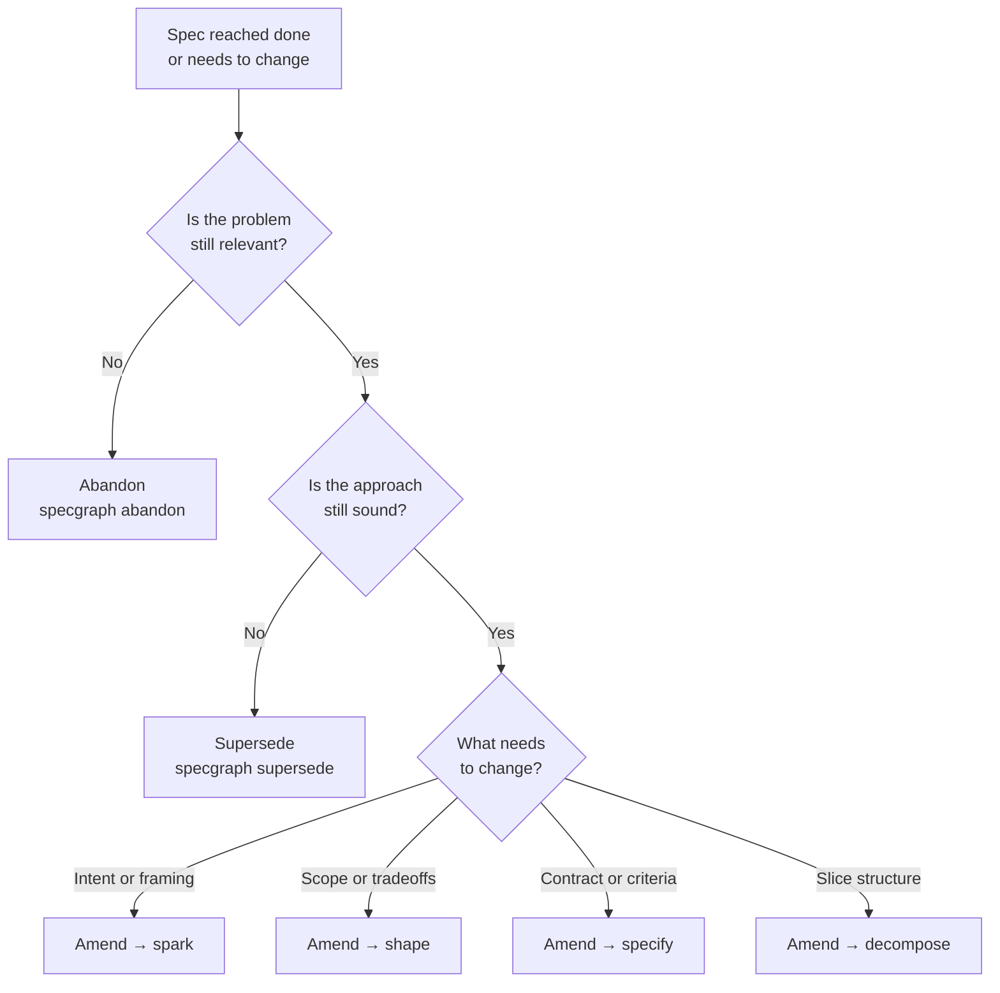

# Lifecycle Transitions

Specs aren't static. A spec that reaches `done` has passed through the full
authoring funnel, been approved, executed, and verified — but the work it
described may need to change. SpecGraph provides three post-completion
transitions: **amend**, **supersede**, and **abandon**.

Each transition is recorded in the changelog, carries a reason, and leaves
a queryable audit trail. Choosing the right one depends on whether the
problem is still relevant and whether the existing spec's approach is still
sound.

---

## Amendment

Amendment returns a completed spec to an earlier authoring stage for
modification. The spec's slug and identity are preserved; the version
increments; the stage resets; a checkpoint ChangeLog entry records the
reason.

**When to use:**

- Scope needs refinement after implementation revealed gaps
- A requirement was misunderstood and needs clarification
- A detail in the spec was wrong but the overall approach is still correct

**When not to use:**

- The approach itself is wrong — use supersession instead
- The problem is no longer relevant — use abandonment instead

Amendment is **semi-terminal**: an amended spec can be superseded or
abandoned, but cannot be amended again until it completes the funnel and
reaches `done` a second time.

```bash
specgraph amend <slug> --stage <stage> --reason "why"
```

### Re-entry Stage Guidance

The amendment returns the spec to the stage that best reflects the nature
of the change. Choosing too early means repeating work that is still valid;
choosing too late means skipping the refinement that the change requires.

| Nature of change | Re-entry stage |
|---|---|
| Intent or problem framing has shifted | `spark` |
| Scope, approach, or structural tradeoffs need revisiting | `shape` |
| Interface contract, invariants, or acceptance criteria need updating | `specify` |
| Slice breakdown needs restructuring | `decompose` |

After the spec completes the funnel again and reaches `done`, it can be
amended again. There is no limit on amendment cycles.

---

## Supersession

Supersession replaces one spec with another. The original spec moves to
`superseded` (a terminal state). A `SUPERSEDES` edge is created from the
new spec to the old. Both specs receive a checkpoint ChangeLog entry.

**When to use:**

- The approach is fundamentally wrong, not just the details
- Requirements changed so significantly that the original spec is misleading
- The existing spec's implementation should be treated as a clean break

**When not to use:**

- The original spec can be refined — amendment is cheaper and preserves
  continuity

The new spec starts fresh in the authoring funnel. It carries no execution
history from the original, but the `SUPERSEDES` edge makes the lineage
queryable.

```bash
specgraph supersede old-spec --with new-spec
```

If the replacement spec does not yet exist, create it first and then run
the supersede command. The `SUPERSEDES` edge is created on the new spec;
the old spec transitions to `superseded`.

### Downstream Awareness

Any spec that depends on the superseded spec will appear in drift detection
after the transition. Review downstream specs and update their
`DEPENDS_ON` edges to point at the replacement if appropriate.

---

## Abandonment

Abandonment drops a spec entirely. The spec moves to `abandoned` (a fully
terminal state). No further transitions are possible.

**When to use:**

- The problem the spec was solving is no longer relevant
- The feature was descoped and will not be revisited
- An in-progress spec was made redundant by other work

```bash
specgraph abandon <slug> --reason "why"
```

A reason is required. It is recorded in the checkpoint ChangeLog entry and
remains queryable for audit and retrospective purposes.

---

## Decision Tree



---

## Viewing History

Every lifecycle transition creates a checkpoint ChangeLog entry. These
entries are queryable without scanning the full spec record.

**View a spec's changelog:**

```bash
specgraph changes <slug>
```

**View only checkpoint entries (stage transitions and lifecycle events):**

```bash
specgraph changes <slug> --checkpoints
```

**Compare two versions:**

```bash
specgraph changes <slug> --diff
```

**Scope to recent changes:**

```bash
specgraph changes <slug> --since-version <n>
```

The dashboard surfaces lifecycle history as a **changelog timeline** on each
spec's detail view. Superseded and abandoned specs show a lifecycle banner
indicating their terminal state and, for superseded specs, a link to the
replacement. Version comparison renders field-level diffs between any two
checkpoint entries.
