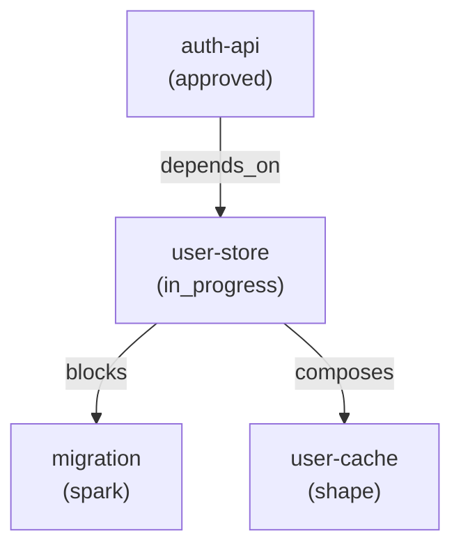

# Specs & the Graph

## What is a Spec?

A spec is a **work unit** in the SpecGraph graph. Every spec has a stable
identity (a ULID like `spec-01JQXYZ...`), a human-readable slug
(e.g. `oauth-refresh-rotation`), and structured content that progresses through
the [authoring funnel](authoring.md). Specs are the fundamental building
block — everything else in SpecGraph exists to create, connect, validate, or
execute them.

---

## Progressive Structure

SpecGraph uses a single schema that scales from solo projects to enterprise
teams. You start with the fields you need and add structure as your project
demands it.

**Minimal spec** — a solo developer getting started:

```yaml
spec: login-api
intent: "REST endpoint for OAuth2 login"
verify:
  - "Returns JWT on valid credentials"
  - "Returns 401 on invalid credentials"
```

Three fields. No ceremony. This is enough for SpecGraph to track the work,
build dependency edges, and feed the spec to an executor.

**Full spec** — a team that needs priority, interface contracts, and invariants:

```yaml
spec: oauth-refresh-rotation
intent: "Implement automatic refresh token rotation per RFC 6749"
stage: approved
priority: p1
complexity: medium
interface:
  input: { endpoint: "POST /auth/token", body: { grant_type, refresh_token } }
  output: { success: { access_token, refresh_token, expires_in }, errors: [...] }
verify:
  - "Rotation returns new token pair"
  - "Old token rejected after rotation"
  - "Concurrent rotation: exactly one succeeds"
invariants:
  - "Never two valid refresh tokens for same session"
depends_on: [user-model]
```

Same schema, more fields. Enterprise teams layer on governance metadata and
approval chains without changing the underlying data model.

---

## The Graph

Specs connect to each other via **first-class edges** stored in the graph.
These are not fragile filename references or hand-maintained lists —
they are queryable, traversable relationships:

| Edge type | Meaning |
|---|---|
| `depends_on` | This spec requires another to be done first |
| `blocks` | This spec prevents another from starting |
| `composes` | This spec was decomposed from a parent spec |
| `relates_to` | Informational link between specs or other artifacts |
| `decided_in` | This spec made a design decision (spec → decision) |
| `informs` | A decision informs this spec (decision → spec) |
| `supersedes` | This spec replaces another spec |



Edges carry semantics. A `depends_on` edge tells the scheduler not to release a
spec until its dependency is complete. A `blocks` edge surfaces bottlenecks. A
`composes` edge traces how a large spec was broken into deliverable slices. A
`decided_in` edge connects specs to the [decisions](decisions.md) they produced,
while `informs` connects decisions back to the specs they affect. A `supersedes`
edge tracks when one spec replaces another.

---

## Identity

Every spec has three identity fields:

- **`id`** — a stable ULID (e.g. `spec-01JQXYZ...`), assigned once at creation
  and never changed. Graph edges (`DEPENDS_ON`, `BLOCKS`, `COMPOSES`) reference
  this ID. ULIDs are timestamp-based and globally unique without coordination.
- **`slug`** — a human-readable name (e.g. `oauth-refresh-rotation`) used in
  CLI output, documentation, and conversation.
- **`content_hash`** — a Murmur3-128 fingerprint (32 hex characters) of the
  spec's substantive fields: intent, stage, priority, complexity, and all
  authoring stage outputs. Recomputed on every create or update.

This gives you three properties:

1. **Merge-conflict-free** — ULIDs have no sequential counters. Two developers
   can create specs independently and merge without ID collisions.
2. **Change detection** — the `content_hash` changes whenever the spec's
   content changes. Drift detection and sync adapters can compare hashes
   instead of diffing every field.
3. **Distributed-safe** — no central authority assigns IDs. Teams across repos,
   time zones, or organizations produce globally unique identifiers by default.

---

## Core Schema

The full spec schema is organized into five categories:

| Category | Fields |
|---|---|
| **Identity** | `id`, `slug`, `version`, `content_hash`, `created_at`, `updated_at` |
| **Intent** | `intent`, `stage` (spark / shape / specify / decompose / approved / in_progress / review / done / amended / superseded / abandoned), `priority` (p0-p3), `complexity` |
| **Edges** | `depends_on`, `blocks`, `composes`, `relates_to` |
| **Authoring Outputs** | `spark_output`, `shape_output`, `specify_output`, `decompose_output` |
| **Verification** | `verify` (acceptance criteria), `invariants` (conditions that must hold before and after execution) |

Not every field is required. The minimal spec uses only `slug` (as the `spec`
key), `intent`, and `verify`. Additional fields appear as the spec moves through
the authoring funnel and as team needs grow.

---

## Change Tracking

Every material change to a spec creates a **ChangeLog** node in the graph,
linked via a `HAS_CHANGE` edge. Each ChangeLog entry records:

- **Content hash** — Murmur3-128 fingerprint of the spec's substantive fields
  after the change
- **Field deltas** — which fields changed and their old/new values
- **Checkpoint flag** — `true` for stage transitions, `false` for in-stage edits

This gives you:

- **Change detection** — compare current `content_hash` against any previous
  ChangeLog entry to know if a spec changed
- **Impact analysis** — walk `DEPENDS_ON` edges from a changed spec to find
  everything affected
- **Point-in-time views** — query checkpoint entries to see the spec's state
  at each stage boundary

ChangeLog entries are queryable without deserializing JSON blobs. You can
ask "what changed across the project this week?" with a single query.

All spec mutations and their ChangeLog entries execute within a single
database transaction. If any step fails — for example, a concurrent
modification is detected via the version guard — the entire operation
rolls back. No orphaned state: if a spec was mutated, its ChangeLog
entry exists; if the ChangeLog failed, the mutation never happened.

Use `specgraph changes <slug>` to view a spec's changelog. Filter to major
milestones with `--checkpoints`, or scope to recent changes with
`--since-version`.

---

## Why a Graph?

Traditional spec management stores specifications as files in a directory.
Relationships between specs are implicit — buried in prose references, filename
conventions, or external tracking tools. Answering questions like "what's the
critical path?" or "what does this spec impact?" requires writing bespoke grep
scripts or manually tracing links across documents.

In SpecGraph, those questions are first-class graph operations. "What's
blocked?" is a single-edge traversal. "What's the critical path?" is a
longest-path query weighted by complexity. "What does this spec impact?" is a
downstream walk from a node through its `blocks` and `depends_on` edges. The
graph makes structural queries cheap and reliable — you query the shape of
your project the same way you query its data.
