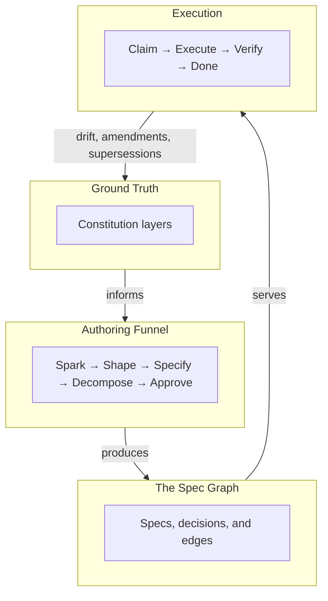

# How It Works

Spec-Driven Development has four layers. SpecGraph implements all of them.

---

## Ground Truth

Every SpecGraph project begins with a constitution — a layered document
that records the decisions, constraints, and conventions that define how
the project works. This is the ground truth: the thing every engineer
and every agent queries before building anything. The constitution has four layers, from most general to
most specific:

**User &rarr; Org &rarr; Project &rarr; Domain**

The **User** layer captures personal preferences (editor, language
defaults). The **Org** layer records organization-wide standards (security
policies, CI requirements). The **Project** layer pins the tech stack, repo
structure, and architectural principles. The **Domain** layer captures
bounded-context details — naming conventions, invariants, and patterns that
apply to a specific part of the codebase.

More specific layers override more general ones. If the org constitution
says "use REST" but the project constitution says "use ConnectRPC," the
project layer wins. Agents never start cold: before writing a single line
of code, they query the constitution to understand what technology to use,
what patterns to follow, and what constraints to respect.

[:octicons-arrow-right-24: Deep dive into Ground Truth](concepts/ground-truth.md)

### What engineers and agents receive

Run `specgraph constitution emit --format claude-md` and agents get the
resolved ground truth as a single document:

    ## Tech Stack
    - **Primary language:** go
    - **Forbidden languages:** java
      - java: No Java expertise

    ## Constraints
    - No ORMs
    - All secrets via Secret Manager

Tech stack, principles, constraints, antipatterns — all four layers merged
into one file. See [Ground Truth](concepts/ground-truth.md#what-engineers-and-agents-receive)
for the full output and format options.

---

## The Spec Graph

Every specification is a **node** in a queryable graph. Relationships
between specs are **first-class edges**, not filename references or
hand-maintained lists:

- **`depends_on`** — this spec requires another spec to be complete first
- **`blocks`** — this spec prevents another from starting
- **`composes`** — this spec is a parent that breaks down into child specs

Because relationships are graph edges, you can query them directly — "show
me every spec blocked by this one" is a single traversal. Every spec has a
**stable identity** (ULID-based) and a **content hash** (Murmur3-128
fingerprint) that changes when content changes, enabling drift detection
without field-by-field comparison.

[:octicons-arrow-right-24: See the full graph model](concepts/spec-graph.md)

### Live Queries

Questions you can answer with one command:

```bash
specgraph critical-path checkout-flow
```

    ## Critical Path

    | Slug            | Stage       |
    |-----------------|-------------|
    | auth-tokens     | in_progress |
    | payment-service | approved    |
    | checkout-flow   | approved    |

`impact`, `ready`, `deps --transitive` — the full set is on
[The Spec Graph](concepts/spec-graph.md#live-queries) page and the
[CLI Cookbook](guides/cli-cookbook.md).

---

## The Authoring Funnel

Ideas do not arrive execution-ready. The authoring funnel is a five-stage
pipeline that adds structure and validation at each step:

| Stage | Purpose |
|---|---|
| **Spark** | Capture the raw idea — a sentence, a bug report, a feature request. No structure required. |
| **Shape** | Scope the work. Identify tradeoffs, surface risks, decide what is in and what is out. |
| **Specify** | Define the interface contract, verify criteria, and invariants. The spec becomes structured and claimable. |
| **Decompose** | Break large specs into smaller, independently deliverable slices connected by `composes` edges. |
| **Approve** | Freeze the spec for execution. After approval, the spec is immutable and claimable. |

Each stage can be driven by a human, an AI agent, or both. SpecGraph
defines three **AI postures** that control how much initiative the agent
takes:

- **Drive** — the agent leads; the human reviews and approves.
- **Partner** — human and agent collaborate interactively (the default).
- **Support** — the human leads; the agent answers questions and fills gaps.

The posture can change at any stage. Let the agent drive during Spark to
brainstorm, switch to Partner for Specify to nail down interfaces together,
and take Support during Approve to keep the human in full control.

[:octicons-arrow-right-24: Deep dive into the authoring funnel](concepts/authoring.md)

---

## Execution-Ready Output

When a spec reaches **Approved**, it becomes claimable. It carries verify
criteria, invariants, and interface contracts — everything an executor
needs. Dependencies are explicit graph edges, so the executor knows what
must finish first.

Agents (or humans) **claim** an approved spec, locking it to prevent
duplicate work. They execute against the verify criteria and report
completion. If the invariants are violated or the criteria are not met, the
claim fails and the spec returns to the pool. The graph structure ensures
work proceeds in dependency order.

When upstream specs change, downstream dependencies surface as drift —
reviewed and acknowledged before execution continues, not discovered in
code review.

---

## Putting It Together



---

## Where to Go Next

- **[The Problem](problem.md)** — the full evidence-backed case for SDD
- **[Quick Start](quickstart.md)** — get running in under 10 minutes
- **[Ground Truth](concepts/ground-truth.md)** — the first concept to understand
